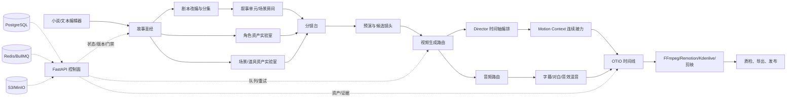

# AI 影视创作工厂总蓝图

版本：v1.2（2026-08-21）  
项目：`novel-to-comic-engine`  
产品暂定名：AI 影视创作工厂  
原产品名：小说转漫画/漫剧引擎（保留为兼容性项目名）

v1.2 新增 §26「开源 H3 工作站参考部件：Kevrai-Omni 融合」，把已核实的开源 H3 工作站事实、参数、硬件分档与下载门禁并入蓝图，并吸收本平台既有 MiniMax H3 测试运行经验；Kevrai-Omni 代码为 CC BY-NC-SA 4.0（非商用），平台只吸收事实与门禁思想、不复制其代码。

v1.1 吸收 K3 对量产控制平面的补充建议。新增内容属于架构规划和数据合同，尚未全部实现或实测；已验证的 H3 参数、模型、耗时和媒体结论仍以 H3 专项交接文档为准。

## 1. 产品定位

本项目不再把目标限定为“小说转漫剧”，而是建设一个以文本为源头、以分镜为生产单元、以 AI 生成和专业剪辑为执行手段的影视创作工厂。

它同时支持：

- 真人写实、3D CG/国漫 3DCG、2D 动漫、水墨、漫画动态化、游戏过场和混合风格。
- 文生图、图生图、文生视频、图生视频、参考图/参考视频生视频、视频延展和多段连续长视频。
- 原创小说、已有剧本、短篇故事、世界观设定、用户上传的人物参考图和用户自有视频素材。
- 本地 GPU、内网 GPU、远程 GPU、ComfyUI 工作流、第三方 API 和剪映/Kdenlive 等外部剪辑器。

核心原则是“三层分工”：

| 层 | 平台负责什么 | 典型能力 |
|---|---|---|
| 控制层 | 版本、数据、状态、队列、引用、门禁、计费、审计、导出 | FastAPI、Next.js、PostgreSQL、Redis/BullMQ、S3/MinIO、FFmpeg、OpenTimelineIO |
| AI 创作层 | 让用户更快得到可编辑的文本、角色、场景、分镜、视频和音频候选 | 文本模型、视觉模型、ComfyUI、Diffusers、H3、Wan、LTX、CosyVoice、Whisper |
| 外部执行层 | 专业 3D、专业剪辑、远程 GPU、商业模型和发布平台 | Blender、剪映、Kdenlive、云 GPU、第三方 API |

平台的价值不是重新训练一个基础模型，也不是重新发明一个剪辑器，而是把“创作意图、生成资产、分镜关系、版本和生产证据”串成可恢复、可复用、可审查的生产链。

## 2. 北极星用户流程

### 2.1 简单模式

用户只需要回答少量问题：故事来源、目标时长、画风、主要角色、输出比例和是否需要对白。系统自动创建生产计划，并在关键节点暂停等待确认。

```text
写作/导入小说
  → AI 整理世界观与人物
  → 用户确认“故事圣经”
  → AI 改编分集剧本
  → AI 拆叙事单元和分镜
  → 自动生成角色三视图、表情姿态包、场景/道具参考图、分镜图
  → 生成 3 秒预演
  → 用户选定镜头候选
  → 正式视频与音频
  → 自动接力成长视频
  → 时间线、字幕、混音和质检
  → 导出项目包/成片/剪映交换文件
```

### 2.2 专业模式

专业用户可以展开每个节点的模型、工作流、LoRA、seed、分辨率、fps、steps、CFG、参考图权重、音频上下文、Motion Context、Director、缓存策略、重试策略和预算；简单模式不隐藏事实，只把复杂参数收进“高级设置”。

### 2.3 每个阶段的统一动作

每个工作台页面都使用同一套交互骨架：

1. 左侧是当前生产阶段和前后依赖。
2. 中间是主要创作画布或时间线。
3. 右侧是“生成/修改/采用/驳回/重跑”操作。
4. 底部是素材、提示词、模型、工作流、耗时、成本和日志抽屉。
5. 每个产物都有 `草稿 → 待审核 → 已采用 → 已锁定 → 已交付` 状态。

## 3. 总体架构



当前项目已经具备控制面的主要骨架：`studio_api/`、`web/`、`orchestrator/`、`rendering/`、PostgreSQL/SQLite、Redis/BullMQ、S3/MinIO、ComfyUI Provider、文本/视觉/视频/语音 Provider、项目交换包和 H3 评测台。新的蓝图是产品总入口，不替换现有 H3 生产交接文档。

## 4. 从小说到成片的页面地图

| 序号 | 页面/工作台 | 用户看到的内容 | 程序化控制 P | AI 辅助 A | 外部工具 E |
|---:|---|---|---|---|---|
| 01 | 项目首页 | 项目进度、待审核事项、最近成片、耗时/积分 | 项目、权限、状态、预算、任务恢复 | 项目摘要、下一步建议 | 无 |
| 02 | 小说/文本创作 | 编辑器、章节树、版本差异、素材引用 | 文档导入、章节、版本、字数、保存、回滚、导出 | 续写、改写、扩写、压缩、风格、对白化、原创化风险提示 | DOCX/EPUB/PDF 导入 |
| 03 | 故事圣经 | 世界规则、时间线、地点、势力、道具、关系图 | 实体、关系、来源段落、审核状态、冲突检测 | 抽取设定、补全空白、发现矛盾、生成摘要 | 可选外部知识库 |
| 04 | 人物设计室 | 角色卡、三视图、年龄/服装/发型/表情/姿态参考 | 角色身份、版本、参考图槽位、锁定、相似度门禁 | 人设提炼、提示词、三视图、表情包、姿态包、服装包、年龄变化 | ComfyUI、SDXL/Flux/角色模型、商业生图 API |
| 05 | 场景与道具实验室 | 场景正交图、空间布局、道具转面图、材质板 | 场景 ID、坐标、门窗/道路/镜头锚点、资产引用 | 场景设定、平面图、关键角度、道具设计、材质和光照建议 | Blender、ComfyUI、商业生图 API |
| 06 | 剧本改编 | 分集、幕、场、对白、动作、情绪、旁白、版权来源 | 原文映射、改编版本、审核、角色/场景引用、时长预算 | 小说转剧本、场景化、对白化、删改建议、节奏重排 | 可选专业编剧工具交换 |
| 07 | 叙事单元/场景房间 | 一段完整戏的目标、角色、冲突、起止状态 | 单元边界、进入/退出状态、前后镜头依赖、时长 | 戏剧目标、动作连续、情绪曲线、声音计划 | 无 |
| 08 | 分镜台 | 分镜卡、画面分镜图、镜头顺序、景别、机位、运动、对白 | shot ID、镜头时长、fps、景别、镜头轴线、seed、参考资产、采用候选 | 自动拆镜、镜头语言、构图、运镜、提示词、分镜图、负面提示词 | Kimi/视觉模型、ComfyUI、Blender 预演 |
| 09 | 预演台 | 低成本 1–4 秒镜头草样、连贯性检查 | 批量任务、候选、seed、模型/LoRA、失败重跑 | 预演生成、问题诊断、动作与画面匹配建议 | ComfyUI、H3、Wan、LTX、Blender |
| 10 | 视频生成台 | 单镜头生成、参考图/视频、长镜头接力、队列 | provider、workflow、steps、分辨率、fps、VAE、LoRA、显存策略、日志 | 提示词增强、参数建议、质量评分、失败解释 | H3、Wan、LTX、CogVideoX、HunyuanVideo、远程 GPU |
| 11 | 音频工作台 | 人声、独白、对白、环境声、音乐、音频波形 | 音轨、时间码、响度、淡入淡出、混音、字幕绑定 | TTS、音色选择、对白润色、ASR、字幕、音效建议、口型风险提示 | CosyVoice、faster-whisper、外部音乐/SFX 服务 |
| 12 | 连续长视频 | 5/10/15/30/60 秒任务链、段间接缝、失败段 | Director 编排、Motion Context、latent/audio context、clip index、断点续跑 | 自动分段、接力提示、接缝评分、重跑建议 | H3 Director、H3 Motion Context、OTIO |
| 13 | 时间线剪辑 | 视频轨、音频轨、字幕轨、转场、标记、调色占位 | 时间线、入出点、版本、代理文件、素材引用、导出 | 自动粗剪、节奏建议、对白对齐、空镜补足 | FFmpeg、OpenTimelineIO、Remotion、Kdenlive、剪映 |
| 14 | 质检与审核 | 人物一致性、场景连续、五官、闪烁、字幕、音频、黑帧 | ffprobe、完整解码、抽帧、哈希、资产门禁、审计 | 视觉审核、异常定位、重生成建议、镜头分级 | Whisper/faster-whisper、PySceneDetect、外部审片 |
| 15 | 交付与发布 | 成片、代理、字幕、封面、项目包、剪辑交换包 | Manifest、SHA-256、权限、导出、归档、发布状态 | 标题、简介、标签、封面文案、平台规格建议 | 剪映、Kdenlive、NLE、发布平台 |

### 4.1 必须加入的生成内容工具

平台不能只生成“最终视频”，应把以下内容都做成一等资产：

| 生成内容 | 最少产物 | 用途 |
|---|---|---|
| 人物三视图 | 正面、侧面、背面、统一服装/光照/画风 | 首段 R2V、角色母版、三维建模参考 |
| 人物表情包 | 中性、喜、怒、哀、惊、说话、闭眼、受伤 | 近景/特写和口型前置参考 |
| 人物姿态包 | 站、坐、走、跑、持物、打斗、转身、倒地 | 动作连续和姿态控制 |
| 服装/道具转面图 | 正反侧、细节特写、材质和配色 | 防止跨镜头服饰/道具漂移 |
| 场景设定图 | 全景、平面布局、关键角度、昼夜/天气版本 | 镜头轴线、机位和空间一致性 |
| 画面分镜图 | 每个 shot 的关键帧、景别、构图、动作方向 | 预演和正式视频的视觉锚点 |
| 分镜九宫格/接力板 | 单元级镜头关系和前后状态 | 导演审片、镜头顺序和情绪节奏 |
| 预演视频 | 1–4 秒低成本运动草样 | 正式生成前发现动作、构图和方向错误 |
| 声音设计表 | 对白、旁白、环境、SFX、音乐时间码 | H3 原生音频或独立音频的生产计划 |

这些产物全部需要来源、版本、提示词、模型、工作流、seed、生成耗时、审核结果和引用关系，不能只保存一张最终图片。

## 5. 生产职责划分

### 5.1 可程序化控制的部分

这些是平台必须自己掌握的“确定性控制面”，不能交给模型自由发挥：

- 文档上传、解析、章节切分、版本差异、原文 SHA-256、授权确认和项目归属。
- 故事圣经实体、角色/场景/道具 ID、关系图、来源段落和审核状态。
- 改编单元、分集、场、叙事单元、镜头、镜头顺序、时长预算和镜头依赖。
- 角色三视图槽位、参考图采用/撤销、角色版本锁、场景空间锚点和道具引用。
- Prompt 模板、负面提示词、模型、LoRA、VAE、workflow、seed、steps、CFG、分辨率、fps 和采样器。
- 任务幂等、队列、重试、取消、断点续跑、失败段隔离、GPU 互斥、显存预留和资源租约。
- Director 的分段时间轴、Motion Context 的 clip index、context latent、audio context 和接缝记录。
- 素材对象存储、缩略图、代理文件、媒体 MIME、文件大小、SHA-256 和完整解码结果。
- 音轨时间码、字幕时间码、响度、淡入淡出、混音版本和交付规格。
- OpenTimelineIO 时间线、FFmpeg 基础合成、项目 ZIP、清单和剪映/Kdenlive 交换文件。
- 权限、计费、积分预留与退款、操作审计、许可证台账和发布前门禁。

### 5.2 AI 适合辅助的部分

AI 的输出必须是“候选稿/候选资产”，不能未经确认直接改写 canonical 事实：

- 小说续写、润色、扩写、压缩、视角转换、对白化和多风格改写。
- 从原文提取人物、地点、势力、道具、时间线、冲突和情感弧线。
- 小说到剧本、剧本到叙事单元、叙事单元到镜头卡的结构化转换。
- 自动生成景别、机位、运镜、动作、画面提示词、负面提示词和声音设计。
- 角色三视图、表情姿态、服饰细节、场景设定、道具转面图、分镜图和封面。
- 预演视频、文生视频、图生视频、参考视频、视频延展和风格迁移。
- TTS、音色建议、对白情绪、ASR、字幕、音效分类、混音建议和口型风险提示。
- 视觉一致性审核、人物五官/服装/场景漂移检测、闪烁/黑帧/字幕幻觉提示。
- 自动粗剪、镜头节奏建议、空镜建议、标题/简介/标签/封面文案。

每次 AI 输出至少保存：输入引用、模型/provider、提示词、结构化 JSON、原始响应摘要、版本、时间、耗时、失败原因和人工处理结果。

### 5.3 需要外部工具或外部服务的部分

| 外部能力 | 平台边界 | 接入方式 |
|---|---|---|
| ComfyUI | 生成节点和 workflow 执行，不承担项目权限/计费/版本真相 | API-format workflow、队列、object_info、结果回写 |
| Blender | 三维虚拟片场、镜头预演、空间/灯光/角色 blocking | `.blend`/脚本/渲染帧/相机元数据 |
| 剪映 | 面向普通创作者的最终人工剪辑、字幕、包装和发布 | 优先导出 MP4、SRT、FCPXML/EDL/OTIO；不把屏幕自动化作为核心依赖 |
| Kdenlive/MLT | 开源剪辑器备选和本地时间线验证 | OTIO/EDL/FCPXML/媒体目录 |
| 远程 GPU | 大模型、高分辨率、长视频和批量生产 | Provider adapter + 任务凭证引用，不把秘密写入项目包 |
| 商业模型 API | 当本地模型质量/速度不足时的替代路线 | 统一 Provider contract、预算和内容策略 |
| 音乐/SFX 服务 | 版权合规的音乐、环境声和音效补足 | 音频 asset + 许可证/来源记录 |

剪映不是开源底座，平台要保证即使没有剪映也能用 FFmpeg + OpenTimelineIO + Kdenlive 完成基本交付；有剪映时提供“导出到剪映”的便捷路径。

## 6. 开源底座与接入建议

### 6.1 立即复用

| 组件 | 用途 | 结论 |
|---|---|---|
| FastAPI + Pydantic | API、结构化输入、Provider contract | 继续使用，不新建第二套 API 层 |
| Next.js + React | 工作台、向导、专业抽屉、任务中心 | 继续使用；按阶段新增页面和组件 |
| PostgreSQL/SQLite | 项目、版本、资产、镜头、任务和审核 | 继续使用；SQLite 保持本地预览，PostgreSQL 做生产 |
| Redis + BullMQ | 生成队列、重试、取消、事件和分布式 worker | MVP 继续使用，适合当前已有 H3 流程 |
| S3/MinIO adapter | 图片、视频、音频、工作流和证据包 | 继续保持 S3 兼容抽象；不把存储实现写死 |
| FFmpeg/ffprobe | 转码、封装、抽帧、音频混音、媒体质检 | 作为无许可证风险的基础交付路径 |
| ComfyUI | 图像/视频/音频生成工作流执行 | 作为生成执行平面，不把其数据库当产品数据库 |
| Remotion | 可选的 Web/React 合成和预览 | 继续保留，但必须做许可证评估；基础交付不依赖它 |

### 6.2 建议接入

| 组件/项目 | 接入位置 | 适用价值 | 风险/门禁 |
|---|---|---|---|
| OpenTimelineIO | 时间线领域模型和交换 | 把平台时间线交给剪映/Kdenlive/FCPXML/EDL | OTIO 不嵌入媒体，必须维护稳定的媒体 URI/manifest |
| Blender | 场景实验室/虚拟片场/3D CG 预演 | 可重复空间、相机、灯光和 blocking | 渲染资源和资产许可证；不替代 H3 视频生成 |
| CosyVoice | 独立对白、旁白、角色音色 | 本地多语种 TTS/音色和流式能力 | 音色授权、克隆同意、口型仍需单独验收 |
| faster-whisper/Whisper | ASR、字幕、对白对齐和质检 | 本地运行、快速批处理 | 小显存下模型选择和语言准确率需实测 |
| PySceneDetect | 镜头切点、场景检测、粗剪辅助 | 生成后自动提取镜头边界 | 只能提供候选切点，不能替代导演确认 |
| Diffusers | 模型适配器的通用运行时 | 便于接入 Wan/LTX/CogVideoX 等模型 | 不能假设每个 H3 工作流都能无损迁移 |
| 官方 ComfyUI workflow templates | 工作流模板注册与版本管理 | 避免手工重造节点图 | 必须锁定 commit、节点版本、模型文件和输入契约 |
| Temporal | 多日任务、远程 GPU、跨服务恢复 | 长流程可视化、重试、补偿和恢复 | MVP 不替换 BullMQ；规模扩大后再做 PoC |
| SeaweedFS | 大规模媒体存储候选 | S3/文件/分布式存储路线 | 先做兼容性、备份、权限和性能验证；不盲目替换现有 MinIO |

### 6.3 模型适配矩阵

| 后端 | 文生视频 | 图生视频/参考 | 音频 | 3DCG/动漫 | 当前定位 |
|---|---:|---:|---:|---:|---|
| MiniMax H3 | 是 | 是 | 原生支持 | 可通过提示词/参考资产 | 当前 3060 本地生产候选，重点做低显存、LoRA、Director、Motion Context |
| Wan 2.1/2.2 | 是 | 是 | 需配套路线 | 动漫/写实均可试 | 第二视频后端和低显存/通用 fallback |
| LTX-2/2.3 | 是 | 是 | 音视频同步路线 | 动漫/预演/高效短镜头 | 已有 LTX 经验，适合快速预演和超分/同步研究 |
| CogVideoX | 是 | 是 | 需外接 | 风格范围广 | 低显存候选；2B/5B 许可证分开核对 |
| HunyuanVideo | 是 | 是 | 需外接 | 高质量/高显存 | 远程 GPU 或未来高配节点，不作为 3060 主链 |
| Blender | 不属于扩散视频 | 相机/场景/角色可控 | 外接 | 3D CG 最强 | 确定性片场和预演，不替代生成模型 |

模型路由必须按能力声明而不是按模型名称硬编码：`t2v`、`i2v`、`r2v`、`v2v`、`audio`、`long_video`、`lora`、`control`、`upscale`、`max_frames`、`recommended_resolution`、`vram_profile`、`license`、`local_or_remote`。

### 6.4 开源 H3 工作站部件（Kevrai-Omni 参考融合）

Kevrai-Omni（MiniMax H3 Studio，`github.com/Bullobis/Kevrai-omni`）被列为本平台的**开源 H3 工作站参考部件**：它是一份已核实的 H3 单机工作站参考实现，平台吸收其事实库、参数闭环、硬件分档和下载门禁，但其代码（CC BY-NC-SA 4.0，非商用）与其 PySide6 桌面形态均不进入生产链。融合合同详见 §26。

## 7. 生成工具链设计

### 7.1 角色资产链

```text
角色描述
 → 角色卡
 → 正面/侧面/背面三视图
 → 表情包/姿态包/服装包/道具包
 → 选择并锁定角色母版
 → 首段 R2V/I2V
 → 后续镜头引用角色 ID 与采用参考图
 → 视觉审核与版本升级
```

规则：三视图是身份锚点，不等于高分辨率面部修复；特写必须单独建立面部参考/近景候选，并在视频前先审核画面分镜图和预演。

### 7.2 场景与道具链

```text
世界观/剧本场景
 → 场景卡与空间锚点
 → 场景全景/平面布局/关键角度
 → Blender 可选三维片场
 → 道具转面图/材质板
 → 分镜机位引用
 → 视频生成和长链一致性检查
```

门窗、道路、桌椅、灯光方向、天气和时间段应当作为结构化字段，而不是只写在提示词里。

### 7.3 画面分镜图链

每个镜头至少保存：

```json
{
  "shot_id": "E01-S03-012",
  "framing": "medium_close_up",
  "camera": {"position": "front_45deg", "lens": "50mm", "motion": "slow_push_in"},
  "actors": ["char-lin-001"],
  "scene": "scene-rain-alley-001",
  "action": "人物抬头看向巷口，雨水从发梢滑落",
  "continuity_in": "右手持伞，视线向左",
  "continuity_out": "伞柄保持右手，视线仍向左",
  "image_prompt": "...",
  "negative_prompt": "...",
  "reference_asset_ids": ["character-front-v3", "scene-wide-v2"],
  "candidate_asset_id": "asset-keyframe-...",
  "review_status": "pending"
}
```

画面分镜图应先于正式视频生成；分镜图不满意时，不进入视频采样，以减少 3060 本地抽卡成本。

### 7.4 预演与正式生成

预演负责验证人物、场景、动作方向、镜头节奏和接力关系；正式生成才承担画质、音频和交付。默认流程：

1. 分镜图确认。
2. 生成 1–4 秒预演。
3. 视觉审核：人物脸、衣服、背景锚点、动作方向、镜头运动。
4. 通过后复制同一角色/场景/seed/提示词骨架进入正式视频。
5. 使用 H3 时按生产交接文档选择 LoRA、SageAttention、分辨率和 steps。
6. 15 秒以上必须采用 Director/Motion Context 或明确标记为独立片段拼接。

### 7.5 音频生产

H3 自带原生音频时，平台仍保留独立音频链：

- H3 原生音频作为氛围/同步参考。
- CosyVoice 生成可控对白和独白。
- faster-whisper/Whisper 做 ASR、字幕和音频文本核验。
- 独立 SFX/音乐作为可替换音轨。
- FFmpeg/Remotion 做混音和封装。

“有音频”不等于“对白口型通过”；口型同步、字幕时间码、对白清晰度和音乐版权必须分开验收。

## 8. 长视频生产合同

### 8.1 平台统一接口

所有视频后端都实现相同的任务合同：

```text
create_generation_job
  input: project_id, episode_id, shot_ids, reference_asset_ids,
         prompt_revision, workflow_revision, provider_profile,
         seed, width, height, fps, frames, steps, lora_ids,
         audio_plan, long_video_plan
  output: job_id, status, events, output_asset_ids, evidence_dir
```

### 8.2 H3 长链分工

- Director：默认生产编排，负责时间轴分段、提示词、任务清理、局部重跑和产物汇总。
- Motion Context：负责上下文 latent、音频上下文、clip index 和段间连续性接力。
- 角色三视图：首段身份/材质锚点，不在每段重复上传。
- 画面分镜图：每个镜头的构图和动作锚点。
- 失败恢复：只重跑失败段，保留前段 latent、音频、日志、workflow、GPU/RAM/Swap 和媒体证据。

### 8.3 质量档

| 档位 | 用途 | 默认策略 |
|---|---|---|
| 草稿 | 构图/动作试错 | 低分辨率、短时长、4 steps 或快速 LoRA |
| 平衡 | 生产预览和普通镜头 | 参考图 + 匹配 LoRA + SageAttention + 推荐 steps |
| 精修 | 中近景/特写/关键镜头 | 更高分辨率、面部参考、较高 steps、单镜头重跑 |
| 长链 | 30–120 秒连续段 | 先用平衡档通过，再 Director + Motion Context，固定分辨率和参考资产 |

平台必须展示“预估耗时”和“已用耗时”，但不能把模型宣传速度当作验收结果；真实结果以 job 日志、GPU/RAM/Swap、ffprobe、完整解码和人工审片为准。

## 9. 界面设计：简单但专业

### 9.1 导航结构

```text
项目
├── 文本与章节
├── 故事圣经
├── 人物
├── 场景与道具
├── 剧本与分集
├── 叙事单元
├── 分镜台
├── 预演
├── 视频生成
├── 音频
├── 时间线
├── 质检
└── 导出发布
```

### 9.2 每个界面必须有的最小信息

- 当前项目、分集、叙事单元和镜头。
- 当前版本与采用版本。
- 使用的人物、场景、道具和分镜参考。
- 生成按钮旁边显示预计耗时、积分/资源消耗和失败风险。
- “查看提示词”“查看工作流”“查看日志”均为可展开抽屉。
- 任何自动生成结果都显示“AI 草稿”标签，采用后才进入生产链。
- 任何变更都会提示哪些下游资产会失效。

### 9.3 关键页面的简易布局

| 页面 | 默认视图 | 高级设置 |
|---|---|---|
| 小说编辑 | 文本+章节树+“改编本章” | 版本 diff、来源段落、温度、模型、输出 schema |
| 人物设计室 | 角色卡+三视图+“生成表情/姿态” | 参考图权重、seed、LoRA、负面词、批量数量 |
| 分镜台 | 横向镜头卡+分镜图+播放预览 | 景别、焦段、轴线、动作状态、镜头锚点、时间码 |
| 视频生成 | “预演/正式/接力”三按钮 | workflow JSON、steps、VAE、显存策略、上下文长度 |
| 音频 | 音轨列表+波形+字幕 | TTS 音色、音高、速度、响度、混音总线 |
| 时间线 | 类剪辑器轨道+标记 | OTIO、代理媒体、转场、音频路由、导出格式 |
| 质检 | 通过/警告/失败卡片 | 帧抽样密度、阈值、人工备注、重跑范围 |

“简单”来自默认参数和向导；“专业”来自可展开的可追溯参数，而不是把参数从用户面前永久隐藏。

## 10. 数据模型与版本不变量

建议领域对象：

```text
Workspace
Project
SourceDocument / TextRevision
StoryBible / StoryEntity / StoryRelationship
Character / CharacterReference / ExpressionPack / PosePack / OutfitPack
Scene / Prop / EnvironmentReference
AdaptationRevision / Episode / NarrativeUnit
Shot / ShotPlan / StoryboardImage / PrevisClip
WorkflowTemplate / ModelProfile / LoRAProfile / ProviderProfile
GenerationJob / GenerationAttempt / Preview / AudioAsset
Timeline / TimelineRevision / Review / ExportManifest
LicenseRecord / CreditLedger / AuditEvent
```

必须保持以下不变量：

1. 一个镜头只能有一个当前采用的关键帧候选和一个当前采用的视频候选。
2. 角色、场景、道具变更会让引用它的提示词/分镜/视频标记为 stale，而不是静默使用旧资产。
3. 只有 `approved` 的故事资产、角色参考和分镜才能进入正式视频任务。
4. 正式任务绑定 workflow revision、model profile、LoRA、seed、分辨率、fps、steps 和 provider。
5. 所有生成任务可幂等重放、可取消、可重试，失败只重跑失败阶段或失败分段。
6. 交换包不写入绝对服务器路径、密钥、Cookie、Token 或私钥；媒体由 manifest 和相对路径重新挂载。
7. 产出状态必须以真实媒体证据为准，不能以“任务完成”或 HTTP 200 代替有效采样。

## 11. 控制平面与唯一事实源

当前蓝图已经定义了生产流程，但要真正量产，必须增加一个不依赖模型记忆的控制平面。`canon/`、资产清单、镜头清单、提示词库、模型注册表和任务证据共同构成项目的唯一事实源。

### 11.1 Canon/Story Bible 目录

建议每个项目使用以下结构化目录；Markdown 负责可读说明，YAML/JSON 负责机器可执行事实：

```text
project/
├── canon/
│   ├── characters.yaml       # 人物、性格、口癖、禁忌、服装版本
│   ├── world.yaml             # 世界观、时间线、地点、势力、规则
│   ├── style.yaml             # 画风、色彩、镜头语言、灯光、禁用元素
│   └── episode_map.yaml       # 小说章节→剧本→分集→场景→镜头
├── assets/                    # 三视图、表情、姿态、服装、场景、道具、分镜、视频、音频
├── prompts/                   # Prompt revision 和可复用模板
├── workflows/                 # ComfyUI/API workflow 及其版本
├── renders/                   # 预演、正式片段、长链分段和成片
├── qc/                        # 自动 QC、人工审片、缺陷和回归样片
└── exports/                   # OTIO、SRT、FCPXML/EDL、项目包、平台交付包
```

Canon 的写入规则：

- 人物、世界观、风格和分集映射必须有版本、来源和审核状态。
- AI 可以提出草稿，但不能直接覆盖已批准事实。
- 修改人物发型、服装、年龄、声音或世界规则时，系统必须生成影响分析。
- 影响分析至少列出三视图、表情/姿态包、场景参考、画面分镜、已生成镜头、LoRA/参考图、音色和字幕等下游资产。
- 旧版本保留并可回滚；新版本未重新通过门禁前，不能悄悄进入正式渲染。

### 11.2 资产身份证和版本规范

所有实体均使用稳定 ID，不用文件名和目录位置充当身份：

```text
CHAR_001                 林夜
CHAR_001_COSTUME_v03     黑色风衣第三版
CHAR_001_FACE_v02        人物面部参考第二版
SCENE_012                雨夜巷口
PROP_012_004             旧铜铃
EP_014_SC_003            第14集第3场
SHOT_014_003_007         第14集第3场第7镜
ASSET_<uuid>             具体生成资产
PROMPT_<uuid>            提示词版本
MODEL_<provider>_<ver>   模型注册项
RENDERJOB_<uuid>         可恢复渲染任务
```

P0 要落下的控制文件：

- `ASSET_MANIFEST.schema.json`：资产类型、来源、父子关系、版本、哈希、许可证、审核状态和引用。
- `SHOTLIST.schema.json`：镜头、时长、景别、机位、动作、对白、声音、参考资产和连续性关系。
- `PROMPT_PRESET.library.yaml`：风格、镜头、景别、负面提示词和模型适配模板。
- `MODEL_REGISTRY.md`：模型、LoRA、VAE、节点、workflow、commit、许可证、适用显存和真实测试证据。
- `CONSISTENCY_ENGINE.md`：一致性维度、检测器、阈值、人工复核和失败回退。
- `QC_CHECKLIST.md` / `DEFECT_TAXONOMY.md`：自动质检、缺陷分级、返工动作和回归样片。
- `RIGHTS_AND_LICENSES.md` / `CONTENT_POLICY.md`：模型、素材、音色、音乐、字体、IP 和内容安全边界。

## 12. 镜头级导演上下文与一致性引擎

### 12.1 一致性不是一个分数

一致性引擎拆成可解释的维度，不用“AI 觉得像”作为唯一结论：

| 维度 | 结构化锚点 | 候选检测/控制手段 | 失败动作 |
|---|---|---|---|
| 人脸/体型 | `character_dna.json`、三视图、面部参考 | 人脸特征相似度、视觉模型、参考图、LoRA/IP-Adapter/ControlNet | 重新生关键帧或近景，不盲目重跑整段 |
| 服装/道具 | costume/prop ID、颜色、材质、持有手 | 参考图、视觉审核、属性清单 | 锁定参考版本，局部重生成 |
| 声音 | voice profile、语速、音高、口音、情绪曲线 | TTS 元数据、ASR、响度和人工听审 | 替换音色/对白段，重新对齐字幕 |
| 场景 | 平面图、门窗、道路、灯光方向、天气时间 | 场景参考图、Blender 相机、视觉审核 | 回到场景母版或重新做分镜图 |
| 镜头 | 焦距、机位高度、轴线、运动、色彩基线 | Shot schema、预演、相邻镜头检查 | Retake 或 Patch in edit |

角色的 `character_dna.json` 不是模型权重，而是角色生产合同，建议包含：身份描述、脸部特征、体型、发型、服装版本、颜色、禁用变化、三视图 asset IDs、表情/姿态包、voice profile、允许的风格变体和最近一次通过的质量样片。

阈值必须按画风、景别和用途配置：真人近景、3DCG 中景、2D 动漫远景不能共用一个相似度阈值。检测器只产生 `pass / warn / fail / unknown`，最终采用仍需人工门禁。

### 12.2 镜头级导演上下文

Director 和 Motion Context 读取同一个结构化镜头合同，而不是只读取一段长提示词：

```yaml
shot:
  id: SHOT_014_003_007
  duration_sec: 6
  camera:
    size: CU
    lens_mm: 50
    movement: slow_push_in
    height: eye_level
    axis: 180_left
  action: 男主回头，压住怒火
  dialogue: 你早就知道了？
  emotion: suppressed_anger
  assets:
    - CHAR_001_COSTUME_v03
    - CHAR_001_FACE_v02
    - SCENE_012_night_rain
    - PROP_012_004
  audio:
    sfx: [rain, distant_thunder]
    bgm: tension_low
  negatives: [extra_fingers, logo, modern_car]
  continuity_from: SHOT_014_003_006
  continuity_to: SHOT_014_003_008
  generation:
    mode: reference_video
    provider: h3
    workflow_revision: h3-director-vX
    lora_ids: [lora-...]
    seed: 20260818
  review_status: pending
```

这份合同同时服务于剧本、分镜图、预演、正式视频、音频、剪辑和质检；任何阶段发现设定变化，都回写为新的 revision，而不是只改某个孤立 prompt。

## 13. Animatic 预演与任务编排

### 13.1 Animatic 工作台

正式视频之前增加低成本预演层：

```text
静态分镜图 + 临时 TTS + 临时音效
    → Animatic 时间线
    → Blender blocking/机位预演（可选）
    → OTIO/EDL/XML 节奏检查
    → 人工确认时长、台词密度、动作方向、转场
    → 才进入高成本视频生成
```

Animatic 的目标不是画质，而是提前发现：镜头过长、对白过密、动作无法接力、人物出画、轴线跳切、场景锚点不对和声音进入/退出错误。

### 13.2 RenderJob 和 workflow registry

每个 ComfyUI workflow 都注册为可验证的能力项：

- `workflow_id`、版本、commit、输入/输出 schema、适用模型、LoRA、分辨率、显存档位。
- 依赖的自定义节点、VAE、文本编码器、ControlNet、参考图槽位和长视频上下文字段。
- 预计耗时、最大帧数、失败类型、许可证和真实测试证据。

`RenderJob` 至少记录：优先级、依赖 job、重试次数、超时、成本上限、资源租约、缓存键、失败分类、日志路径、输出 asset IDs 和质检结果。

缓存键建议由以下内容组成：

```text
project + shot + canon_revision + asset_revision + prompt_revision
+ workflow_revision + model_revision + lora_revision + seed
+ width + height + fps + frames + steps + provider_profile
```

同一键可以复用中间结果；任何 Canon、资产、workflow 或模型版本改变，都必须自然失效。

失败分类至少包含：`OOM`、`采样崩坏`、`脸崩`、`动作漂移`、`背景漂移`、`音画不同步`、`字幕错轴`、`超时`、`网络/远程 GPU`、`许可证/内容策略拒绝`。不同失败类型对应不同重跑策略，不能统一“再抽一张”。

模型路由可以按镜头类型选择 Wan/LTX/CogVideoX/HunyuanVideo/H3，但必须以 capability manifest 和真实评测矩阵为依据：动态强度、长镜头、风格化、低成本草稿、音视频同步和高分辨率分别建路由标签。

## 14. 音频、口型与字幕链

音频生产增加“角色声音设计”层：

- `VoiceCasting`：角色固定音色、授权、音高、语速、口音、禁忌语气和可用模型。
- 台词节奏表：对白文本、时间码、停顿、重音、情绪、呼吸和口型风险。
- H3 原生音频、CosyVoice 独立对白、环境声、SFX、音乐分别成为可替换音轨。
- faster-whisper/Whisper 负责 ASR、字幕初稿、人名/术语词表和断句规则。
- Wav2Lip 或其他口型工具只能作为可选适配器，必须通过口型误差和人工审片门禁，不能因生成了对白就自动通过。
- 最终输出记录响度目标、峰值、削波、静音段、混音总线和平台规格。

字幕至少保存：原始台词、最终台词、说话人、入出时间码、语言、术语校正、人工修订和导出格式。

## 15. 质量门禁与回归库

质量系统拆为“自动 QC + 人工验收 + Golden Shots 回归库”：

自动项：

- 黑帧、静帧、重复帧、闪烁、花屏、解码失败、分辨率/fps/时长错误。
- 爆音、静音、削波、响度异常、字幕错轴、音画偏移。
- 人脸崩坏、手指异常、肢体穿模、背景漂移、文字/logo 乱入。
- 与上一镜的服装、道具、伤痕、天气、时间和视线连续性。

人工项：

- 表演是否到位，节奏是否拖沓，情绪是否断裂，是否符合故事圣经。
- 景别、构图、动作方向、镜头轴线和声音设计是否服务剧情。
- 远景、中景、近景、特写分别验收，不能由远景通过推断特写通过。

验收结果统一为：`Pass`、`Retake`、`Regenerate`、`Patch in edit`、`Blocked`。所有缺陷进入 `DEFECT_TAXONOMY.md`，严重缺陷和典型通过样片进入 `GOLDEN_SHOTS/`，用于模型、LoRA、workflow 和参数升级后的回归测试。

## 16. 版权、授权与内容合规

长期生产必须维护独立的权利台账：

- 模型、LoRA、节点、字体、贴图、音乐、SFX、参考图、视频和训练素材的许可证/来源。
- 真人脸、真人声音、音色克隆和用户上传素材的授权、范围、撤回和禁用状态。
- 生成内容的来源记录、可选水印/C2PA 凭证和模型/工作流快照。
- 原创世界观、已授权改编、同人/IP 衍生分库；不得只靠文件夹名称区分。
- 内容安全分级：血腥、性暗示、未成年人、政治敏感、侵权角色和真人仿冒等进入生成前/生成后双重策略。

建议正式维护：`RIGHTS_AND_LICENSES.md`、`CONTENT_POLICY.md`、`PROVENANCE_MANIFEST.json`。它们是交付门禁的一部分，不是上线后再补的法务附件。

## 17. 交付规格与运营成本

### 17.1 交付矩阵

同一时间线支持多种导出 profile：

| Profile | 用途 | 典型输出 |
|---|---|---|
| master-16x9 | 横屏正片/归档 | 高质量母版、完整字幕和 OTIO |
| short-9x16 | 短剧切片 | 竖屏、标题安全区、SRT、封面 |
| preview-1x1 | 预告/社交媒体 | 方形预览、短时长、低码率 |
| edit-project | 外部剪辑 | OTIO、FCPXML/EDL、代理媒体、manifest |
| archive | 可复现归档 | 原文、Canon、资产、workflow、参数、日志、QC、许可证 |

平台规格应配置为数据，而不是写死在导出脚本：分辨率、码率、fps、音频响度、字幕规范、封面尺寸、标题/简介/标签、章节 marker 和多语言字幕/配音。

### 17.2 运营与成本仪表盘

每镜头和每分集记录：GPU 时长、队列等待、显存峰值、RAM/Swap、失败次数、返修次数、缓存命中率、远程 GPU 利用率、积分/现金成本和人工审片时间。

平台指标至少包括：每分钟成片成本、每日产能、平均返修率、模型速度/稳定性/一致性对比、不同画风通过率和长视频接缝失败率。后续可以把播放完成率、留存、评论高频词反馈给剧本和分镜模块，但运营数据不得悄悄改写 Canon。

## 18. 漫剧/漫画输出分支

漫画和漫剧不是旧项目残留，而是影视工厂的一条独立输出分支：

- 页漫分格、条漫纵向节奏、Webtoon 滚动节拍和单格/长条画布规范。
- 对白气泡、旁白、音效字、速度线、镜头推拉、局部动效和口型替代策略。
- 黑白、水墨、B5 印刷 DPI、网络条漫切片、PSD/CSP 分层文件和 PDF 输出。
- 漫剧模式复用同一套角色、场景、道具、镜头和 Canon，不复制一套平行资产库。

## 19. 既有生产门禁细则

### 文本门禁

- 原文可回溯，改编版本有 diff。
- 角色、地点、时间线和关键设定没有未确认冲突。
- 用户确认原创/授权使用内容；风险提示不是法律结论。

### 视觉门禁

- 三视图与角色卡匹配。
- 分镜图动作、构图、视线和场景锚点通过人工审核。
- 预演没有明显脸部、手部、背景结构、方向或运动崩坏。
- 正式视频通过完整解码，不能只看文件存在。
- 中近景/特写单独审核，不由远景样本推断。

### 音频门禁

- 音频轨存在且非静音。
- 对白可听清，字幕与时间码对齐。
- 独白、环境声、音乐、SFX 轨道可替换。
- 音色克隆有授权记录；口型同步另行标记，不因有对白就自动通过。

### 交付门禁

- `ffprobe` 元数据、帧数、时长、分辨率、fps、编码和音频信息完整。
- 全文件可解码，关键帧和段间接缝抽帧可审阅。
- 生成日志、workflow、提示词、模型、LoRA、seed、耗时和 SHA-256 可回溯。
- 许可证台账完整，商业组件（包括 Remotion、剪映或第三方 API）不被误标为开源。

## 20. 实施路线

### P0：控制平面地基

- 建立 `canon/`：`characters.yaml`、`world.yaml`、`style.yaml`、`episode_map.yaml`。
- 固化资产 ID、版本、来源、哈希、许可证、引用关系和影响分析。
- 落地 `ASSET_MANIFEST.schema.json`、`SHOTLIST.schema.json`、`PROMPT_PRESET.library.yaml`、`MODEL_REGISTRY.md`。
- 打通小说/剧本 → 分集 → 场景 → 镜头的最小结构化闭环。
- 建立 OTIO 时间线导入/导出，先保证剪辑工程可以复用。

验收：修改一个角色设定时，系统能列出受影响的三视图、分镜、已生成镜头、声音和待重跑任务。

### P1：可生产的资产与预演

- 人物三视图、表情/姿态/服装/道具资产包生成器和一致性阈值。
- 场景、道具、空间布局、画面分镜图、镜头卡、版本和采用机制。
- Animatic：静态分镜 + 临时 TTS + 临时音效 + OTIO/EDL 节奏检查。
- ComfyUI workflow registry、RenderJob、缓存键、失败分类和局部重跑。
- CosyVoice、Whisper/faster-whisper、字幕、音量和音频轨最小链路。

验收：《命运模型》第一章可以从文本生成可审阅剧本、角色资产包、完整分镜和 Animatic，且每项结果都可追溯。

### P2：工厂化质量和交付

- 自动 QC + 人工审片台 + `GOLDEN_SHOTS/` 回归样片库。
- H3 Director/Motion Context、Wan、LTX 等视频适配器的模型/LoRA/workflow 选择矩阵。
- 5 秒、10 秒、15 秒和 30 秒质量/耗时/返修矩阵。
- 权利台账、内容政策、来源记录、交付规格矩阵和项目归档。
- 每镜头成本、GPU 时长、失败/重做次数、缓存命中率和产能仪表盘。

验收：用户可以在正式生成前发现大部分错误；正式失败只重跑对应镜头或分段；成片、OTIO、字幕、manifest 和审片记录可一并归档。

### P3：高阶生产

- CosyVoice、Whisper/faster-whisper、SFX、字幕、混音。
- OpenTimelineIO 领域模型、FFmpeg 交付、Kdenlive 和剪映交换。

验收：不依赖剪映也能导出可播放成片；有剪映时能导入素材和时间线。

### P4：3D 虚拟片场和高级控制

- Blender 场景锚点、相机、灯光和 blocking。
- 3DCG 专用角色/场景资产和可重复机位。
- 参考视频、动作控制、局部重绘和精修工作流。

验收：同一场景换机位时，空间几何和角色站位可复现。

### P5：生产化与协作

- 多用户协作、审核角色、评论和锁定。
- 远程 GPU 调度、资源配额、长任务恢复、许可证和成本报表。
- Temporal PoC 只在 BullMQ 已经不能满足多日/跨服务恢复时引入。

验收：一个完整项目可分派给编剧、分镜、资产、视频、音频和剪辑角色协作。

## 21. 明确不重复造轮子

不自研以下基础能力：

- 不自研扩散模型、文本编码器、TTS、ASR 或视频 VAE。
- 不自研 ComfyUI 节点编辑器；平台只管理模板、输入契约和结果。
- 不自研完整 NLE；先做自己的时间线数据和 OTIO/FFmpeg 交付。
- 不把剪映屏幕自动化作为核心生产路径。
- 不把某一个 H3 workflow 写死在业务逻辑；使用 provider/workflow registry。
- 不让 AI 直接覆盖故事圣经、角色母版和采用资产；所有重要事实需审核。

## 22. 第一轮开发任务清单

1. 新增 `canon/`、资产 ID、schema、Prompt preset 和 model registry。
2. 新增 `ShotPlan`、`GenerationAttempt`、`ConsistencyReview`、`TimelineRevision` 数据契约。
3. 将角色三视图扩展为表情/姿态/服装/道具参考包，并保留 asset lineage。
4. 将关键帧生成抽象为 `StoryboardImage`，让每个镜头保留多候选和采用版本。
5. 增加 Animatic 工作台：分镜图、临时 TTS、临时音效、OTIO 节奏检查。
6. 建立 workflow/model/LoRA registry，生成任务保存不可变快照和缓存键。
7. 建立一致性引擎：角色、服装、场景、镜头、声音五类检查和影响分析。
8. 为 ComfyUI、H3、Wan、LTX 建立统一 capability adapter；暂不要求所有模型同时上线。
9. 增加自动 QC、人工审片、缺陷分类和 `GOLDEN_SHOTS/` 回归库。
10. 建立版权/来源台账、交付规格矩阵和每镜头成本仪表盘。
11. 为每个阶段补“简单模式/高级模式”界面，不把专业信息丢掉。
12. 以《命运模型》第一章作为贯穿样例，完整跑通“文本 → 分镜图 → 人设三视图 → Animatic → 5 秒视频 → 音频 → 时间线 → 交付”。

## 23. 开源参考与许可证边界

本轮只完成调研，没有下载或安装新组件。下面是建议保留的正式参考入口；落地前仍需记录具体 commit、文件哈希、模型许可证和国内源/官方源下载证据。

- [ComfyUI](https://github.com/Comfy-Org/ComfyUI)：模块化生成执行平面，支持工作流、API、队列、VRAM/RAM offload 和多类媒体。
- [ComfyUI workflow templates](https://github.com/Comfy-Org/workflow_templates)：官方模板与工作流蓝图。
- [Diffusers](https://github.com/huggingface/diffusers)：图像/视频/音频扩散模型的通用 PyTorch 运行时。
- [Wan2.1](https://github.com/Wan-Video/Wan2.1)：文生视频、图生视频、编辑和相关媒体能力，适合作为第二视频后端。
- [LTX-Video](https://github.com/Lightricks/LTX-Video)：LTX-2、音视频同步、关键帧、LoRA 和 ComfyUI 路线。
- [CogVideo](https://github.com/zai-org/CogVideo)：CogVideoX 2B/5B，需分别核对代码和模型许可证。
- [HunyuanVideo](https://github.com/Tencent-Hunyuan/HunyuanVideo)：高质量高显存后端，适合远程 GPU。
- [OpenTimelineIO](https://github.com/AcademySoftwareFoundation/OpenTimelineIO)：时间线领域模型与剪辑器交换。
- [FFmpeg](https://ffmpeg.org/)：媒体转换、封装、混音和质检基础设施。
- [Blender](https://github.com/blender/blender)：可重复的 3D 场景、相机、灯光和虚拟片场。
- [MLT](https://github.com/mltframework/mlt) / [Kdenlive](https://github.com/KDE/kdenlive)：开源剪辑器和时间线备选。
- [CosyVoice](https://github.com/QwenAudio/CosyVoice)：多语种 TTS、音色和流式语音。
- [faster-whisper](https://github.com/SYSTRAN/faster-whisper)：本地 ASR 和字幕候选。
- [PySceneDetect](https://github.com/Breakthrough/PySceneDetect)：镜头切点和场景检测。
- [Temporal](https://github.com/temporalio/temporal)：未来跨服务长任务恢复候选，MVP 不替换现有 BullMQ。
- [Remotion License](https://github.com/remotion-dev/remotion/blob/main/LICENSE.md)：现有 Remotion 继续作为可选合成器，但必须单独做商业许可证审查。
- [Kevrai-Omni / MiniMax H3 Studio](https://github.com/Bullobis/Kevrai-omni)：开源 H3 工作站参考部件（§26）。软件代码 CC BY-NC-SA 4.0（署名-非商业性使用-相同方式共享），禁止商用；平台仅吸收其已核实的 H3 事实、参数与门禁思想，不复制代码。MiniMax H3 权重另受 Community License 约束（排除美国/欧盟/英国/韩国）。

## 24. 当前结论

“小说转漫剧”是本项目的历史入口，不是最终产品边界。新的核心产品是：

> 用结构化故事资产和分镜作为中间层，把小说创作、影视改编、人设三视图、场景/道具设计、画面分镜、预演、AI 视频、对白音效、长视频接力、专业剪辑和交付发布串成一条可恢复、可审查、可批量生产的 AI 影视工厂。

第一阶段优先把“文本 → 故事圣经 → 角色资产包 → 画面分镜图 → 预演 → 视频候选”做得稳定；第二阶段再把 H3 长链、独立对白、OTIO/剪映交付和 Blender 虚拟片场纳入生产门禁。平台可以很容易地开始，但所有专业控制和证据都应保留在同一条链上。


## 25. 实施状态快照（2026-08-19）

本快照由 dsh 审计后写入，事实以代码与测试为准；细粒度状态见
`docs/P0_IMPLEMENTATION_STATUS.md`。

### 已实现并通过全量测试（433 项 unittest）

| 阶段 | 模块 | 位置 |
|---|---|---|
| P0 | Canon 四件套 + 《命运模型》第一章实例 | `canon/*.yaml` |
| P0 | 资产身份证 / ShotList schema | `schemas/ASSET_MANIFEST.schema.json`、`SHOTLIST.schema.json` |
| P0 | Prompt 预设库 / 模型注册表 | `canon/PROMPT_PRESET.library.yaml`、`MODEL_REGISTRY.md` |
| P0 | 影响分析引擎（改 Canon → 列受影响镜头/资产/重跑） | `studio_core/impact.py` |
| P0 | 章节→分集→单元→场景→镜头闭环组装 | `studio_core/pipeline.py` |
| P0 | OTIO 时间线导出/导入（纯 stdlib） | `studio_core/timeline.py` |
| P0/P1 | Scene/NarrativeUnit 模型、迁移、SQLite/API 服务层 | `studio_core/models.py`、`migrations/018`、`studio_api/store.py`、`studio_api/service.py`、`studio_api/main.py`；已通过用户隔离 CRUD 和分集回显合同测试 |
| P1 | 角色 DNA + 资产包四值判定 | `studio_core/assets.py` |
| P1 | RenderJob 缓存键/失败分类/重试策略 | `studio_core/render.py` |
| P1 | Workflow Registry 门禁 | `studio_core/registry.py` |
| P1 | Animatic 节奏预审 | `studio_core/animatic.py` |
| P1 尾 | 音频链合同（音色/对白/音轨/字幕/混音）及服务层结构门禁 | `studio_core/audio.py`、`studio_api/service.py`；composition settings 已接入 `audio_gate`，仍不等于真实 TTS/ASR/响度验收 |
| P1 尾 | 镜头候选采用状态机（单候选不变量） | `studio_core/adoption.py` |
| P2 | 一致性视觉 adapter（face/costume/scene/pose） | `studio_core/consistency.py`、`docs/CONSISTENCY_ENGINE.md`；本地/fake/异常 provider 只能 unknown；缺 evidence 的结论自动降级 |
| P2 起 | 自动 QC 规则层（fail-closed） | `studio_core/qc.py` |
| P2 起 | GOLDEN_SHOTS 媒体回归库 | `GOLDEN_SHOTS/manifest.json`、`schemas/GOLDEN_SHOTS.schema.json`、`studio_core/golden_shots.py`；3 条历史人工审阅样本通过 SHA-256、ffprobe 和完整解码验证 |

### 未实现（如实声明）

- QC 视觉维度仍需视觉模型接入；GOLDEN_SHOTS 已有首批 3 条媒体基线，但尚未接入自动模型视觉相似度和 Web 审片台。
- RenderJob 未接 BullMQ worker 调度；TTS/ASR 只有数据合同，无真实调用。
- Schema 运行时装 jsonschema 校验未装包；018 迁移未在真实 PG 执行。
- H3 生产链未改动：剪枝 INT8 + drbaph raw-key LoRA 是唯一收口底座，
  Director 编排 + Motion Context AV latent 接力，同一进程不叠加 patch。

### 开发框架复用门禁（本快照新增）

本轮服务层没有新增自研基础设施：FastAPI/Pydantic 负责 HTTP 合同，SQLite/PostgreSQL
负责产品数据，FFmpeg/Remotion 负责媒体合成，ComfyUI/provider 负责生成执行，CosyVoice/
Whisper 负责音频适配。以后引入工作流、时间线、编解码、视觉审核、模型或插件时，必须先做
成熟开源组件复用评估，并记录许可证、版本/commit、国内源优先下载证据和真实运行验证；只有
无法满足平台合同的部分才写薄 adapter，不复制底座能力。

### v1.2 蓝图更新（2026-08-21，dsh）

- 新增 §6.4 与 §26：Kevrai-Omni 开源 H3 工作站部件融合——H3 能力事实卡、生成模式合同、硬件分档合并表、R1–R5 下载门禁、生产/参考双链分工与技术栈版本基线。本轮仅文档变更：未下载、未安装、未复制任何第三方代码。

## 26. 开源 H3 工作站参考部件：Kevrai-Omni 融合

本章按用户决定写入，目标是把开源项目 Kevrai-Omni（MiniMax H3 Studio）中已核实的事实、参数与门禁，与本平台既有 MiniMax H3 测试运行经验合并为统一的“H3 工作站部件”事实源与执行合同，避免重复制造轮子。

### 26.1 部件定位与硬边界

Kevrai-Omni 在平台中承担三个角色：

1. **H3 能力事实源**：模型规格、输入限制、分辨率档位、官方默认参数。
2. **硬件分档与下载门禁的参考实现**：显存策略、真实测速、断点续传、量化成套校验。
3. **第二执行后端的隔离 A/B 通道**：DiffSynth-Studio 路线，与已收口的 ComfyUI 生产链隔离，不进入默认生产。

硬边界：该软件为 CC BY-NC-SA 4.0（NC 禁止商用、SA 传染、BY 署名），H3 权重为 MiniMax Community License 且排除美国/欧盟/英国/韩国。平台的融合方式是“吸收事实、参数、门禁思想，由平台自研薄 adapter 承载”，不复制其代码、不并入其 PySide6 桌面形态；若未来需要商业交付级别的复用，必须单独取得授权或切换到许可兼容的替代实现。

### 26.2 H3 能力事实卡（并入 canon/MODEL_REGISTRY.md）

| 事实 | 值 | 性质 |
|---|---|---|
| 帧率 | 固定 24 fps | 官方规格 |
| 音频 | 32kHz 立体声原生 | 官方规格 |
| 单段时长 | 4–15 秒 | 官方规格 |
| 帧数对齐 | `num_frames` 向上取整到 `17n+5` | DiffSynth 官方规则 |
| 分辨率约束 | 宽、高必须为 32 的倍数；默认 1344×768 | 官方规格 |
| 分辨率档位 | 16:9 → 832×480 / 1152×640 / 1344×768；9:16 → 480×832 / 640×1152 / 768×1344；1:1 / 4:3 / 3:4 / 21:9 同档 | 已核实 |
| CFG | CFG 蒸馏模型，negative_prompt 默认无效（cfg_scale=1.0） | 官方规格 |
| Ref2VA 输入上限 | ≤9 图、≤3 视频、≤3 音频、合计 ≤12；单段 2–15s 且各自总时长 ≤15s；音频不能单独作为唯一输入 | 官方仓库核实 |
| FL2VA 关键帧 | 首尾帧 ≤2 张 | 官方规格 |
| 开源范围 | H3-Base（FL2VA + Ref2VA）；H3-Context-IR 与 2K 再生仅官方 API，开源版短边上限 768 | 官方发布页 |

写入规则：以上条目作为 `canon/MODEL_REGISTRY.md` 的 H3 条目与 provider capability manifest 的输入校验基线；任何 UI/API 层必须在提交任务前按此表拒绝超限输入，而不是把错误留给引擎。

### 26.3 生成模式合同（映射到 §10 ShotPlan/GenerationJob）

`t2va`（文生视频）、`first`（首帧）、`last`（尾帧）、`fl`（首尾帧）、`ref2va`（全模态参考）、`audio_driven`（音频驱动）、`retake`（视频局部重生成）作为统一的 provider capability 枚举。`retake` 直接映射到 §8.2 失败分段重跑与 §13.2 RenderJob 局部重跑合同：同一 shot 的局部重生成必须携带源视频引用与起止时间码，不整段重抽。

### 26.4 硬件分档与实测速度合并表

本平台既有实测与 Kevrai-Omni 收集的社区实测合并为同一张硬件路由表；所有数字必须标注来源与日期，`declared ≠ verified`：

| 硬件 | 实测结论 | 来源 |
|---|---|---|
| RTX 3060 12GB + 32GB RAM（本平台 `cachyos-ai`） | 832×480/124帧/24fps T8 基线 891.58s、Drbaph Ref2V 831.04s；640×384 Motion Context 4 段 15 秒精确成片（drift 0.00ms）；1088×608 15 秒约 46 分钟 | 本平台 2026-08-14～18 实测（test-runs/） |
| RTX 3060 12GB + 32GB RAM | 480P/5s ≈ 9 分钟 | Kevrai-Omni 引用 B站 ComfyUI 团队实测 2026-08 |
| RTX 4090 24GB + 64GB RAM | 15s 视频 ≈ 14–22 分钟 | Kevrai-Omni 引用社区实测 2026-08 |
| RTX 5090 32GB | 480P/5s ≈ 80 秒；720P/10s ≈ 9 分钟 | Kevrai-Omni 引用 B站实测 2026-08 |

显存分档策略（供 planner/资源租约参考）：≥48GB 可考虑 BF16 全精度；16–48GB 走 NF4 双分区；8–16GB 走 NF4 FL2VA 单分区；本平台生产主链（剪枝 INT8 + 专用 LoRA + `--lowvram --fp16-vae --use-sage-attention`）在 12GB 档位已收口验证，优先级高于通用分档推断。

### 26.5 模型资产下载门禁（R1–R5 硬校验 + 测速续传）

新组件下载前必须通过（与 Atlas `source-preflight` 联动）：

- **R1 引擎匹配**：DiffSynth 组件与 ComfyUI 组件不混装。
- **R2 量化成套**：主模型、文本编码器、VAE 必须同一量化族（NF4 全家桶或官方 BF16 全家桶）。
- **R3 分区匹配**：FL2VA 主模型必须配 FL2VA Processor，Ref2VA 同理。
- **R4 显存可行性**：估算最低显存显著超过实际显存即拒绝。
- **R5 磁盘可行性**：包体超过模型目录剩余空间即拒绝。

下载器合同：Range 断点续传（`.part`）、失败指数退避重试、真实测速（Range 采样 4MB，评分 = 速度 75% + 延迟 25%）、国内源（魔搭 / hf-mirror）优先、海外源需记录 `OVERSEAS_FALLBACK`。远端目录列举走 HF tree API 与魔搭 repo files API。

### 26.6 执行链分工（生产 vs 参考）

- **生产默认链（已收口）**：ComfyUI 0.31.0 + 剪枝 INT8 FL2VA + drbaph 剪枝专用 raw-key Turbo LoRA + INT4 ConvRot Qwen 文本编码器 + 原生视频/音频 VAE + `--lowvram --fp16-vae --use-sage-attention`；640×384 默认档、832×480 精选档、1088×608 极限档；8 steps 正式、4 steps 预演；Director 编排 + Motion Context AV latent 接力；独立 TTS/SFX + FFmpeg/Remotion 混音。
- **参考/隔离链**：DiffSynth-Studio NF4/GGUF（Kevrai 路线）作为低资源第二执行后端，隔离端口与目录，只做 A/B 对照与兼容性证据；不进入默认生产穷举，不把其结果冒充生产验收。
- **图片工作台参考**：Z-Image-Turbo（8 步）/ Qwen-Image-2512 的显存互斥加载模式（生成前互相卸载）可参考进图片 Provider 的资源租约。

### 26.7 技术栈版本基线

`diffsynth>=2.1.0`、`bitsandbytes>=0.43`、PyAV `av>=12`、`imageio>=2.31` + `imageio-ffmpeg`、`psutil>=5.9`、`requests>=2.31`；Python 3.10–3.14。torch 必须按硬件从官方索引安装（NVIDIA cu124/cu128；ROCm rocm6.2；昇腾 torch-npu 2.7.1），禁止用国内 PyPI 镜像装 torch（2026-08 实测会装到 CPU 版）。

### 26.8 与既有章节的联动

- §6.3 模型适配矩阵：H3 行增加 DiffSynth-Studio 参考后端（隔离 A/B）。
- §13.2 RenderJob：缓存键已含 model/lora/workflow revision；新增组件前先跑 §26.5 的 R1–R5 预检。
- §16 版权合规：Kevrai-Omni（CC BY-NC-SA 4.0）与 H3 Community License 进入权利台账必查项。
- §20 实施路线：P1 的 workflow/model/LoRA registry 直接复用本章事实卡与门禁，不重复调研。

### 26.9 后续动作（未实现声明）

- 把事实卡落入 `canon/MODEL_REGISTRY.md` 与 provider capability manifest（后续代码任务，不在本轮文档任务内）。
- 下载器与 R1–R5 门禁由平台自研 adapter 实现，通过 Atlas `source-preflight` 与 `reuse-decision` 留档。
- 本轮仅完成蓝图融合：未下载、未安装、未复制任何第三方代码，未改动生产链。

### 26.10 本轮任务上下文记录（2026-08-21，dsh）

- Atlas 任务：`task-20260821-021356-a5d586`（Kevrai-Omni 开源 H3 工作站部件融合进 AI 影视创作工厂蓝图）。
- 国内源预检：gh-proxy.com（HTTP 200）可用；gitclone.com 502；gitee 无此仓库；kkgithub 404。已用 gh-proxy 镜像下载到外盘。
- 代码快照：`/Volumes/AJW-Data/Projects/_external_kevrai-omni/repo`（43 文件，branch main）；压缩包 SHA-256 `cb1b943214bdb979104038bc154bd6063afedebf71eb5f303d8b32650d2eed89`。
- 拆解报告：`docs/KEVRAI_OMNI_TEARDOWN.md`——模块原理→平台映射、可吸收数据结构、不采用部分、与本平台 H3 实测对齐表。
- 复用决策：`adapt`——只吸收事实/参数/门禁思想，自研薄 adapter 承载，不复制 CC BY-NC-SA 4.0 代码。
- 范围声明：本轮未下载模型权重、未安装运行依赖、未复制第三方代码进生产链；下载快照仅用于本地原理拆解。
