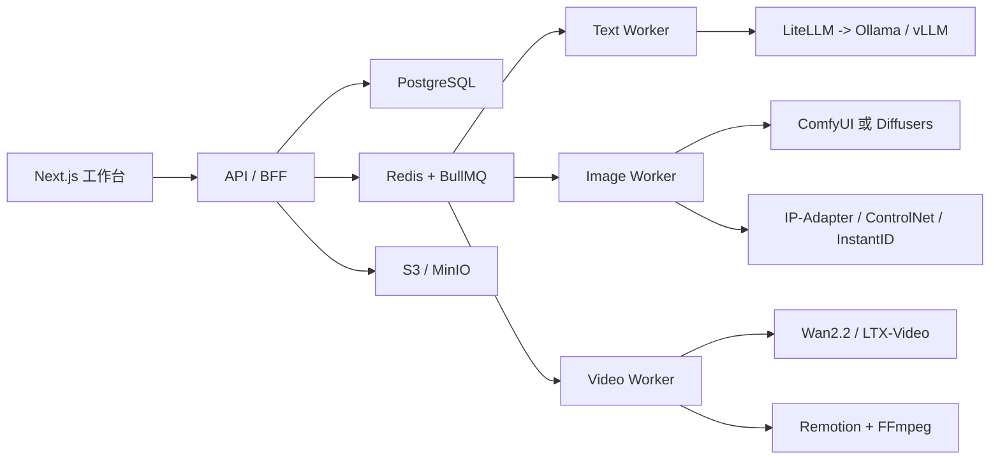

# AI 漫剧创作平台开发蓝图

> 产品范围已升级为“AI 影视创作工厂”。本文件保留为漫剧/H3 生产子蓝图，负责记录历史功能、H3 本地生成和现有 Web/API 实现；小说创作、剧本改编、人设三视图、场景/道具、画面分镜、预演、音频、时间线和外部剪辑器的总产品规划请以 [`AI_FILM_FACTORY_BLUEPRINT.md`](./AI_FILM_FACTORY_BLUEPRINT.md) 为准。

最新状态覆盖：v2.06（2026-08-17）。顶层长摘要中的历史版本号保留作兼容索引，以下实现记录以最新版本为准。

## v2.05 平台参考长链音频生产门禁（2026-08-17）

在平台真实 Job `job_d00225c5f1024939` 的四图 R2V + Motion Context 15 秒成片上，已完成独立 CosyVoice3 中文对白、保留 H3 音频床/纯对白 A/B 封装和完整媒体验收。对白 `这座桥，为什么还在呼吸……` 由 Linux `127.0.0.1:8789` 的 `Fun-CosyVoice3-0.5B` 生成，WAV 为 24kHz 单声道、2.880 秒；混音版与纯对白版均为 640×384、15.000 秒、AAC 32kHz 双声道，完整解码通过。

证据目录：`test-runs/2026-08-17-h3-platform-reference-long-video-15s-real-gpu/audio/`。本轮确认生产职责：H3 负责视觉和可选原生氛围，CosyVoice3 负责对白，独立环境声/SFX 与 FFmpeg/Remotion 负责最终混音。`8790` SenseVoice 未运行、Whisper small 权重未缓存，故 ASR 和逐音素口型仍是未通过边界；后期混音不可冒充口型同步。

## v2.06 失败分段只重跑门禁（2026-08-17）

服务层回归已验证：第 1 段完成、第 2 段首次模拟 Motion Context 中断，retry 后生成调用序列为 `[1, 2, 2]`，因此已完成段不会被重复采样。平台真实四段 Job `job_d00225c5f1024939` 仍保持四段 `completed`，恢复证据落在 `test-runs/2026-08-17-h3-platform-reference-long-video-15s-real-gpu/recovery/`。

生产恢复规则：失败时保留该段 H3 日志、workflow、GPU/RAM/swap、context latent、clip index 和媒体证据；只重跑失败段。若上一段 latent 丢失、尺寸/clip index/上下文目录不一致，禁止自动恢复，先人工修复，否则可能把接缝或人物崩坏误判成模型问题。

## v2.03 H3 长期生产底座选型收口（2026-08-17）

模型评测阶段已收口，不再对所有量化底座继续做无边界长视频穷举。当前 RTX 3060 12GB + 32GB RAM 的主生产候选为：

```text
剪枝 INT8 FL2VA
+ drbaph 剪枝专用 raw-key Turbo LoRA
+ INT4 ConvRot Qwen
+ 原生视频/音频 VAE
+ SageAttention
+ 640×384、8 steps、24fps
```

该组合完成 4 景别 5 秒、Director 15 秒和 Motion Context 15 秒真实媒体测试；后续段使用 AV latent 接力，完整解码通过，Motion Context 段间 `drift 0.00ms`。因此它是当前的长期生产默认底座，而不是只凭模型文件大小做出的推断。

- Director 负责默认生产编排：时间轴分段、提示词管理、局部重跑和自动清理。
- Motion Context 负责底层连续性接力、上下文参数控制和故障回退；需要连续长镜头时，在独立进程或由 Director 内置路径使用，不能与独立 patch 在同一 ComfyUI 进程叠加。
- 非剪枝 INT8 + 匹配 T8-convert 保留为质量上限/备用；GGUF Q4_K_M 仅为极慢兼容备用；剪枝 INT4 不进入当前 3DCG 长视频主链。
- 4 steps 只做预演，8 steps 做正式平衡档；1088×608 只做精选单镜头，15 秒以上默认回到 640×384，再以后期超分。

完整模型路径、LoRA SHA、运行耗时和媒体证据见 `docs/H3_PRODUCTION_HANDOFF.md` 与 `test-runs/2026-08-17-h3-pruned-lora-15s/REPORT.md`。

## v2.04 H3 平台多参考图长链合同落地（2026-08-17）

本项目的平台层已经把“角色身份参考图”纳入可恢复长视频 Job：`LongVideoInput`/`normalize_long_video_plan` 接受 `reference_asset_ids`，服务端只允许同项目、ready 状态的 image asset；Provider 只在首段上传 `REFERENCE_IMAGE_0..7_REF` 所需的图片，后续 Motion Context 段不重复上传参考板。工作流模板为 `h3-reference-first-segment-av-latent-640x384-8steps.json`，后续仍复用 `h3-motion-context-segment-640x384-8steps.json`。

真实 GPU 门禁已通过：剪枝 INT8 FL2VA + INT4 Qwen + drbaph 剪枝专用 raw-key LoRA + SageAttention，4 张参考图首段 R2V，3 段 AV latent 接力，640×384、24fps、8 steps，最终精确 15 秒。首段/后续段真实耗时 `518.354/433.734/415.910/416.474s`，墙钟约 29 分 44 秒；最终 SHA-256 `28512e3f48417524ac482ec15016c50c30bcf188207a1919a995249eba472543`，完整解码和抽帧通过。

蓝图生产路径固定为：`Director 时间轴编排 → 首段三视图/面部参考 R2V → Motion Context AV latent 接力 → CosyVoice3 独立对白 → 环境声/SFX → FFmpeg/Remotion 混音 → ffprobe/完整解码/人工脸部与接缝门禁`。该门禁不等于逐音素口型通过；R2V 参考图只负责身份与材质锚定，远景和低分辨率仍需人工审片。完整证据见 `test-runs/2026-08-17-h3-platform-reference-long-video-15s-real-gpu/REPORT.md`。

## v2.02 H3 离线评测资料台（2026-08-15）

已将 2026-08-12 至 2026-08-15 的 H3 真实测试整理为无需部署的静态复制包：
`/Volumes/AJW-Data/Projects/novel-to-comic-engine/h3-evaluation-offline/index.html`。

- 页面可直接双击打开；视频、抽帧、工作流 JSON、ffprobe JSON、日志、报告和拼接清单均使用同一文件夹内的相对路径。
- 当前包包含 29 个测试批次、120 个视频和 625 个原始证据文件，覆盖官方 INT8、T8、BlockCache、Spectrum、高清矩阵、LoRA A/B、Motion Context、Director 长视频、独立 5 秒拼接、三视图 R2V、3DCG 连续性和真人 I2V。
- 逐条样本页面展示实际媒体时长、分辨率、帧率、帧数、编码、音频、文件大小、SHA-256、生成耗时、模型、LoRA、节点、采样参数、提示词预览和原始证据链接；无法从报告/日志确认的生成耗时显示为“未单独记录”。
- 原始资料副本位于 `h3-evaluation-offline/runs/`；总说明为 `README.txt`，机器索引为 `catalog.json`。复制时必须复制整个文件夹，不能只取 HTML。

## v2.01 独立 5 秒片段拼接 30 秒实测（2026-08-14～15）

补做“每段独立生成 5 秒，再拼接成长视频”的路径验证：使用 Drbaph Ref2V、三视图人物参考、832×480、4 steps，生成 6 段不同 seed/动作/对白的视频。六段均成功，耗时分别为 `780.98s/791.83s/801.14s/811.28s/811.01s/822.51s`，合计 `4818.75s`（约 80 分钟）。

- 原始无重编码拼接得到 `31.033656s`，因为 H3 每段实际为 124 帧/5.1667 秒；精确 30 秒版本已重新编码并通过完整解码。
- 画面主题、服装、雨巷和人物大体身份可维持，但独立 seed 造成明显的站位、镜头角度、脸部表情和动作跳变；音频也只是可拼接播放，没有跨段声场连续性。
- 结论：独立 5 秒拼接适合“分镜剪辑成 30 秒短视频”，不适合充当无缝连续长镜头。需要连续走位、口型、声场和动作方向时，仍必须使用 Director 内置 Motion Context 或独立 Motion Context。

完整报告、原始 31 秒版、精确 30 秒版和边界抽帧见 [独立片段拼接评测](/Volumes/AJW-Data/Projects/novel-to-comic-engine/test-runs/2026-08-14-h3-5s-concat-30s/CONCAT_REPORT.md)。

## v2.00 H3 开源 LoRA 候选矩阵与人物五官 A/B 复测（2026-08-14）

在 RTX 3060 Laptop GPU 12GB + 32GB RAM 上，使用 Director 外部 R2V、三视图人物参考、832×480、124 帧、24fps、同一 seed `20260814832`，逐个替换开源 LoRA 完成真实媒体复测。正式端口 `8189`、微信 Bot 和 Qwen 路由未停止；全部实验在隔离端口 `8191` 完成，并在每条任务前后释放模型缓存。

| LoRA 路径 | 步数 | 端到端耗时 | 结果 |
|---|---:|---:|---|
| T8-convert 标准 Loader 基线 | 8 | 891.58s | 有效基线；画面完整，面部有 H3 原生柔化 |
| Larry v4 step600 EMA low-vram merge | 8 | 941.63s | 有效；面部略干净但提升不大，RAM 约 29GiB |
| fal Realism People（触发词 `r34l1sm`） | 8 | 931.30s | 有效；本次近景面部、皮肤和表情连续性最好 |
| Drbaph 动态 rank Ref2V | 4 | 831.04s | 有效；本机速度/清晰度综合最好 |
| Kijai LightX2V Ref2V | 4 | 832.00s | 有效；可作为备用，未超过 Drbaph |

完整视频、工作流、抽帧、SHA-256、权重校验和失败样本见 [H3 LoRA A/B 报告](/Volumes/AJW-Data/Projects/novel-to-comic-engine/test-runs/2026-08-14-h3-lora-ab/AB_REPORT.md)。本轮新增的 Realism People、Drbaph Ref2V、Kijai Ref2V 均已下载到 Linux `/mnt/gaosu_sata/ComfyUI/models/loras/` 并校验；LTX LoRA、裁剪底座专用 LoRA 不得与当前 H3 非剪枝 INT8 底座混用。

关键工程结论：T8-convert 的键含 `diffusion_model.`，当前 `MiniMaxH3TurboLoRA` 专用节点再次补此前缀，因此出现 `0 bypass adapters/0 injections`，不是画质差而是节点键映射不兼容；标准 `LoraLoaderModelOnly` 才是本机 T8-convert 的有效链。Larry bypass 注入路径虽然能正确挂载，但 32GB RAM 压力过大，生产采用 low-vram merge。标准 LoRA 路径在 4/8 步采样时 RAM 峰值约 29GiB，必须隔离串行、任务前后 `/free`，不得与正式 H3 并发抢 GPU。

当前生产选择：Drbaph Ref2V 用于批量预演和速度/画质平衡；Realism People 用于通过预演后的真人中近景精修；Larry v4 EMA merge 作为通用 Turbo 备用；Kijai 作为 Ref2V 备选。Realism People 不能替代三视图、首帧锁定、超分或人工画质门禁。

## v1.99 三视图 R2V 角色建立段实测（2026-08-14）

为验证人物五官和服装的一致性，使用三张独立角色参考图（正面、侧面、背面）在 Director 隔离端口 `8191` 做了 832×480、124 帧、约 5.17 秒的真实 R2V 测试。工作流使用非剪枝 INT8 H3、INT4 Qwen、T8 Turbo LoRA、SageAttention、8 steps 和原生音频；没有连接首帧或 `i2v_groups`，日志确认 `external r2v groups × 1`，因此这条样本属于三视图参考主体生视频，而非首帧 I2V。

- 结果成功，端到端耗时 `891.58s`（14分46秒）；采样阶段约 3分33秒，前置约 10 分钟为 3060 低显存模型初始化/CPU-交换区搬运。采样观察到约 9.3GiB 显存、100% GPU；解码封装阶段观察到约 11.5GiB、温度约 70°C；无 OOM/Traceback/HTTP 5xx。
- 输出：[h3_r2v_3view_832x480_5s_t8_sage.mp4](/Volumes/AJW-Data/Projects/novel-to-comic-engine/test-runs/2026-08-14-h3-r2v-3view-832x480-5s/h3_r2v_3view_832x480_5s_t8_sage.mp4)，工作流：[workflow_r2v_3view_832x480_5s.json](/Volumes/AJW-Data/Projects/novel-to-comic-engine/test-runs/2026-08-14-h3-r2v-3view-832x480-5s/workflow_r2v_3view_832x480_5s.json)，报告：[TEST_REPORT.md](/Volumes/AJW-Data/Projects/novel-to-comic-engine/test-runs/2026-08-14-h3-r2v-3view-832x480-5s/TEST_REPORT.md)。H.264/AAC 媒体通过完整 ffmpeg 解码，视频 124 帧/5.167秒，音频非静音。
- 抽帧审阅显示没有白底三视图参考板泄漏；从中远景推进到中近景时，脸型、发型、发簪和服装色彩比此前 704×416 长视频远景更稳定、细节更可审阅。但三视图不是面部超分或绝对身份锁定，嘴型/局部五官仍有轻微变化，远景仍不应承担近景特写质量。
- 生产策略更新为：首段或角色建立段使用三视图 R2V；后续段固定同一分辨率，使用 Director 内置接力或独立 Motion Context，不要每段重复挂白底三视图。单段 5 秒测试没有实质运行接缝，因此 Motion Context 的长链收益仍需在同分辨率多段 A/B 中单独验收。

## v1.98 H3 长链高负载、卡顿与“假死”诊断记录（2026-08-14）

本条专门记录 120 秒 Director → 内置 Motion Context 实测期间的运行态，避免后续 AI 或人工把低显存模式下的正常段间整理误判为挂死。测试主机为 RTX 3060 Laptop GPU 12GB、32GB RAM；隔离 Director 端口为 `8191`，微信 Bot PID `3621712` 未停止。

### 已观察到的正常高负载状态

| 表象 | 真实阶段 | 本次证据 | 正确处理 |
|---|---|---|---|
| GPU 约 8.0–8.5GB、利用率 100%，进程 CPU 约 149–164% | 正在采样 | 120 秒日志持续出现 segment 初始化/采样/完成，最终 8/8 段完成 | 保持等待，不重启、不重复提交 |
| GPU 暂降至约 1.9GB、利用率 0%，日志数分钟没有新行 | 段间 CPU 侧 VAE、视频导出、缓存/latent 整理或序列化 | ComfyUI 进程仍存活，CPU 约 149–157%，随后继续初始化下一段 | 先看 CPU、内存、进程和日志 mtime；不要仅凭 GPU 低利用率杀进程 |
| RAM 在约 10–11GiB 与 29–31GiB 间跳变，Swap 约 31–36GiB | 下一段模型重载、上下文装配或段间缓存压力 | 后续段重新出现 `Requested to load MiniMaxH3`，没有 OOM/Traceback | 允许完成当前段；若要止损，等段完成后再降低时长/分辨率 |
| 日志出现 `segment N/8 done`，随后又出现模型加载 | 前一段已完成，下一段准备中 | 120 秒共 8 段均完成，并记录视频/音频上下文接力 | 这是进度，不是重复生成或死循环 |

### 本次没有发生的真正失败

本轮没有 OOM、Traceback、ComfyUI 进程退出、HTTP 5xx 或上下文接力中断；进程短时间处于 `S` 状态也不能单独作为假死依据。后续只有在“进程退出/队列异常结束、出现 OOM 或 Traceback、CPU 与 GPU 长时间同时无活动、日志 mtime 和文件 I/O 均超过 10 分钟没有变化”并经二次检查后，才可判定为疑似假死。单独出现 GPU 0%、显存回落、日志暂时不动或系统 Swap 增长，均不满足失败判据。

### 运维门禁与止损规则

- 3060 12GB + 32GB RAM 的长链路必须按段观察，不要按“单段采样耗时”推算总耗时；段间 CPU/Swap 整理可能额外增加数分钟。
- 观察顺序固定为：远端进程存活 → CPU/GPU 活动 → RAM/Swap → 日志 mtime/新增行 → ComfyUI 队列状态 → 最后才考虑终止。
- 120 秒本次约 2 小时 24 分钟，Swap 压力明显；生产默认仍以 5–15 秒叙事单元、30 秒重复验证档、60 秒审片档为主，120 秒仅作低频长链路回归。
- 任何止损必须先等当前段落完成或确认进程/队列确实失败；不要在 GPU 空闲窗口直接强杀，以免破坏正在写出的 raw 视频、缓存或上下文文件。
- 复测必须保留：运行日志、每段完成标记、GPU/RAM/Swap 峰值、raw/final 媒体元数据和完整 ffmpeg 解码结果。

## v1.97 H3 Director → Motion Context 国风独白长视频实测（2026-08-14）

基于国风雨巷提示词，加入普通话人物内心独白、雨声、脚步、衣料声、竹风、屋檐滴水、灯笼链轻响和低古琴/箫氛围，使用 `MiniMaxH3Director` 做默认生产编排，由 Director 内置的 H3 Motion Context 路径负责上一段视频 latent、音频上下文和关键帧接力。独立 `ComfyUI-H3-Motion-Context` 仅加载但没有在同一进程叠加运行时补丁，避免与 Director 冲突。

- 固定链路：704×416、24fps、每段 362 帧/15.083333 秒、22 帧视频 overlap、40 步音频上下文、非剪枝 INT8 FL2VA、INT4 Qwen、T8 Turbo LoRA、SageAttention KJ + H3 Memory Efficient SageAttention、8 steps、`res_multistep/simple`、video/audio shift `12/3`、原生 T2VA 音频、段间清理显存。
- 三个目标时长均真实完成：30 秒=2 段，耗时 `2065.61s`（34分25.61秒）；60 秒=4 段，耗时 `4438.23s`（73分58.23秒）；120 秒=8 段，耗时 `8667.43s`（2小时24分27.43秒）。
- raw 输出分别为 30.166667 秒、59.917000 秒和 119.417000 秒；因 H3 帧对齐及接缝相位裁剪，分别封装为精确 30/60/120 秒。三条 final 均为 704×416、24fps、H.264 + AAC 32kHz 双声道，完整 ffmpeg 解码通过。
- 120 秒日志确认 8/8 段均完成，接力过程重复记录 22 个视频 latent 帧 + 40 个音频步，并记录 7 个接缝的 12 帧 luma 平滑；没有 OOM。画面抽帧显示人物、服装和雨巷几何没有全局坍塌，但 60 秒样本出现少量模型字幕样式文字，仍需人工审片。
- 120 秒 final：[final_120s_director_guofeng_monologue.mp4](/Volumes/AJW-Data/Projects/novel-to-comic-engine/test-runs/2026-08-14-h3-long-director-audio/final_120s_director_guofeng_monologue.mp4)；完整报告：[review_report.md](/Volumes/AJW-Data/Projects/novel-to-comic-engine/test-runs/2026-08-14-h3-long-director-audio/review_report.md)；工作流脚本：[make_h3_long_director_audio_chains.py](/Volumes/AJW-Data/Projects/novel-to-comic-engine/scripts/make_h3_long_director_audio_chains.py)。
- 生产判断：30 秒是可重复验证档，60 秒是可审片长镜头档，120 秒可以生成但约 2.4 小时且 Swap 压力大，不适合批量生产单元。H3 原生音频已验证可封装和解码，但独白逐字 ASR、口型评分、独立 TTS 和最终混音尚未完成。

## v1.96 H3 框架无关生产交接包（2026-08-14）

本轮把 H3 本地测试和生产候选链整理为可被不同 AI 框架、Agent 或人工运维直接恢复的交接合同。首读入口为项目根目录 [AGENTS.md](/Volumes/AJW-Data/Projects/novel-to-comic-engine/AGENTS.md) 和 [H3_PRODUCTION_HANDOFF.md](/Volumes/AJW-Data/Projects/novel-to-comic-engine/docs/H3_PRODUCTION_HANDOFF.md)。交接手册包含已验证模型/LoRA/VAE 绝对路径和字节数、节点 commit、正式 ComfyUI 启动参数、Director/Motion Context 两套长视频链、35 条高清矩阵结果、15 秒 OOM/成功门禁、复现命令、媒体验收规则、服务保护规则和未完成的整集级生产门禁。

- 项目 README 已增加 H3 交接入口；跨会话记忆只保留不含秘密的指针和稳定结论，详细事实以项目文档和 Atlas canonical 为准。
- 本次新增事实以 Atlas task `task-20260814-021120-73090c` 记录，长期事实提案字段为 `h3_production_handoff`；不向 Atlas 或文档写入密码、Token、Cookie 或私钥值。
- 当前最重要的生产判断：H3 是渲染底座，Director 是默认生产编排层，Motion Context 是底层连续性/故障回退层；二者不能在同一个 ComfyUI 进程叠加运行时补丁。
- 当前准确状态仍是“本地生产候选链”：5 秒矩阵、约 10 秒两段接力和 704×416/15 秒档已实测通过；30～60 秒多段、断点重跑、最终混音和整集交付仍是后续门禁，不能提前宣称已完成。

## v1.95 H3 评测网页与长视频证据展示（2026-08-14）

新增独立评测页 `/h3-evaluation`，将 H3 高清矩阵与长视频实测产物放进同一个可播放、可筛选的审阅界面。页面直接读取外盘 `test-runs` 产物，不复制大体积视频到 Web 仓库；媒体 API 支持 MP4 Range 请求，浏览器可以按需加载和拖动播放。

- 页面入口：[H3 评测页](/Volumes/AJW-Data/Projects/novel-to-comic-engine/web/app/h3-evaluation/page.tsx)，客户端交互：[H3EvaluationClient.tsx](/Volumes/AJW-Data/Projects/novel-to-comic-engine/web/app/h3-evaluation/H3EvaluationClient.tsx)，样式：[page.module.css](/Volumes/AJW-Data/Projects/novel-to-comic-engine/web/app/h3-evaluation/page.module.css)。
- 短视频区：35 个样本，可按分辨率、风格、8/20 steps 筛选；详情展示生成耗时、视频时长、帧数、文件大小、首/中/尾抽帧、SHA-256 和对应 ComfyUI 工作流。
- 长视频区：接入 832×480/10.125s、832×480/12.25s、704×416/15.083s 三个直接 T2VA 成功档；接入 Motion Context `chain_concat.mp4`（9.449s）和 Director `aimixer_director_2segments.mp4`（10.334s）；同时明确展示 832×480/15.083s 的 CUDA OOM 边界。
- 页面验证：Next.js production build 通过；本地预览页 `/h3-evaluation` 浏览器快照通过；矩阵 MP4 与 15 秒长视频 MP4 的 API Range 请求均返回 `206 Partial Content`；长视频与 OOM 说明均在页面 DOM 中可见。
- 重要边界：该页是本地评测/审片工具，不把“机器解码通过”替代人工画质判断；H3 原生音频仍应作为氛围底层，最终对白与混音继续走独立音频链路。

## v1.94 H3 高清多风格多分辨率大规模矩阵（2026-08-13～14）

为确定 RTX 3060 Laptop GPU 12GB + 32GB RAM 在“速度/画质兼顾”之外的高清上限，使用正式 H3 ComfyUI 端口 `8189`、统一 seed `20260813` 和已验证的 T8 双时钟文生视频链路，完成 5 种风格 × 6 个分辨率的 8 steps 测试，并在约 1MP 档追加 20 steps 对照，共 **35 个样本**。链路固定为：非剪枝 INT8 FL2VA、INT4 Qwen 文本编码器、T8 转换 Turbo LoRA、`MiniMaxH3DualClockSamplerT8`、SageAttention、视频/音频 VAE、T2VA 原生音频。

- 风格：真人写实、3D 国风、3D 仙侠、赛璐璐动画、水墨 CG。
- 分辨率阶梯：`640×384`、`832×480`、`960×544`、`1088×608`、`1216×672`、`1344×768（约 1MP）`；每档 8 steps，1MP 另有 20 steps。
- 统一媒体规格：24fps、124 帧、实际 5.167s、H.264；原生音频为 AAC 32kHz 双声道。35/35 完整 `ffmpeg -f null -` 解码通过，未发生 OOM；逐样本均保存 SHA-256、ffprobe 元数据和首/中/尾三张抽帧。
- 结果目录：[h3-hd-matrix](/Volumes/AJW-Data/Projects/novel-to-comic-engine/test-runs/2026-08-13-h3-hd-matrix)；逐样本审阅索引：[review_index.md](/Volumes/AJW-Data/Projects/novel-to-comic-engine/test-runs/2026-08-13-h3-hd-matrix/review_index.md)；机器验收清单：[review_manifest.json](/Volumes/AJW-Data/Projects/novel-to-comic-engine/test-runs/2026-08-13-h3-hd-matrix/review_manifest.json)。
- 实测耗时：`640×384` 为约 `6.5–7.4min`；`832×480` 为约 `8.5–8.9min`；`960×544` 为约 `9.7–10.2min`；`1088×608` 为约 `11.7–12.1min`；`1216×672` 为约 `13.9–14.3min`；`1344×768/8 steps` 为约 `17.2–17.4min`；`1344×768/20 steps` 为约 `32.4–33.1min`。全批次累计 GPU 时间约 `8.48h`。
- 运行态观察：采样中显存峰值约 `11,033MiB/12,288MiB`，空闲回落约 `6,297MiB`；32GB 内存能完成本矩阵，但 1MP 档已经接近 12GB 显存上限，不建议再叠加高分辨率、长时长或额外控制插件。
- 初步生产建议：先人工审阅 `r660` 作为质量/耗时平衡档，再审 `r1mp/8 steps` 作为高清候选；`r1mp/20 steps` 只用于关键镜头对照，不作为批量生产默认。最终艺术质量、闪烁、人物一致性和镜头可用性以用户逐项审阅为准，机器通过不等于画面合格。
- 复现脚本：[run_h3_hd_matrix.py](/Volumes/AJW-Data/Projects/novel-to-comic-engine/scripts/run_h3_hd_matrix.py)、[verify_h3_hd_matrix.py](/Volumes/AJW-Data/Projects/novel-to-comic-engine/scripts/verify_h3_hd_matrix.py)、[build_h3_hd_review_index.py](/Volumes/AJW-Data/Projects/novel-to-comic-engine/scripts/build_h3_hd_review_index.py)。

## v1.93 H3 Director 长视频段间引导实测（2026-08-13）

在完成高画质矩阵后，使用下载包中实际引用的 AIMixer Director 工作流做了独立端口真实验收。运行端口为 `8191`，正式 H3 端口 `8189` 仅在测试收尾后恢复；RTX 3060 Laptop GPU 12GB、32GB RAM，`--lowvram --fp16-vae --use-sage-attention`，非裁剪 INT8 FL2VA、INT4 Qwen 文本编码器、视频/音频 VAE、T8 Turbo LoRA。

- 工作流：[workflow_aimixer_director_t8_2segments_832x480.json](/Volumes/AJW-Data/Projects/novel-to-comic-engine/test-runs/2026-08-13-h3-director-aimixer/workflow_aimixer_director_t8_2segments_832x480.json)。两段各 124 帧，合计 248 帧、24fps、832×480、8 steps、文生视频、音频生成、`continuityEnabled=true`、重叠/上下文 22 帧、段间清理显存。
- 实际链路确认：SageAttention KJ `auto` + H3 Memory Efficient SageAttention、T8 转换 LoRA `minimax_h3_turbo_v4_step600_comfyui_T8-convert.safetensors`、Director 内置视频/音频上下文承接。日志确认第 2 段接收前一段 22 个视频 latent 帧和 40 个音频步，合并时 `seam_gap=0`。
- 输出：[aimixer_director_2segments.mp4](/Volumes/AJW-Data/Projects/novel-to-comic-engine/test-runs/2026-08-13-h3-director-aimixer/aimixer_director_2segments.mp4)，实际 10.334s、H.264 832×480/248 帧、AAC 32kHz 双声道；`ffmpeg -f null -` 全量解码通过。接触表：[director_contact_sheet.png](/Volumes/AJW-Data/Projects/novel-to-comic-engine/test-runs/2026-08-13-h3-director-aimixer/director_contact_sheet.png)。
- 运行成本：有效任务总计 `00:18:28`，第 1 段约 2:49，第 2 段约 4:44，峰值显存约 9.3GiB。画面抽查显示雨巷几何、人物背影、服装和镜头方向可连续；最终对白仍不应依赖 H3 原生音频，Director 输出音轨继续作为氛围底层。
- 部署修正：AIMixer 节点必须放在 ComfyUI 实际 `--base-directory` 指向的 `custom_nodes` 下；本机正确路径为 `/mnt/gaosu_sata/ComfyUI/custom_nodes/ComfyUI_MiniMaxH3_Director_AIMixer`。工作流隐藏的分组输入 `bd_grp_sample`、`bd_grp_advanced`、`bd_grp_perf` 必须补齐，否则 API 400；当前已固定在复现脚本中。
- 兼容边界：Director 已内置连续段运行时，不要再同时启用独立 Motion Context 的运行时补丁；需要底层逐段重试时使用独立 Motion Context 工作流。当前共享 venv 缺少可选 `scenedetect`，不影响本次文生视频批量 Director 测试，但视频自动切镜功能仍需补依赖后单独验收。

## v1.92 H3 Motion Context 长视频接力实测（2026-08-13）

使用 `ComfyUI-H3-Motion-Context` 0.3.0（commit `658ba11ae91737391a247cf9758d0063c43491b3`）在隔离端口 `8190` 完成两段 T8 LoRA 文生视频接力。该插件的核心不是重新拼接两个独立视频，而是把上一段尾部的 latent 与音频上下文作为下一段起点。

- 工作流：[clip1 workflow](/Volumes/AJW-Data/Projects/novel-to-comic-engine/test-runs/2026-08-13-h3-motion-context/workflows/workflow_clip1_t8_lora_832x480_5s.json)、[clip2 workflow](/Volumes/AJW-Data/Projects/novel-to-comic-engine/test-runs/2026-08-13-h3-motion-context/workflows/workflow_clip2_t8_lora_motion_context_832x480_5s.json)。固定 `context_length=22`、`audio_context_length=24`、`match_tail=true`，关闭 Spectrum 跳步，分辨率完全一致。
- 输出：[clip1.mp4](/Volumes/AJW-Data/Projects/novel-to-comic-engine/test-runs/2026-08-13-h3-motion-context/clip1.mp4)、[clip2_trimmed.mp4](/Volumes/AJW-Data/Projects/novel-to-comic-engine/test-runs/2026-08-13-h3-motion-context/clip2_trimmed.mp4)、[chain_concat.mp4](/Volumes/AJW-Data/Projects/novel-to-comic-engine/test-runs/2026-08-13-h3-motion-context/chain_concat.mp4)。首段约 5.167s，第二段去掉 22 帧上下文后约 4.25s，合并约 9.45s；两段均为 H.264 + AAC，完整解码通过。
- 运行成本：第 1 段 `464.97s`，第 2 段 `521.56s`，峰值显存约 9.26GiB。日志确认保存/加载 AV latent、interior keyframe anchors、keyframe/ref coexistence 和 22 帧视频 + 40 步音频承接均生效。
- 生产建议：需要时间轴、批量分段、自动清缓存和局部重跑时优先 Director；需要研究上下文长度、手工控制承接和故障隔离时使用 Motion Context。两者不要在同一个 ComfyUI 进程叠加运行时补丁；3060 12G 默认先用 832×480、5 秒段、8 steps、T8 LoRA，长片由段间接力实现。

## v1.90 MiniMax H3 长视频实测边界（2026-08-13）

本轮在 Atlas 登记的 Linux 台式机 `cachyos-ai` 上完成真实 ComfyUI 长视频测试。硬件为 RTX 3060 Laptop GPU 12GB、32GB RAM；测试端口为隔离 ComfyUI `8190`，正式 H3 端口 `8189` 未重启、未并发抢占；每轮前后确认 `wechat-linux-bot.service=active`。链路固定为：非裁剪 INT8 FL2VA 扩散模型、INT4 Qwen 文本编码器、T8 转换 Turbo LoRA、`MiniMaxH3DualClockSamplerT8`、`dual_clock_euler/native_flow`、视频/音频 VAE、`--lowvram --fp16-vae --use-sage-attention`、8 steps、T2VA 无首帧、seed `20260815`。

### 1. 15 秒 832×480：真实 OOM 边界

- `362` 帧、约 `15.083s`、832×480、8 steps、T8 LoRA。
- 在 LoRA 分支额外申请约 `2.31GiB` 工作区时触发 CUDA OOM；日志记录显存设备限制约 `11.63GiB`、当时可用约 `59.56MiB`。
- 未产出可验收视频。该结果证明“RTX 3060 12GB + 32GB 内存”不能把 832×480/15 秒/T8 LoRA 作为稳定生产档位；失败原因是显存，不是模型文件损坏、工作流节点缺失或微信 Bot 影响。

### 2. 15 秒 704×416：成功生产档

- 为满足 H3 节点的 32 倍数约束，实际采用 `704×416`（早期工作流文件名保留 `704x400` 历史名称，文件内容已修正为 704×416）。
- `362` 帧、24fps，实际 `15.083333s`；H.264 视频 + 32kHz AAC 双声道音频。
- 总执行 `14:06`，8 步采样约 `8:08`；峰值显存约 `9.997GiB`；未 OOM。
- `ffprobe` 确认视频 `362` 帧、音频轨存在；`ffmpeg -f null -` 全量解码通过；首帧/中帧/尾帧抽查显示从滑梯向石桥推进的空间关系连续，无整体坍塌。
- 输出：[h3_s04a_t8_dualclock_int8_int4clip_audio_704x416_15s_8steps_00001_.mp4](/Volumes/AJW-Data/Projects/novel-to-comic-engine/test-runs/2026-08-13-h3-longvideo/h3_s04a_t8_dualclock_int8_int4clip_audio_704x416_15s_8steps_00001_.mp4)，SHA-256 `a8222d016ae5a0d2d214ba1a581b37450baccbbfb05adc7bb280043027a43405`。
- 工作流：[workflow_h3_s04a_t8_dualclock_int8_audio_704x400_15s_8steps.json](/Volumes/AJW-Data/Projects/novel-to-comic-engine/projects/destiny-model/workflow_h3_s04a_t8_dualclock_int8_audio_704x400_15s_8steps.json)。该文件名沿用首次低分辨率尝试的 `704x400` 标识，当前 `height` 已是 `416`，后续应在工作流整理时复制为语义准确的 `704x416` 文件名。

### 3. 长度/分辨率生产结论

| 档位 | 结果 | 建议 |
|---|---|---|
| 832×480、10.125s、243帧 | 成功，约12:33 | 质量与长度平衡档 |
| 832×480、12.25s、294帧 | 成功，约14:48 | 画面质量优先的长镜头上限候选 |
| 832×480、15.083s、362帧 | OOM | 不作为3060 12G默认档 |
| 704×416、15.083s、362帧 | 成功，约14:06 | 3060 12G 的15秒可行档，建议后期放大 |

由此，H3 本地生产应采用“分辨率/时长联合门禁”，不能只按显存容量判断：`832×480` 推荐控制在 10–12 秒；15 秒镜头切换到 704×416 或更低，并保留后期超分/裁切步骤。原生 H3 音频仍只作为氛围底层，对白、旁白和最终音效继续走独立 TTS/后期混音。长剧情仍优先采用“预演视频 → 关键帧抽取 → 正式生成”与拆镜头承接，单段 15 秒通过不等于整部剧可以直接连续生成。

## v1.91 MiniMax H3 20 步 + LoRA 1MP 复测（2026-08-13）

本轮针对“官方 20 步无 LoRA 画面崩坏”的用户反馈，固定同一 S04 提示词、seed `20260815`、T2VA 无首帧、124 帧、24fps、1344×768，新增 T8 转换 LoRA 后重新实测。该复测只改变 LoRA 与步数链路，不把无 LoRA 20 步继续当作画质参考。

- 正式工作流：[workflow_h3_t8_dualclock_int8_lora_1mp_5s_20steps.json](/Volumes/AJW-Data/Projects/novel-to-comic-engine/projects/destiny-model/workflow_h3_t8_dualclock_int8_lora_1mp_5s_20steps.json)。链路为非裁剪 INT8 `minimax_h3_fl2va_int8_convrot.safetensors`、INT4 Qwen 文本编码器、视频/音频 VAE、`minimax_h3_turbo_v4_step600_comfyui_T8-convert.safetensors`、`MiniMaxH3DualClockSamplerT8`、视频/音频 shift `12/3`、`dual_clock_euler/native_flow`、20 steps、SageAttention。
- 实测输出：[h3_t8_dualclock_int8_lora_1mp_5s_20steps_00001_.mp4](/Volumes/AJW-Data/Projects/novel-to-comic-engine/test-runs/2026-08-13-h3-t8-1mp-20steps/h3_t8_dualclock_int8_lora_1mp_5s_20steps_00001_.mp4)，H.264 `1344×768`、124 帧、24fps，AAC `32000Hz/2ch`，实际 `5.167s`，完整 `ffmpeg -f null -` 解码通过；SHA-256 `b6ca5c3ffa4b846fe8be7f985e815761a56de5a0adde76efb8feeba6398b262b`。
- 运行成本：20 步采样 `26:14`，ComfyUI prompt 总耗时 `00:32:20`；峰值观察显存约 `11.3GiB/12GiB`，运行中 RAM 约 `29–30GiB`、交换约 `9.8GiB`，无 OOM。相同底座的 T8 1MP/8 步为约 `16:02`，所以 20 步约为 8 步的 2 倍耗时，不建议批量抽卡。
- 画质结论：加入 T8 LoRA 后没有出现无 LoRA 20 步样本的全局坍塌，画面更锐利，路径/滑梯/桥的运动关系可读，达到“可继续人工审片”的最高质量候选；但提示词要求的单拱桥仍漂移成多拱桥，不能直接作为最终镜头。LoRA 在这里不只是加速器，也承担渲染分布/细节稳定作用。
- 音频结论：音轨封装和全量解码通过，但电平约为 `mean -38.5dB / max -26.4dB`，仍只作为氛围底层；对白、旁白、关键音效必须独立 TTS/后期混音。

### 20 步选型修正

| 档位 | 结果 | 用途 |
|---|---|---|
| 官方 20 步、无 LoRA | 本机视觉渲染不合格，出现画面崩坏 | 仅保留为失败技术基线，不再作为画质参考 |
| T8 LoRA、8 步、1MP | 约 `16:02/5秒`，画面可用，空间关系较稳 | 速度/画质平衡与批量候选 |
| T8 LoRA、20 步、1MP | 约 `32:20/5秒`，细节和渲染稳定性更好，但仍有单拱桥语义漂移 | 最高质量候选、关键镜头复现 |
| T8 LoRA、8 步、704×416、15秒 | 已通过本机显存边界测试 | 当前 15 秒生产档，后期超分 |

因此，生产默认改为“Larry 6 步预演 → T8 LoRA 8 步批量候选 → 通过镜头用 T8 LoRA 20 步复现 → 首中尾帧和语义审核 → 独立 TTS/后期混音”。官方无 LoRA 20 步不再进入生产链；20 步 + LoRA 也不能替代拆镜头和关键帧承接。

本轮新增决策：将“预演视频 → 关键帧抽取 → 正式视频生成”确定为长剧情一致性的主工作流。图片关键帧直出视频保留为低成本兼容路径；预演阶段发现的人物、场景、动作和镜头问题必须在正式生成前解决。

本轮蓝图校准日期：2026-08-04；文档中既有的历史证据目录/记录保留原样，本轮新增验收以 v1.87 记录为准。

最新实现与验收记录：v1.88（2026-08-04）。在 v1.87 的纯故事梗概交付门禁修复基础上，新增 `scripts/local_preview_smoke.sh` 与 `make local-preview-smoke`：无 Docker/Podman 时自动以当前 `NEXT_PUBLIC_API_BASE` 重建 Web，再启动任务自有的 SQLite API、本地 worker 和 Next preview，执行来源文件/A-V/签名支付 smoke；`STUDIO_LOCAL_SMOKE_BROWSER=1` 可继续执行完整制作和旁白浏览器回归。脚本只管理自有 PID，保留脱敏证据与受控日志，避免旧 `.next` 构建把浏览器 API 请求误发到 Web 自身。本轮 `make quality` 通过 Python 362 项、compileall、Next Web production build、Rendering 4 项、Orchestrator 11 项和 Compose 静态检查；入口默认 smoke 与浏览器模式均返回 `status=passed`，浏览器证据在 `output/playwright/local-preview-smoke-20260804-002936/`，包括 `3/3` 镜头成片审计和旁白 WAV/字幕/音轨/积分合同；占用端口故障探针也确认失败状态会传播且自有进程会清理。真实 PostgreSQL/BullMQ/MinIO、Provider/GPU、支付商户和公网仍需外部运行时验收。

最新实现与验收记录：v1.86（2026-08-03）。新增自动 PostgreSQL migration 字段覆盖回归：测试解析 `migrations/*.sql` 中的 `CREATE TABLE` 与 `ALTER TABLE ... ADD COLUMN`，要求每个迁移字段都被 `REQUIRED_COLUMNS` 纳入 schema gate；以后新增迁移字段若未同步 gate 会在 CI/质量门直接失败。专项 schema-check 10 项通过；完整 `make quality` 通过 Python 360 项、compileall、Next Web production build、Rendering 4 项、Orchestrator 11 项和 Compose 静态检查。真实 PostgreSQL catalog、BullMQ/MinIO、Provider/GPU、支付和公网仍需外部运行时验收。

最新实现与验收记录：v1.85（2026-08-03）。对 migrations/001–017 逐表逐列审计，扩展 `scripts/postgres_schema_check.py` 的生产列合同，补充项目故事/样式/状态、来源文件元数据、改编原文/改写文、故事实体/关系、角色和镜头状态、媒体 Provider/时间字段、Job 成本/重试/错误、积分时间字段及成片状态等 69 个此前未被 gate 检查的字段；新增跨流程缺列测试。专项 schema-check 9 项通过；完整 `make quality` 通过 Python 359 项、compileall、Next Web production build、Rendering 4 项、Orchestrator 11 项和 Compose 静态检查。真实 PostgreSQL migration/schema-check、BullMQ/MinIO、Provider/GPU、支付和公网仍需外部运行时验收。

当前状态摘要：v1.84；PostgreSQL schema gate 现在把 `composition_settings.narration_text` 纳入必需列检查，旁白稿迁移/字段缺失不会被 `--check-only` 漏报。Remotion 的 `/api/ready` 和 `scripts/runtime_preflight.py` 现在使用一致的 runner 合同：默认除 npm、`package.json` 和 `@remotion/renderer` 外，还必须确认 `rendering/node_modules/.bin/tsx`/`.cmd`；显式配置的自定义渲染命令必须可解析、非空且首个命令可执行，非法引号不再误报 ready，避免部分恢复的依赖卷把服务误报为 ready、直到付费合成 Job 才失败。分镜时长人工编辑现在拒绝 `NaN`/正负无穷等非有限浮点值；外部结构化文本模型返回非有限分镜时长时回退到安全默认 3 秒，避免旧的 `min/max` 组合把 `NaN` 静默变成 30 秒；外部模型分集编号/目标时长和项目交换包中的同类字段遇到 `Infinity` 时也会安全回退，不再让 `OverflowError` 中断结构生成或导入；验签后的账务调整金额遇到 `Infinity`/`-Infinity` 时返回明确业务错误且不改变积分余额，结构化分镜的改编单元序号也不会因非有限值中断生成。旁白配置现在严格只能从默认 OpenAI 内置音色中收窄，不能通过 `STUDIO_SPEECH_ALLOWED_VOICES` 添加自定义 voice；生产配置 gate 对未知 voice fail closed，health 与 Web 只暴露过滤后的内置集合。Web 时间线已接入旁白语速预设、最多 1000 字表达指令和可保存的分集旁白稿；`composition_settings.narration_text` 会跨刷新、项目 JSON/ZIP 导出导入保留，重新生成旁白在未显式传入文本时读取该稿件，改稿也会进入成片 revision。资产 metadata 只保留是否配置表达指令的布尔事实，不落完整指令。提示词版本绑定已修复：镜头编辑后保留的历史 `image_prompts` 不再被关键帧生成路径按 `shot_id` 任取，`prompt_with_job`、同步关键帧创建和 image Job 均严格按 `shots.image_prompt_id` 读取当前提示词，避免错误 `artifact_revision` 进入视频批量门禁。小说文件导入现在已有 TXT、DOCX、EPUB、PDF 的 API、真实浏览器和生产拓扑 multipart 合同：生产 `stack_smoke.py --include-source-files` 会在 PostgreSQL/BullMQ/MinIO 栈中复核四格式抽取、媒体类型持久化和幂等重放，并由 CI `production-compose-smoke` 调用。本机 `make edge-smoke` 已用真实 Caddy 进程通过 Edge、API/Web upstream、`/api`、`/assets` 和 Web fallback；`compose_static_check.py` 也通过。v1.80 新增本地 API + Next Web + Remotion 全栈验收：SQLite/local queue/local storage + signed-webhook smoke 的 HTTP 合同与真实浏览器 UI 全流程均通过，证据目录保留在 `output/playwright/browser-full-pipeline-smoke-20260803/`。真实 OpenAI key/SDK 调用、音色/模型/成本与成片质量仍需外部验收，Docker/GPU/Provider、PostgreSQL/BullMQ/MinIO、真实支付和公网业务仍未完成最终验收。

最新实现与验收记录：v1.84（2026-08-03）。PostgreSQL `REQUIRED_COLUMNS` 新增 `composition_settings.narration_text`，并增加缺列回归，保证 schema gate 对旁白草稿字段进行实际 catalog 校验。专项 schema-check 8 项通过；完整 `make quality` 通过 Python 358 项、compileall、Next Web production build、Rendering 4 项、Orchestrator 11 项和 Compose 静态检查；schema-check CLI 与 `git diff --check` 通过。真实 PostgreSQL migration/schema-check、BullMQ/MinIO、Provider/GPU、支付和公网仍需外部运行时验收。

最新实现与验收记录：v1.83（2026-08-03）。修复 `scripts/runtime_preflight.py` 与 API readiness 的 Remotion 检查分叉：预检现在同步检查默认 npm/tsx runner，且同步拒绝非法或不可执行的自定义命令；显式可执行自定义 runner 在没有 tsx 时仍可通过。新增 3 项预检回归。预检专项 21 项通过；完整 `make quality` 通过 Python 357 项、compileall、Next Web production build、Rendering 4 项、Orchestrator 11 项和 Compose 静态检查；本地 report-mode 预检执行成功。该修复只统一生产就绪判断，不替代真实 Docker/Chrome for Testing、GPU/Provider、PostgreSQL/BullMQ/MinIO、支付和公网验收。

最新实现与验收记录：v1.82（2026-08-03）。修复 `STUDIO_REMOTION_RENDER_COMMAND` 非法引号被 readiness 当作默认 npm 命令的误判：自定义命令在 `/api/ready` 阶段必须通过 `shlex` 解析、含有首个命令且该命令可执行；默认命令仍检查 npm 与 `tsx/tsx.cmd`。新增 malformed custom runner 回归。聚焦 Remotion 合同测试 6 项通过；完整 `make quality` 通过 Python 354 项、compileall、Next Web production build、Rendering 4 项、Orchestrator 11 项和 Compose 静态检查；默认本地 Remotion readiness 为 `ready=true`，非法命令为 `ready=false`。该修复只收紧就绪判定，不替代真实 Chrome for Testing、GPU/Provider、PostgreSQL/BullMQ/MinIO、支付和公网验收。

最新实现与验收记录：v1.81（2026-08-03）。`StudioService.composition_engine_status()` 新增 Remotion runner readiness gate：默认渲染脚本要求 `node_modules/.bin/tsx` 或 Windows `tsx.cmd`，自定义 `STUDIO_REMOTION_RENDER_COMMAND` 则要求配置命令可执行；新增缺失默认 runner 与自定义 runner 两项回归，防止服务在依赖卷不完整时先报 ready、付费合成后才暴露故障。聚焦 Remotion 合同测试 5 项通过；完整 `make quality` 通过 Python 353 项、compileall、Next Web production build、Rendering 4 项、Orchestrator 11 项和 Compose 静态检查；`git diff --check` 与默认本地 Remotion readiness 亦通过。该修复只收紧启动就绪判定，不替代真实 Chrome for Testing、GPU/Provider、PostgreSQL/BullMQ/MinIO、支付和公网验收。

最新实现与验收记录：v1.79（2026-08-03）。账务 Webhook 的 adjustment `amount_cents` 校验现在捕获 `OverflowError`，非有限金额在进入账本/余额更新前返回 400；结构化分镜的 `adaptation_unit_sequences` 同样捕获非有限整数转换并忽略该条不可追溯引用，镜头仍可安全生成。新增 4 项服务层聚焦回归。完整 `make quality` 通过 351 个 Python 测试、compileall、Next Web production build、Rendering 4 项、Orchestrator 11 项和 Compose 静态检查；本地生产运行时、真实 Provider/GPU、支付和公网仍按既有边界待外部验收。

最新验证记录：v1.80（2026-08-03）。在任务专用临时 SQLite runtime 启动真实本地 API（8787）、Next Web（3000）和 Remotion runtime，`/api/health`/`/api/ready` 均通过，`scripts/stack_smoke.py --include-source-files --include-av --include-billing --generation-timeout 180` 返回 `status=passed`：来源文件四格式、项目/改编/故事资产/结构、角色三视图、关键帧、视觉审核、视频、音频时间线、Remotion 分集合成、项目导出/归档导入、16 个 Job、signed-webhook 充值/取消/refund/chargeback/funds-reinstated 幂等账务均完成。随后按 Playwright 技能执行真实浏览器全流程，返回 `status=passed`，覆盖 `register/create/import/rewrite/story-bible/structure/character-reference/keyframe/review/video/compose`；脱敏快照/截图保留在 `output/playwright/browser-full-pipeline-smoke-20260803/`。临时 API/Web 进程和 runtime 已释放；该证据证明本地可运行闭环，不替代 PostgreSQL/BullMQ/MinIO、真实 Provider/GPU、真实支付商户、公网 HTTPS 和生产流量验收。

最新实现与验收记录：v1.78（2026-08-03）。结构化分集生成的 `number`/`target_duration_seconds`、人工分集时长更新和项目交换包导入的整数归一化均捕获 `OverflowError`，`Infinity`/`-Infinity` 回退到索引或项目默认时长，避免异常模型/交换包中断整个结构 Job 或导入事务；新增 3 项服务层回归。完整 `make quality` 通过 350 个 Python 测试、compileall、Next Web production build、Rendering 4 项、Orchestrator 11 项和 Compose 静态检查；本地生产运行时、真实 Provider/GPU、支付和公网仍按既有边界待外部验收。

最新实现与验收记录：v1.77（2026-08-03）。`StudioService.create_shots` 对外部结构化模型给出的 `duration_seconds` 增加有限值校验，`NaN`/正负无穷/不可解析值统一回退到 3 秒，再进行 1–30 秒裁剪；新增 Provider 异常响应回归。结合 v1.76 的人工编辑 gate，生成和编辑两条入口都不会把非有限时长送入持久化或渲染链路。完整 `make quality` 通过 348 个 Python 测试、compileall、Next Web production build、Rendering 4 项、Orchestrator 11 项和 Compose 静态检查；本地生产运行时、真实 Provider/GPU、支付和公网仍按既有边界待外部验收。

最新实现与验收记录：v1.76（2026-08-03）。`StudioService.update_shot` 对人工输入的 `duration_seconds` 增加 `math.isfinite` gate，继续限制在 1–30 秒；新增服务层回归覆盖 `NaN`，证明非有限值不会进入持久化或渲染链路。完整 `make quality` 通过 347 个 Python 测试、compileall、Next Web production build、Rendering 4 项、Orchestrator 11 项和 Compose 静态检查；本地生产运行时、真实 Provider/GPU、支付和公网仍按既有边界待外部验收。

最新实现与验收记录：v1.74（2026-08-03）。补齐生产栈来源文件合同：`scripts/stack_smoke.py` 新增 `--include-source-files`，在隔离 smoke 项目中用标准库生成 TXT/DOCX/EPUB/PDF fixture，真实调用 `/source-file` multipart 路由，核对抽取段落、文件名、真实 `media_type`、项目持久化和用户作用域幂等重放；`.github/workflows/ci.yml` 的 `production-compose-smoke` 已接入该参数。新增 fixture→抽取器回归和 CI 合同测试；四格式浏览器回归仍由 `browser-smoke` 独立 artifact 覆盖。由于本机无 Docker/Podman daemon，生产 PostgreSQL/BullMQ/MinIO 容器执行仍以 GitHub Actions 成功和外部运行时为准。

最新验证记录：v1.75（2026-08-03）。本机 `make edge-smoke` 与 `scripts/edge_runtime_smoke.py --json` 均返回 `status=passed`，真实 Caddy 进程验证 Edge 自身、API 健康 upstream、Web upstream、公开 `/api`、私有媒体 `/assets` 和 Web fallback；`scripts/compose_static_check.py --json` 返回静态 Compose 合同通过。`runtime_preflight.py --json` 当前只报告本地预览状态：Docker/Podman、PostgreSQL、Redis、MinIO、ComfyUI/GPU 和 API/Web 未运行，未把这份预检报告当成生产通过。

最新实现与验收记录：v1.73（2026-08-03）。修复 CI 覆盖缺口：`.github/workflows/ci.yml` 的 `browser-smoke` 现在按独立 Playwright session 顺序执行 TXT、DOCX、EPUB、PDF 四条来源文件 smoke，并将四组快照/截图上传为 `browser-source-file-smokes` artifact；新增 `tests/test_compose_contract.py` 工作流合同测试并验证 CI YAML 可解析。全量 `make quality` 通过 344 项 Python 测试、compileall、Next Web production build、Rendering 4 项、Orchestrator 11 项和 Compose 静态检查；本地四格式浏览器证据和 CI 配置合同均已覆盖。GitHub runner 的真实 Docker/Chromium job、生产对象存储/Provider/公网验收仍需以 Actions 成功和外部运行时为准。

最新实现与验收记录：v1.68（2026-08-03）。本地全链路 smoke 首次在补齐 queued Job 驱动后于 `POST /api/projects/{project_id}/video-assets` 暴露 HTTP 409；受控 SQLite 证据 `/tmp/ai-manhua-full-audit-runtime-r2/studio.sqlite3` 显示镜头当前提示词与关键帧 metadata 的版本不一致。修复后新增 `test_image_generation_uses_current_prompt_after_shot_edit`，验证“镜头编辑→新提示词→关键帧→人工 PASS→批量视频”。干净本地运行目录 `/tmp/ai-manhua-full-audit-runtime-r3` 的 `scripts/stack_smoke.py --include-av --generation-timeout 120` 已通过：结构、角色三视图、关键帧、批量视觉审核、异步审核、人工审核、批量视频、音频/字幕时间线、批量分集合成、Remotion/归档交换包全部完成；真实浏览器全流程 `register/create/import/rewrite/story-bible/structure/character-reference/keyframe/review/video/compose` 已通过，证据目录为 `output/playwright/browser-full-pipeline-smoke-r1/`。本轮 `make quality` 通过 341 项 Python 测试、compileall、Next Web production build、Rendering 4 项、Orchestrator 11 项和 Compose 静态检查；测试中的既有 HTTP 502 `ResourceWarning` 不影响退出码。生产预检仍按预期因本机无 Docker/Podman、PostgreSQL、Redis、MinIO、BullMQ 编排器、ComfyUI 和生产配置而未通过，不能将本地 Provider/Remotion 预览声明为真实外部 Provider/GPU/公网生产完成。

最新实现记录：v1.67（2026-08-03）。补齐分集旁白脚本的持久化闭环：SQLite 旧库启动时自动补 `composition_settings.narration_text`，PostgreSQL 增加 `017_narration_draft_postgresql.sql`；Web 为每个分集提供旁白稿编辑、保存和生成读取，刷新/轮询不会覆盖本地草稿，项目 JSON/ZIP 交换包保留旁白稿，导入时执行 48,000 字上限校验；省略文本的 narration 请求读取已保存稿件，旁白稿变化会使组合 revision 失效，避免旧成片继续被视为当前版本。新增服务、主路由、Web 合同、交换包往返和真实本地浏览器 smoke 验收；本地 WAV 仍不替代真实 OpenAI TTS 与 Remotion 成片验收。

最新实现记录：v1.66（2026-08-03）。补齐 Web 旁白控制闭环：工作台新增 `0.75×/1×/1.25×/1.5×` 语速选择和表达指令输入，生成请求发送 `speed` 与裁剪后的 `instructions`；服务层/Provider 已有的范围校验、分段合并和 metadata 脱敏继续生效。新增 Web、路由、服务和浏览器 smoke 合同，真实本地 API + Next Web + Playwright 将验收选择值、音频资产、音轨、估算字幕和积分变化；本地确定性 WAV 不替代真实 OpenAI TTS/Remotion 成片验收。

最新实现记录：v1.65（2026-08-03）。修复白名单覆盖语义：`configured_speech_voices()` 将环境值限制为 `DEFAULT_SPEECH_VOICES` 的子集，非法/未知值不会进入 Provider 请求；`scripts/production_config_check.py` 复用同一默认合同，对合法格式但非内置的 voice 返回 `STUDIO_SPEECH_ALLOWED_VOICES:unknown-voice`。新增 Provider 与生产配置回归，确保自定义 voice 无法通过环境配置放行；本地 health/Web 仍只显示生效的内置集合。

最新实现记录：v1.64（2026-08-03）。修复部署级音色收窄与 Web UI 的配置裂缝：`GET /api/health` 新增 `speech_voices`，只返回当前服务实际允许的 voice 名称，不返回 key、文本或 Provider 凭据；Web 首次加载读取该字段，动态构造旁白下拉选项，配置异常或 health 不可用时保留内置默认集合，当前选择不在服务集合时切换到首个允许音色。新增主路由/Web 合同测试和受限 `marin,cedar` 配置下的真实 Playwright 旁白 smoke；证据仍是本地 Provider，不替代真实 OpenAI TTS。

最新实现记录：v1.63（2026-08-03）。依据 OpenAI Audio API 的内置 voice 合同，将 `alloy`、`ash`、`ballad`、`coral`、`cedar`、`echo`、`fable`、`marin`、`nova`、`onyx`、`sage`、`shimmer`、`verse` 固化为默认白名单；`STUDIO_SPEECH_ALLOWED_VOICES` 只作为部署级逗号列表覆盖入口，并经过配置形状校验。`StudioService.request_narration` 在扣积分/创建 Job 前校验，Local/OpenAI Provider 在真正合成前再次校验并归一化 voice；Web 时间线使用下拉选择，不接受任意自由字符串。新增 Provider、服务、配置、Compose 和 Web 合同测试；本地质量门与浏览器旁白 smoke 仍不替代真实 OpenAI Audio API 付费调用。官方 voice 参考：[OpenAI Audio API Reference](https://platform.openai.com/docs/api-reference/audio/voice-consent-list)。

状态：v1.59，已完成领域层、可运行本地 API、持久化 Web 工作台、项目设置编辑、角色/分集/分镜人工编辑、图片正/负面提示词人工编辑、编辑能力全栈 smoke、镜头提示词失效保护、设置驱动的分集生成、项目交换包双向流转、改编版本审计、改编内容快照传递到镜头/关键帧/视频/合成、改编审核状态下游硬门禁、原创化改编相似度风险审计、来源文档安全抽取与媒体类型追踪、来源导入服务端授权确认 gate、来源导入用户作用域幂等、来源幂等并发冲突 409、来源幂等 PostgreSQL schema/data gate、chunked 来源文件/webhook 流限长、生产 Host/CORS 通配符 gate、可替换基础设施适配层、任务控制台、Job 状态时间线、Job 状态迁移数据库保护、Job 服务端进度持久化与刷新恢复、真实浏览器 Job 进度刷新恢复 smoke、用户级 Provider 路由、结构化文本 Provider 链路、小说改编持久化文本 Job、小说改编请求幂等、故事资产持久化异步 Job、故事资产幂等/重试/取消、项目结构持久化异步 Job、兼容结构入口阶段 Job、结构生成改编审校 API/worker 双重门禁、交付 readiness 全阶段门禁、视觉审核持久化异步 Job、Job 输入持久化、图片提示词 Worker 延迟生成、BullMQ 入队恢复、编排器请求边界、生产编排器强制认证边界、ComfyUI 输出媒体有界下载、ComfyUI 控制响应有界读取、数据库/队列/对象存储 readiness 合同、组合引擎 readiness、角色母版任务与项目级批量三视图、角色母版用户参考图上传、项目级批量关键帧、项目级批量视频片段、项目级批量分集合成、项目级批量视觉审核、旁白/TTS Provider、narration Job、音频资产自动挂载和 AI 语音披露、批量合成分集幂等键、单镜头关键帧候选唯一采用、合成来源锁定与候选预览、资产角色母版绑定、改编 diff 预览、改编草稿保存与批量审校、改编单条/批量驳回、改编驳回全栈 HTTP smoke、改编驳回 smoke 合同测试与生产验收判定、多用户项目归属 HTTP smoke、媒体资产归属 HTTP smoke、异步合成 Job、Remotion 音频混流与字幕时间线、分集音频导入与字幕编辑、Web 音轨起点/音量编辑与草稿抗轮询、带音频引用的项目交换包、可下载 ZIP 项目交付包、历史交换包确定性导入修复、ZIP 归档安全导入与二进制重挂载、服务级 A/V smoke、PostgreSQL JSONB 跨库合同、Remotion 官方浏览器准备、会话批量撤销、账户设备列表/单设备撤销、崩溃后 Job 租约回收、共享限流/可选 OTel、OTLP headers secret 注入、带 advisory lock 的可重复 PostgreSQL migration job 与不可变校验账本、脱敏 PostgreSQL schema gate 与事务回滚 data smoke、Wan2.2/LTX 可复用 ComfyUI 视频 benchmark 入口与图生视频关键帧上传、容器部署骨架、生产运行手册、能区分 daemon 可用性的只读运行时预检、GPU 能力与 ComfyUI JSON 健康 gate、真实 Provider 配置 gate、Compose workflow/secret 注入合同、ComfyUI workflow JSON 合同 gate、ComfyUI API-format 节点/引用结构校验、ComfyUI workflow 角色语义校验与未知占位符阻断、统一 Provider smoke 和本地媒体按项目归属访问控制、基础镜像内置 PDF 文本解析、生产默认凭据配置 gate、积分商品目录/订单/短时签名支付回调/幂等入账底座、Stripe Checkout Session/Stripe-Signature provider adapter、Stripe 支付 Web 工作台闭环、生产用户 Provider 降级与 SSRF 路由防护、厂商无关 checkout redirect 合同、独立本地预览 Compose 入口、可重复 CI/质量门、Provider HTTP 适配器合同测试、生产 checkout HTTPS gate、订单服务层 HTTPS 防御、PostgreSQL 所有迁移命名索引 schema gate、runtime preflight 复用 workflow 文件合同、故事资产抽取与关系知识图谱持久化、故事资产来源段落追溯、故事资产运行快照审计、故事资产交换包重映射、故事资产 Web 故事资产/视觉审核幂等请求、Provider smoke workflow 内容合同与脱敏失败边界、已审核故事资产下游分镜/提示词约束、项目结构异步化、视觉审核异步化、任务时间线实时刷新、登录表单可访问性合同、项目创建用户作用域幂等与并发冲突 409、项目幂等 PostgreSQL schema/data gate、无容器运行时的静态 Compose 安全/服务/镜像版本回退门禁、签名支付 checkout/金额币种校验/时间窗 HMAC 回调/重复事件幂等入账 smoke、OpenAI-compatible 文本/视觉响应体大小上限与超限脱敏失败、BullMQ readiness 编排器健康响应体上限与超限按未就绪处理、关系画布缺失/待处理状态与节点类型筛选、真实浏览器全流程 UI/后端一致性验收与严格失败传播、项目级制作就绪度服务端门禁与 Web 状态卡、最新本地 HTTP/浏览器完整验收证据、生产 Compose CI 集成 smoke 与 mock Provider、生产 Web API/媒体同源 HTTPS 配置合同、stack smoke HTTP/探针/Job 失败输出脱敏合同与安全回归；真实生产运行时待具备 Docker/GPU/真实支付适配器环境后验收

更新时间：2026-08-04

验证补充：v1.31 的 CI 生产集成 job 增加同版本 Caddyfile validate 步骤；本机已用 Caddy 2.11.1 执行等价 validate/adapt，真实 GitHub runner、Docker merge/build/up、ACME/DNS 和公网 HTTPS 仍需执行。

最新实现记录：v1.32（2026-08-03）。将 `STUDIO_PUBLIC_HOST` 一致注入 production `config-check` 与 API，并由生产配置 gate 校验其为纯主机名、存在于 `STUDIO_ALLOWED_HOSTS`，且对应 `https://<host>` CORS origin；`.env.example` 不再用 HTTP localhost 覆盖生产 HTTPS 示例，开发覆盖仍由 `docker-compose.dev.yml` 提供。静态 Compose 检查和 runtime preflight 也记录该非秘密域名配置存在性，避免 Caddy 已能接入但 API TrustedHost/CORS 仍拒绝请求的裂缝。已通过 38 项配置/Compose/preflight 聚焦测试、28 项 Compose 合同测试、静态 Compose 检查和 diff check；真实域名、ACME、Docker merge/up 与公网 HTTPS 仍需外部环境验收。

最新实现记录：v1.33（2026-08-03）。补强 Caddy Edge overlay 的容器健康合同：`/_edge_health` 仍验证 Caddy 进程，新增内部 `/_edge_api_health` 和 `/_edge_web_health`，分别反向代理并检查 API `/api/health` 与 Web upstream；Compose healthcheck 三项均成功后 Edge 才报告 healthy。新增 Caddy/Compose/Runbook/README 合同断言，本机 Caddy validate 与相关测试通过；真实 Docker 网络、容器启动和公网 TLS 仍需外部环境验收。

最新实现记录：v1.34（2026-08-03）。将 Edge 真实反代 smoke 固化为 `scripts/edge_runtime_smoke.py` 和 `make edge-smoke`：从生产 `infra/Caddyfile` 派生临时配置，启动进程内假 API/Web upstream，实际验证 Edge 健康、API、`/assets` 和 Web fallback；无 Caddy 时默认安全跳过，`--require-caddy` 可作为部署机失败门。该 smoke 不读取 secret、不申请证书、不启动业务服务，不能替代 Docker 网络、真实 upstream、ACME 或公网验收。

最新实现记录：v1.35（2026-08-03）。新增 `make production-preflight` 与 `make production-edge-preflight` 作为部署前的 fail-closed 入口：前者先执行静态 Compose 合同，再强制检查容器运行时、API/Web、PostgreSQL、Redis、MinIO、BullMQ 编排器、ComfyUI 和生产配置；后者在前者通过后追加 Edge 反代 smoke，GPU 节点可用 `REQUIRE_GPU=1` 追加 NVIDIA 能力门禁。两个入口只输出脱敏状态，不调用 Provider、不登录数据服务，也不会把本机缺少依赖误报为通过。本机已验证静态合同、289 项 Python 测试、Web/Rendering/Orchestrator 检查和 Edge smoke；生产预检按预期因本机无 Docker/Podman、数据服务、编排器、ComfyUI 及生产环境变量而失败，真实生产节点仍需重新执行并完成 Provider/GPU、支付、对象存储和公网验收。

最新实现记录：v1.36（2026-08-03）。收紧 `orchestrator/src/worker.ts` 的内部 API 响应边界：非 2xx 响应只保留状态码，错误体按 4 KiB 有界读取后丢弃；成功响应按 64 KiB 有界读取并拒绝超限/非法 JSON；Provider 或 API 原始错误不再被 BullMQ Worker 直接写入异常日志。新增 2 项 Node 合同测试，未改变队列重试、失败退款和内部 token 合同；真实 Redis/BullMQ/生产 Provider 仍需外部运行时验收。

最新实现记录：v1.37（2026-08-03）。补齐本地视觉预览的人工复核闭环：新增 `POST /api/assets/:id/review/decision`，只接受人工 `PASS`/`FAIL`，以 `provider=manual`、`model=human-review` 写入独立审核历史；人工 PASS 在当前关键帧已采用时恢复一致性确认，人工 FAIL 会清除确认。Web 对 `UNKNOWN` 提供“人工通过/人工驳回”操作，项目就绪度现在只有所有关键帧最新审核为 PASS 才进入 `ready`，否则明确显示 `needs-review`，避免把 UNKNOWN 误显示为就绪。新增服务、路由和 Web 合同测试；真实视觉 Provider 仍可继续生成自动审核记录。

最新实现记录：v1.38（2026-08-03）。补齐人工视觉审核决策的重试安全：新增 SQLite/PostgreSQL `asset_review_decisions` 幂等映射表，人工决策 API 接受用户作用域 `Idempotency-Key`，相同素材、状态和问题列表的重试复用原审核记录，复用同一 key 但改变请求返回 409；Web 人工按钮携带幂等键。新增服务层、主路由、Web 和 PostgreSQL schema 合同测试；真实 PostgreSQL migration、并发数据库重试和公网浏览器仍需在生产运行时验收。

最新实现记录：v1.39（2026-08-03）。将视觉审核从只读 readiness 状态落实为下游媒体门禁：单镜头和批量视频生成必须存在当前最新 `PASS` 审核，`UNKNOWN`/`FAIL` 返回 409；分集合成按当前采用关键帧重新检查同一门禁，避免旧视频绕过失败审核。更新本地 `stack_smoke.py` 与 Playwright 全流程，在视频前执行人工 PASS 并验证人工决策幂等，最终后端审计要求 `manual_passed=3` 与 `ready_for_delivery=true`。真实 Provider/GPU 和生产队列仍需外部运行时验收。

最新实现记录：v1.40（2026-08-03）。扩展 `scripts/runtime_preflight.py` 的生产验收边界：默认模式保持只读端口/HTTP 检查不变；显式 `--probe-data-services` 时复用现有 `psycopg`、`redis`、`boto3` 依赖，执行 PostgreSQL `SELECT 1`、Redis `PING`、S3/MinIO `HeadBucket` 认证探针。探针只输出固定错误码和状态，不输出 DSN、URL、凭据或原始异常；新增 4 项运行时合同测试并同步 Runbook/README。该探针通过仍不替代真实 Provider/GPU workflow、Docker/BullMQ、支付和公网验收。

最新实现记录：v1.41（2026-08-03）。将认证探针接入生产预检入口：`PROBE_DATA_SERVICES=1 make production-preflight` 和对应的 `production-edge-preflight` 会把 `--probe-data-services` 传入 runtime preflight；默认不启用，保持开发/静态检查兼容。新增 Makefile 合同断言，部署人员可明确选择“只做端口/健康检查”或“再做认证读合同”。

最新实现记录：v1.42（2026-08-03）。修正 `scripts/benchmark_video_provider.py` 的脱敏边界：完成报告只保留 `provider`/`source` 白名单短标签，丢弃 Provider 原始 metadata；失败报告改用固定原因码，不再把异常正文写入 benchmark 产物。新增成功 metadata 泄露和失败异常泄露回归，保持真实 GPU benchmark 的输入、耗时、输出大小和 ffprobe 合同不变。

最新实现记录：v1.43（2026-08-03）。收口 `scripts/stack_smoke.py` 的失败信息边界：API/上传/下载/内部 Job HTTP 失败只保留方法、路径和状态码；公开健康探针失败使用固定错误类别，不回显可能带凭据的 URL；异步 Job 失败不再回显服务端原始 `error`。新增 `tests/test_stack_smoke_security.py` 覆盖 HTTP 响应体、内部 Job、failed Job 和带凭据探针 URL 的泄露回归，`tests/test_stack_smoke_contract.py` 锁定固定输出合同。README 与生产运行手册同步说明：烟测终端摘要只用于判断合同失败，根因必须在受控 API/Worker/Provider 日志中排查。已通过 305 项 Python 测试、compileall、Web/Rendering/Orchestrator、Compose 静态质量门和 diff check；真实容器、GPU、Provider、支付和公网验收边界不变。

最新实现记录：v1.44（2026-08-03）。补齐 CI 生产拓扑的 Stripe 合同层：`scripts/mock_provider_server.py` 新增受 Basic Auth 保护的 form-encoded Checkout Session mock，按 `Idempotency-Key` 返回稳定 session；`infra/docker-compose.ci.yml` 新增 `mock-stripe`，CI smoke 改用 Stripe provider，并通过 `STUDIO_BILLING_CI_MODE=true` + `CI=true` 显式允许仅 CI mock 使用 HTTP API base。生产配置 gate 仍拒绝非 CI 的 Stripe HTTP endpoint。`scripts/stack_smoke.py --include-billing` 现在按健康端点 provider 验收 signed-webhook 或 Stripe 原始 `Stripe-Signature`、Checkout、重复事件和一次性积分入账。新增 mock server、CI 配置和签名回归；本地临时 API + mock Stripe 的真实 HTTP smoke 已通过 `billing_contract=completed`，全量质量门为 310 项 Python、compileall、Web/Rendering/Orchestrator 和 Compose 静态检查通过。GitHub Docker runner、真实 Stripe 商户、真实 GPU/Provider 与公网支付回调仍未执行，不能据此报告生产完成。

最新实现记录：v1.45（2026-08-03）。扩展 `scripts/stack_smoke.py --include-billing` 的支付合同：paid 订单成功后，另建 pending 订单并验证 signed-webhook 的 provider-neutral `cancelled`，以及 Stripe `checkout.session.async_payment_failed`、`checkout.session.expired` 两种原始事件；每个事件均检查签名、首次状态迁移、同事件重放幂等和余额不增加。同步 README/PRODUCTION_RUNBOOK 与合同测试。该实现只覆盖未支付订单取消，不把“取消”误报为退款或拒付/争议处理；真实 Stripe 商户、退款/争议账务、公网回调和生产运行时仍待外部验收。

最新验证记录：v1.45（2026-08-03）。真实本地 API + Next Web 分别以 mock Stripe HTTP 和 signed-webhook 运行 `scripts/stack_smoke.py --skip-generation --include-billing`，两次均通过 `status=passed`、`api_health=ok`、`api_ready=ready`、`web_status=200`、`billing_contract=completed`、`billing_cancellation_contract=completed`；两次均验证端口释放。该证据证明 provider adapter 与 provider-neutral 取消合同，不替代 Docker/PostgreSQL/Redis/BullMQ/MinIO、真实 Stripe 商户、退款/争议、公网回调或真实 Provider/GPU。

最新实现记录：v1.46（2026-08-03）。新增 PostgreSQL migration `015_billing_adjustments_postgresql.sql` 与 SQLite 兼容 schema：订单保存 `provider_payment_id`，Stripe Checkout 将订单/积分 metadata 传入 PaymentIntent；新增 `billing_adjustments` 独立账本，归一化 `refund.created`、`charge.dispute.funds_withdrawn`、`charge.dispute.funds_reinstated`，按 provider adjustment key 幂等写入负/正积分流水。退款/拒付不会篡改原订单为 cancelled，资金恢复只恢复相同 dispute 的 withdrawal；余额不足时允许负数欠账并由积分 reservation gate 阻止新消费。新增 Stripe adapter、服务层、schema 和 smoke 合同测试。

最新验证记录：v1.46（2026-08-03）。真实本地 API + Next Web + mock Stripe HTTP `scripts/stack_smoke.py --skip-generation --include-billing` 通过：`status=passed`、`api_health=ok`、`api_ready=ready`、`web_status=200`、`billing_contract=completed`、`billing_cancellation_contract=completed`、`billing_adjustment_contract=completed`；paid、全额 refund、chargeback withdrawal、funds reinstated 及重复事件均已实际走 HTTP。SQLite 旧库兼容初始化回归也已修复并在本轮临时 runtime 验证。真实 PostgreSQL migration、商户 Stripe、退款/争议、公网回调和生产运行时仍待外部验收。

最新实现记录：v1.47（2026-08-03）。Web 工作台扩展订单与积分流水显示：`billing_orders` 按用户作用域附带 `adjustments`，UI 将 pending/paid/cancelled、退款、拒付扣回、拒付资金恢复和 purchase/usage 流水翻译为可读状态；余额为负时显示“退款/拒付已超过当前余额，暂不能继续消费”提示。新增 Web 源码合同与服务层订单调整归属测试，未在前端推算账务数字。

最新验证记录：v1.47（2026-08-03）。Web production build 通过，账务 UI/服务聚焦 122 项测试通过；订单调整只从服务端 `billing_adjustments` 返回，跨用户订单不混入查询。真实 API/Web 支付与账本合同沿用 v1.46 双 provider smoke 证据；本轮仍未把本地浏览器 build 当作生产公网 UI 验收。

最新实现记录：v1.48（2026-08-03）。新增 Web `/billing/success` 与 `/billing/cancel` 静态回跳页，分别提示“以支付 Webhook 验证为准”和“订单不会入账”，再返回根工作台；生产 ingress 必须让这两个路径继续由 Web upstream 处理。

最新验证记录：v1.48（2026-08-03）。Next production build 新增两条回跳路由并通过 7 个静态页面生成；Web billing 合同测试 3 项通过。该证据只证明本地构建和路由合同，不替代真实 Stripe Checkout 回跳、公网 HTTPS 或 Webhook 验收。

最新实现记录：v1.49（2026-08-03）。收紧 `billing_adjustments` 幂等冲突保护：同一 provider + adjustment key 的新事件若改变 adjustment type、金额或币种返回 409，不再静默复用旧账；正常事件重放仍返回 duplicate。新增服务层冲突回归，真实支付和生产数据库仍待外部验收。

最新实现记录：v1.50（2026-08-03）。Stripe success/cancel 回跳 URL 现在由服务端安全追加本地 `order_id`，回跳页在返回工作台时保留订单上下文；工作台读取回跳状态后最多轮询 6 次、每次 2 秒，只有服务端订单从 pending 变为 paid/cancelled 才显示已入账或已取消，否则提示仍待 Webhook，不在前端推算积分。新增服务层、Web 回跳页和有界轮询合同测试；真实 Stripe Checkout、公网回跳、生产 Webhook 和支付财务流程仍待外部验收。

最新验证记录：v1.50（2026-08-03）。聚焦支付/Web 合同 6 项通过；`npm run build` 通过，success/cancel 变为按请求动态渲染并保留 7 条构建路由；`make quality` 通过 Python 315 项、compileall、Web、Rendering 4 项、Orchestrator 11 项和 Compose 静态合同。该证据仍不替代真实商户、公网 HTTPS、PostgreSQL/BullMQ/MinIO、GPU/Provider 验收。

最新实现记录：v1.51（2026-08-03）。根据参考站首屏 UI 实测，Web 首次建项增加四个通用题材模板、标题/梗概/视觉风格联动和 `NEXT ACTION` 卡片；卡片按服务端 readiness 的首个未完成阶段导向小说改编、结构准备、角色母版、分镜资产或合成入口，交付完成时提供项目包下载。新增前端 `requestId()` 统一处理项目、来源、改编、故事资产、角色、提示词、图片、视频、审核、合成和账单等幂等写请求，并在缺少 `crypto.randomUUID` 的内置浏览器环境提供兼容降级。

最新验证记录：v1.51（2026-08-03）。聚焦 Web readiness 合同 4 项通过；本地 API `8787` + Next Web `3000` 以局域网地址运行真实浏览器验收，模板点击成功填充标题、梗概和“黑白水墨”，创建请求 `POST /api/projects` 返回 200，随后项目/readiness/改编入口读取成功，页面出现当前阶段“改编审校”的 `NEXT ACTION` 且无 API 错误；临时端口已释放。全量 `make quality` 通过：Python 316 项、compileall、Next Web build、Rendering 4 项、Orchestrator 11 项和 Compose 静态合同；过程中出现 1 条 Python `ResourceWarning`，未影响退出码或测试结果。该证据仍不替代 Docker/PostgreSQL/Redis/BullMQ/MinIO、GPU/Provider、真实支付和公网验收。

最新实现记录：v1.52（2026-08-03）。首次建项新增 `NEXT ACTION` 后，真实全流程 smoke 暴露三个同名动作按钮导致 Playwright strict locator 中止；更新 `scripts/browser_full_pipeline_smoke.sh` 对故事资产、项目结构和角色母版动作使用稳定首个匹配，保持动作语义不变，避免 UI 扩展破坏既有端到端验收。

最新验证记录：v1.52（2026-08-03）。使用本地 API + Next 生产 Web 构建执行真实浏览器全流程，结果 `status=passed`，覆盖注册、建项、小说导入、改编、故事资产、项目结构、角色三视图、关键帧、人工 PASS、视频和合成；机器审计为 `shots=3`、`selected=3`、`reviewed=3`、`manual_passed=3`、`video_ready=3`、`composed=true`、`ready_for_delivery=true`。脱敏证据目录为 `output/playwright/browser-full-pipeline-current-20260803-r2/`；真实生产 Docker/PostgreSQL/Redis/BullMQ/MinIO、GPU/Provider、支付和公网仍未验收。

最新实现记录：v1.53（2026-08-03）。修正服务端 readiness 的改编审校语义：存在改编单元不再直接等同于阶段 ready，只有所有单元为 `approved` 才算改编阶段完成；`ready_for_delivery` 同时要求来源、改编审核和合成门禁。Web 全流程 smoke 在项目结构前显式批量通过改编单元，并保存 `04b-adaptation-approved.yml` 脱敏证据；避免草稿/驳回改编在媒体已生成时被误报为可交付。

最新验证记录：v1.53（2026-08-03）。服务层 readiness 回归通过：改编未审核时 `adaptation.ready=false`、`ready_for_delivery=false`，批量批准后才转为可交付；真实浏览器全流程通过，覆盖注册、建项、小说导入、改编、故事资产、改编批量通过、项目结构、角色三视图、关键帧、人工 PASS、视频和合成，最终审计为 `shots=3`、`selected=3`、`reviewed=3`、`manual_passed=3`、`video_ready=3`、`composed=true`、`ready_for_delivery=true`。证据目录为 `output/playwright/browser-full-pipeline-adaptation-gate-20260803-r2/`；真实生产运行时仍需外部验收。

最新实现记录：v1.54（2026-08-03）。将小说改编后的结构生成顺序落实为服务端领域合同：存在改编单元时，项目结构、角色/大纲/分镜兼容阶段入口必须先完成全部人工 `approved`；请求层在创建/复用队列任务前返回 409，结构 worker 在真正执行前再次复核，防止入队后改编被驳回而继续生成。没有小说改编单元的纯故事梗概项目保持可直接生成结构；带明确角色卡的人工写入仍不被误判为 AI 结构生成。同步增强真实浏览器 smoke 的干净状态处理，已有本地匿名项目不会污染注册流程。

最新验证记录：v1.54（2026-08-03）。新增服务层回归覆盖“未批准请求拒绝、批准后入队、入队后驳回由 worker 失败”三种边界；`make quality` 通过 317 项 Python、compileall、Next Web build、Rendering 4 项、Orchestrator 11 项和 Compose 静态合同，过程中保留 1 条既有 Python `ResourceWarning`，退出码为 0。使用临时 SQLite runtime 执行真实本地 API + Next Web + Playwright 全流程，结果 `status=passed`，审计为 `shots=3`、`selected=3`、`reviewed=3`、`manual_passed=3`、`video_ready=3`、`composed=true`、`ready_for_delivery=true`；脱敏证据目录为 `output/playwright/browser-full-pipeline-adaptation-gate-20260803-r4/`。真实生产 Docker/PostgreSQL/Redis/BullMQ/MinIO、GPU/Provider、支付和公网仍未验收。

最新实现记录：v1.55（2026-08-03）。收紧服务端制作就绪度合同：`ready_for_video` 现在必须同时满足结构、角色母版、提示词、采用关键帧和视觉审核；`ready_for_composition` 必须有完整结构和全部视频；`ready_for_delivery` 必须一次性满足来源、改编审校、结构、角色母版、提示词、关键帧、视觉审核、视频和分集合成。补充回归覆盖“媒体与合成已存在但角色母版缺失仍不可交付”，角色母版补齐后才进入可交付。

最新验证记录：v1.55（2026-08-03）。服务层 readiness 回归通过；`make quality` 通过 317 项 Python、compileall、Next Web build、Rendering 4 项、Orchestrator 11 项和 Compose 静态合同，保留 1 条既有 Python `ResourceWarning` 但退出码为 0。使用临时 SQLite runtime 执行真实本地 API + Next Web + Playwright 全流程，结果 `status=passed`，审计为 `shots=3`、`selected=3`、`reviewed=3`、`manual_passed=3`、`video_ready=3`、`composed=true`、`ready_for_delivery=true`；脱敏证据目录为 `output/playwright/browser-full-pipeline-readiness-gate-20260803-r5/`。真实生产 Docker/PostgreSQL/Redis/BullMQ/MinIO、GPU/Provider、支付和公网仍未验收。

最新实现记录：v1.56（2026-08-03）。新增 `shots.adaptation_revision/status` 结构快照和确定性改编内容哈希；关键帧元数据保存镜头 artifact revision，视频保存来源关键帧 revision，合成保存分集 artifact revision。改编稿或镜头语义变化后，服务端 readiness 只统计当前 revision，旧媒体不会继续满足交付；结构重建会复用镜头 ID、supersede 多余旧镜头并清空旧提示词，媒体文件和审计记录保留。图片、视频和合成 Worker 在执行前再次检查 revision，防止排队期间改稿导致旧任务写回。

最新验证记录：v1.56（2026-08-03）。新增版本失效回归通过；`make quality` 通过 318 项 Python、compileall、Next Web build、Rendering 4 项、Orchestrator 11 项和 Compose 静态合同，保留 1 条既有 Python `ResourceWarning` 但退出码为 0。最后一轮隔离 SQLite runtime + API + Next Web + Playwright 全流程通过，覆盖注册、建项、小说导入、改编、故事资产、结构、角色母版、关键帧、人工 PASS、视频和合成；审计为 `shots=3`、`selected=3`、`reviewed=3`、`manual_passed=3`、`video_ready=3`、`composed=true`、`ready_for_delivery=true`，证据目录为 `output/playwright/browser-full-pipeline-artifact-revision-20260803-r7/`。真实生产 Docker/PostgreSQL/Redis/BullMQ/MinIO、GPU/Provider、支付和公网仍未验收。

最新实现记录：v1.57（2026-08-03）。新增 `_require_clear_adaptation_review_for_downstream()`，当任一改编单元状态为 `review` 或 `rejected` 时，提示词生成、关键帧生成、视频生成、批量视频和分集合成统一返回 409；由于该检查位于当前镜头 revision 复核路径，排队 Worker 也不会在审校状态变化后继续写入旧媒体。重新将单元改为 `approved` 后，原内容 revision 不变时既有媒体可继续复用。

最新验证记录：v1.57（2026-08-03）。新增“review/rejected 阻断下游、approved 恢复合成”服务回归通过；`make quality` 通过 319 项 Python、compileall、Next Web build、Rendering 4 项、Orchestrator 11 项和 Compose 静态合同，保留 1 条既有 Python `ResourceWarning` 但退出码为 0。最后一轮隔离 SQLite runtime + API + Next Web + Playwright 全流程通过，覆盖注册、建项、小说导入、改编、故事资产、结构、角色母版、关键帧、人工 PASS、视频和合成；审计为 `shots=3`、`selected=3`、`reviewed=3`、`manual_passed=3`、`video_ready=3`、`composed=true`、`ready_for_delivery=true`，脱敏证据目录为 `output/playwright/browser-full-pipeline-review-gate-20260803-r8/`。真实生产 Docker/PostgreSQL/Redis/BullMQ/MinIO、GPU/Provider、支付和公网仍未验收。

最新实现记录：v1.58（2026-08-03）。新增 `POST /api/characters/{character_id}/reference-upload`，接受带项目归属的 PNG/JPEG/WebP 三种用户参考图，逐个保存正面/侧面/背面视图；服务端验证图片魔数、大小和文件类型，支持本地文件与 S3/MinIO 私有对象键，上传不调用 Provider、不扣积分，部分三视图标记为 `uploaded`，三视图齐全才进入 `ready`。Web 角色母版面板增加三个上传入口；交换包和 ZIP 归档沿用既有角色母版媒体追踪与授权回读。

最新验证记录：v1.58（2026-08-03）。新增服务层、FastAPI 路由和 Web 合同回归；验证用户上传三视图后状态从 `uploaded` 到 `ready`、积分不变、本用户可回读且其他用户 404，非法图片类型被拒绝。`make quality` 最终通过 324 项 Python、compileall、Next Web build、Rendering 4 项、Orchestrator 11 项和 Compose 静态检查，保留 1 条既有 Python `ResourceWarning` 但退出码为 0；重新以 `NEXT_PUBLIC_API_BASE=http://127.0.0.1:8787` 构建 Web 后，隔离 API + Web + Playwright 真实流程通过，三次文件选择产生 `views=3` 且 `credit_unchanged=true`，脱敏证据目录为 `output/playwright/browser-character-reference-upload-20260803-r10/`。真实 S3/MinIO、PostgreSQL/BullMQ、GPU/Provider、支付和公网仍未验收。

最新实现记录：v1.59（2026-08-03）。新增 `SpeechProvider`、`LocalPreviewSpeechProvider` 和 `OpenAISpeechProvider`，统一复用现有 assets、Job、积分 reservation、对象存储和 Remotion 时间线，不新增音频业务表；旁白请求保存文本参数到用户可见 Job payload，资产 metadata 只保存字符数和 SHA-256，不把完整文本放入媒体 metadata/日志。支持 `voice`、`speed`、最多 4096 字符输入、输出大小限制、失败退款和本地/BullMQ worker；OpenAI 适配器使用官方 `openai` SDK，key 只从 `OPENAI_API_KEY` 环境读取。编排器新增 `narration` 任务合同，生产 config-check/runtime preflight 要求真实语音 Provider，开发/CI 仍显式使用 local/mock。

最新验证记录：v1.59（2026-08-03）。聚焦旁白服务、路由、Provider、Web、生产配置和 Compose 合同测试通过；Web production build、Orchestrator typecheck/test、compileall、Compose static check 通过。真实本地 API + SQLite worker + Next Web + Playwright 旁白 smoke 通过，结果为 `provider=local`、`status=ready`、`url_suffix=wav`、`tracks=1`、`credit_delta=1`，脱敏证据目录为 `output/playwright/browser-narration-smoke-20260803-r2/`。该证据证明本地业务与浏览器闭环，不证明真实 OpenAI TTS、PostgreSQL/BullMQ/MinIO、GPU、支付或公网生产完成。

最新实现记录：v1.61（2026-08-03）。补充 `split_speech_text` 与 `combine_speech_assets`：服务层接受最多 48,000 字旁白，按句末边界切成最多 16 个不超过 4,096 字的 Provider 请求；本地 WAV 使用 Python 标准库合并，OpenAI MP3 使用镜像内 FFmpeg concat，最终仍写入一个项目音频资产并自动挂载原音轨。失败保持 Job 脱敏、整次请求退款和临时分段清理，不新增表或暴露完整旁白文本；新增长旁白服务回归测试。
最新实现记录：v1.62（2026-08-03）。旁白 Job 完成时复用现有 `composition_settings.subtitles` 回填估算字幕：按句末边界切为短片段，使用 Provider 返回时长或受限字符速度估算时间，已有人工字幕不覆盖，payload 支持 `auto_subtitles=false`；Web 继续使用既有字幕编辑器，不新增表、不声称 ASR 强对齐。

最新实现记录：v1.59（2026-08-03）。新增 `SpeechProvider`、`LocalPreviewSpeechProvider` 和 `OpenAISpeechProvider`，统一复用现有 assets、Job、积分 reservation、对象存储和 Remotion 时间线，不新增音频业务表；旁白请求保存文本参数到用户可见 Job payload，资产 metadata 只保存字符数和 SHA-256，不把完整文本放入媒体 metadata/日志。支持 `voice`、`speed`、最多 4096 字符输入、输出大小限制、失败退款和本地/BullMQ worker；OpenAI 适配器使用官方 `openai` SDK，key 只从 `OPENAI_API_KEY` 环境读取。编排器新增 `narration` 任务合同，生产 config-check/runtime preflight 要求真实语音 Provider，开发/CI 仍显式使用 local/mock。

最新验证记录：v1.59（2026-08-03）。聚焦旁白服务、路由、Provider、Web、生产配置和 Compose 合同测试通过；Web production build、Orchestrator typecheck/test、compileall、Compose static check 通过。真实本地 API + SQLite worker + Next Web + Playwright 旁白 smoke 通过，结果为 `provider=local`、`status=ready`、`url_suffix=wav`、`tracks=1`、`credit_delta=1`，脱敏证据目录为 `output/playwright/browser-narration-smoke-20260803-r2/`。该证据证明本地业务与浏览器闭环，不证明真实 OpenAI TTS、PostgreSQL/BullMQ/MinIO、GPU、支付或公网生产完成。

最新实现记录：v1.31（2026-08-03）。新增可选 `infra/docker-compose.edge.yml` 与 `infra/Caddyfile`，基于官方 Caddy Alpine 镜像提供自动 HTTPS、HSTS、API/媒体/文档路径转发和 Web fallback；Caddy 数据/配置使用独立命名卷，域名与 ACME 邮箱只从环境注入。生产基础 Compose 的 PostgreSQL、Redis、MinIO、API、编排器和 Web 端口改为仅绑定 `127.0.0.1`，并补齐 Web healthcheck；CI/本地 smoke 仍可通过回环端口访问。新增 edge overlay、路由和端口隔离合同，真实 Caddy build、ACME、DNS、公网 HTTPS 和生产 Provider 仍需外部环境验收。

最新实现记录：v1.27。复用 `STUDIO_PROVIDER_RESPONSE_MAX_BYTES` 为 ComfyUI `/prompt`、`/history`、`/upload/image` 控制响应的统一硬上限；超限或异常只返回固定 ProviderError，不把原始 JSON/解析细节写入 Job。图片/视频媒体继续使用独立 `COMFYUI_OUTPUT_MAX_BYTES` 有界分块下载；新增 prompt/history 超限 HTTP 合同回归，生产 GPU workflow 仍需真实 smoke/benchmark。

最新验证记录：v1.28（2026-08-04）。重新启动临时 API + Next Web 栈，使用 SQLite/local Provider、Remotion、signed-webhook 和临时 runtime，运行 `scripts/stack_smoke.py --include-av --include-billing --generation-timeout 120` 通过：`status=passed`、`api_health=ok`、`api_ready=ready`、`generation=true`、`jobs=16`、`graph_nodes=14`、`billing_contract=completed`、`ownership_contract=completed`、`asset_ownership_contract=completed`、`character_reference_binding=completed`、`composition_status=completed`、`audio_timeline=completed`、`archive_import.status=completed`、`mounted=16`、`failed=0`。同一轮使用真实 Playwright 浏览器完成改编单条驳回/刷新恢复/批量通过，以及小说导入→改编→故事资产→结构→角色母版→关键帧→审核→视频→成片全流程；全流程后端审计为 `shots=3`、`selected=3`、`reviewed=3`、`video_ready=3`、`composed=true`。脱敏证据分别保存在 `output/playwright/browser-adaptation-audit-20260804/` 和 `output/playwright/browser-full-audit-20260804/`。这证明本地业务与浏览器合同，不替代 Docker/Podman、PostgreSQL/Redis/BullMQ、MinIO、ComfyUI/GPU、真实 Provider、商户支付和公网验收。

最新实现记录：v1.29（2026-08-04）。新增 `infra/docker-compose.ci.yml` 生产拓扑集成 override、`infra/mock-provider.Dockerfile` 和 `scripts/mock_provider_server.py`：CI 仍以 `STUDIO_ENV=production` 启动真实 PostgreSQL、Redis、BullMQ orchestrator/worker、MinIO、API、Web 和 Remotion，只把文本/视觉 OpenAI-compatible 与 ComfyUI HTTP 端点替换为确定性的 schema/media mock；新增 `workflows/ci-image.json`、`workflows/ci-video.json` 通过同一 workflow 合同校验，并由 `.github/workflows/ci.yml` 的 `production-compose-smoke` 执行完整 `stack_smoke.py --expect-store postgres --expect-queue-backend bullmq --expect-storage s3 --include-av --include-billing`。本机已真实验证 mock 文本改写/JSON、视觉 PASS、ComfyUI prompt/history/upload/view 图片与 MP4 适配，YAML/静态 Compose/合同测试通过；由于本机没有 Docker/Podman，GitHub Actions job 尚未运行，不能把 mock 集成 smoke 当作真实 GPU Provider、商户支付或公网完成。

最新实现记录：v1.30（2026-08-03）。修复生产 Web 的 API/媒体地址边界：`web/app/page.tsx` 和关系画布在 production 且未配置 `NEXT_PUBLIC_API_BASE` 时使用同源相对路径，开发环境仍 fallback 到本地 API；生产 Web Dockerfile、Compose 和 `.env.example` 默认空值，CI-only override 单独注入 `http://localhost:8787` 以适配其直出 3000/8787 的测试拓扑。生产配置 gate 对显式 `NEXT_PUBLIC_API_BASE` 只接受无凭据 HTTPS URL，拒绝 HTTP/fragment/非法地址；Runbook/README 明确 HTTPS ingress 必须将 `/api`、`/assets` 路由至 API。新增配置、Compose/Web 合同测试；`make quality` 通过 Python 282 项、Web production build、Rendering 4 项、Orchestrator 9 项、compileall、静态 Compose 和 diff check。真实生产 ingress、Docker build/up、PostgreSQL/BullMQ/MinIO、GPU/ComfyUI、真实 Provider、支付和公网仍需外部验收。

最新实现记录：v1.26。ComfyUI 图片/视频 `/view` 输出改为分块有界读取，默认 `COMFYUI_OUTPUT_MAX_BYTES=268435456`（256 MiB），服务端硬上限 2 GiB；超过上限在写入资产目录前以固定脱敏 ProviderError 失败，避免异常 workflow 导致 Worker 无界内存增长。新增图片/视频超限 HTTP 合同回归，`.env.example`、Runbook 与 Atlas 任务账本同步；生产 GPU workflow 仍需真实 smoke/benchmark。

最新实现记录：v1.25。编排器新增 `ORCHESTRATOR_REQUIRE_AUTH` 生产开关和启动配置校验：开发直启未设置时保留本地兼容模式；生产 Compose 固定为 `STUDIO_ENV=production` 与 `ORCHESTRATOR_REQUIRE_AUTH=true`，即使单独以生产环境启动也会自动强制认证，缺少 `ORCHESTRATOR_TOKEN` 时进程直接失败，已配置 token 时 `/jobs` 始终要求 `X-Orchestrator-Token`，健康探针仍保持公开。认证比较复用定时安全比较，新增环境解析、缺 token、错误 token和正确 token回归；Compose、`.env.example`、Runbook 与 Atlas 任务账本同步。生产 Docker/PostgreSQL/Redis/MinIO/真实 Provider/支付和公网仍明确待外部运行时。

v1.24 环境验证补充（2026-08-04）：通过 Atlas 登记的 `cachyos-ai` 做只读 SSH 预检，确认 RTX 3060 Laptop GPU 12GB 可见，但 Docker/Podman 不可用、ComfyUI systemd 服务 inactive、8188 无监听且 `/system_stats` 不可达；没有安装或修改远端环境。故当前结论是“GPU 硬件可用、ComfyUI/容器运行时未就绪”，后续必须在获得运行时后执行真实 workflow/provider benchmark，不能把本地 local preview 或 GPU 存在性当作生产完成。

最新实现记录：v1.24。除 v1.23 的项目级制作就绪度门禁外，新增 ComfyUI workflow 角色语义校验、未知占位符阻断、GPU 运行时预检和 ComfyUI JSON 健康合同。生产 Docker/PostgreSQL/Redis/MinIO/真实 Provider/支付和公网仍明确待外部运行时。

## 1. 目标与边界

本项目不重新实现一个图片生成器，而是在现有“小说改编层 → 分镜 → 生图 → 视觉审核 → 排版”引擎之上，逐步形成一个可扩展的 AI 漫剧创作工作台。

第一阶段的目标是建立可被 Web API、CLI 和未来 GPU Worker 共同使用的领域合同：

- 小说/剧本来源导入与可追溯改编单元。
- 项目、角色、分集、分镜、素材、审核和积分的稳定数据模型。
- 生成任务状态机、重试、取消和失败退款语义。
- 与参考平台 UI/API 对齐的模块边界，但不复制其前端实现。
- 继续复用当前仓库已有的改编、分镜、视觉审核和 B5 排版能力。

本阶段不直接提交任何 API key、Cookie、用户密码、私有 URL 或真实 provider 配置。

## 2. 参考平台实测结论

参考站点：路小飞漫剧创作助手（2026-08-02 登录态实测）。

### 2.1 已确认的 UI 模块

| 模块 | 当前能力 | 目标领域对象 |
| --- | --- | --- |
| 故事/项目 | 故事模板、标题、视觉风格、故事梗概、保存项目 | `Project` |
| 角色设定 | 根据故事生成 3 个角色卡，包含身份和视觉锁定描述 | `CharacterCard` |
| 故事资产 | 从小说来源抽取地点、道具和角色/资产关系，草稿可审核 | `StoryEntity`、`StoryRelationship`、`StoryBibleRun` |
| 角色母版 | 生成正面、侧面、背影三视图，支持批量处理 | `CharacterReference` |
| 分集大纲 | 生成分集标题、摘要、冲突、钩子、目标时长 | `Episode` |
| 分镜脚本 | 将分集拆成镜头，包含场景、情绪、时长和镜头描述 | `Shot` |
| 图片提示词 | 将角色与镜头约束写入生图提示词 | `ImagePrompt` |
| 关键帧候选 | 每个镜头可产生多张候选图，用户选择“采用” | `Asset(kind=image)` |
| 连续性确认 | 选择角色母版并确认脸型、服装、道具一致 | `AssetReview` |
| 视频片段 | 基于采用的关键帧生成视频片段 | `Asset(kind=video)` |
| 单集合成 | 检查采用素材后按镜头顺序生成播放清单或成片 | `Composition` |
| 制作关系画布 | React Flow/xyflow 关系画布和缺失状态筛选 | `GraphNode/GraphEdge` |
| 账户与积分 | 余额、充值记录、点数明细、设备、安全设置 | `CreditAccount`、`CreditTransaction`、`BillingOrder` |
| Provider 设置 | 文本、图片、视频支持 inference 或外部 Provider | `ProviderConfig` |

### 2.2 观察到的 REST 边界

参考平台前端静态资源中可见的同源 API：

```text
/api/auth/me
/api/auth/logout-all
/api/projects
/api/projects/:id
/api/projects/:id/adaptation-units
/api/projects/:id/rewrite
/api/projects/:id/characters       POST：空 payload 在队列模式下创建 structure 阶段 Job
/api/projects/:id/structure       POST：可恢复生成角色、分集和分镜结构
/api/projects/:id/story-bible       GET/POST：读取或抽取地点、道具和关系
/api/story-entities/:id             PATCH：人工修订故事资产和来源段落引用
/api/story-relationships/:id        PATCH：人工修订关系标签、描述和审核状态
/api/characters/:id              PATCH：人工修订角色卡和视觉锁定提示
/api/characters/:id/reference-image
/api/projects/:id/outline          POST：可恢复生成 outline 阶段
/api/episodes/:id                PATCH：人工修订标题、摘要、冲突、钩子和目标时长
/api/episodes/:id/shots            POST：可恢复生成 shots 阶段
/api/shots/:id                   PATCH：人工修订场景、情绪、描述和时长
/api/shots/:id/image-prompts       POST：可恢复生成图片提示词
/api/image-prompts/:id          PATCH：人工修订正/负面图片提示词
/api/assets/:id/image
/api/assets/:id/video
/api/assets/:id/review
/api/assets/:id/review/decision  POST：人工 PASS/FAIL 决策，保留人工审核记录；支持用户作用域 Idempotency-Key
/api/assets/:id/character-reference
/api/assets/:id              PATCH：采用、取消采用、确认一致性
/api/episodes/:id/compose
/api/episodes/:id/audio
/api/episodes/:id/composition-settings
/api/projects/:id/export
/api/projects/:id/archive
/api/jobs/:id/retry
/api/jobs/:id/cancel
/api/studio-settings
/api/billing/packages
/api/billing/orders              创建/查询充值订单，使用用户作用域 Idempotency-Key
/api/billing/webhook             短时 HMAC 签名回调，paid/cancelled 幂等结算
```

### 2.3 已验证的数据依赖

```text
Project
  -> CharacterCard
  -> CharacterReference
  -> Episode
  -> Shot
  -> ImagePrompt
  -> ImageAsset
  -> selected + consistency_confirmed
  -> VideoAsset
  -> EpisodeComposition
```

关键约束：

- 没有角色卡，不能进入角色母版。
- 没有角色三视图，分镜阶段会提醒角色一致性风险。
- 没有提示词和关键帧，不能生成视频。
- 没有采用且确认一致的关键帧，不能进入视频/合成。
- 同一镜头最多一个图片资产处于 `selected=1`；采用新候选会原子撤销同镜头其他候选的 `selected` 与 `consistency_confirmed`，合成还必须通过 `source_asset_id` 关联到当前 ready 且已采用/确认的关键帧，不能误用旧候选视频。
- 合成按分镜顺序处理，不是简单把所有视频文件拼接。
- 生成后的角色卡、分集大纲和分镜必须允许人工修订；保存由服务端按项目归属校验，避免通过前端隐藏字段越权。
- 修改镜头的场景、情绪或描述会清除 `image_prompt_id` 引用，但不删除旧图片/视频资产；下一次生图必须重新生成提示词，旧资产仍作为审计历史保留。

### 2.4 参考平台的实现风险

静态前端代码显示，生成调用主要是“前端发起一个 JSON 请求，等待请求返回后刷新项目”；页面进度条是客户端状态，最高显示 94%，并不等于可靠的后端 Job 进度。

本项目不复制这个实现。生产版必须将生成请求拆成持久化 Job，并提供：

- 幂等键。
- 队列状态。
- Worker 心跳。
- 可重试错误与不可重试错误。
- 取消和超时。
- 预扣、提交、退款的积分事务。
- 页面刷新后的任务恢复。

参考平台实测中，批量三视图只成功生成了第一个角色母版，账户积分从 10 点变为 2 点，点数明细记录了一笔“生成女主角三视图 -8”。这说明积分账本是真实后端能力，且批量任务需要逐项扣费和失败补偿，不能只在前端显示“生成中”。

制作关系画布在只有故事、角色和角色母版而没有分集/镜头时显示空画布，当前更像“镜头/资产关系图”，不应假设它天然包含角色知识图谱。

## 3. 小说改编模块

参考平台当前没有独立的小说导入/改编入口，只有“输入故事梗概”文本框。现有仓库反而已经具备小说改编层，因此小说改编是本项目的差异化入口。

产品文案使用“小说改编 / 原创化重写”，不使用“洗稿”作为正式能力名称。

### 3.1 改编流程

```text
TXT / Markdown / DOCX / PDF / EPUB
  -> 文本抽取与章节切分
  -> 原文句子/段落建立 source_ref
  -> 人物、关系、地点、道具抽取
  -> 改编模式选择
       faithful       保留剧情和对白结构
       condensed      在用户允许范围内压缩
       originalized   产生新的表达和镜头结构
  -> 改编层审核
  -> 分集大纲
  -> 分镜脚本
  -> 图片/视频流水线
```

硬约束沿用当前仓库规则：默认“1 句原文 = 1 个改编条目 = 1 格”，任何压缩都必须产生可审计的来源映射和用户确认。

### 3.2 合规与审计

- 记录来源文件哈希、导入时间和用户声明。
- 每个改编条目保存原文范围、改编模式和生成版本。
- 服务端按字符序列生成 `equal/delete/insert` diff 片段，Web 同时保留可编辑改编稿和删除线/插入色差异预览，不用黑箱结果覆盖原文。
- 对有版权风险的内容提供人工确认节点。
- 生成日志不保存 API key、Cookie 或密码。

### 3.3 故事资产与知识图谱

来源导入后可通过 `POST /api/projects/:id/story-bible` 调用统一文本 Provider，抽取地点和道具；人物不重复建模，关系端点引用现有 `characters` 或新建 `story_entities`。模型返回的来源段落 ID 会与项目实际 `source_segments` 求交集，未知 ID 会被丢弃并写入运行警告，不能借模型响应伪造来源证据。

抽取结果全部先落为 `draft`；人工可通过 `PATCH /api/story-entities/:id`、`PATCH /api/story-relationships/:id` 审核为 `approved`/`rejected`。重新抽取会把未审核草稿标记为 `superseded`，保留 `story_bible_runs.output_json` 作为运行快照，不覆盖已批准资产。默认本地 Provider 显式返回空草稿和 `fallback=true`，不把占位文本伪装成模型抽取。

关系画布现在在原有“项目 → 分集 → 镜头 → 素材”制作链路上增加故事资产节点和关系边；导出/导入交换包包含故事资产、关系和抽取运行，并重新映射实体 ID。该模块复用现有 FastAPI、Provider interface、PostgreSQL/SQLite、React Flow 和项目审计合同，不另造图数据库或画布引擎。

### 3.4 片场式视频工作流：用视频控制视频

用户提供的 AI 短剧生产案例说明，长剧情最昂贵的不是单次生成，而是成片后才发现人物、场景、动作和镜头方向不一致，随后反复抽卡。平台的视频生产链路因此分为“低成本预演”和“正式生成”两阶段：

```text
分集/叙事单元
  -> 镜头计划（动作、站位、场景锚点、镜头方向、时长）
  -> 预演视频 Previs（3–4 秒；每镜头约 1 秒或更短）
  -> 人工/视觉审核：人物、场景、动作、运镜、节奏
  -> 从预演视频抽取关键帧/锚点帧
  -> 关键帧候选采用与连续性确认
  -> 正式视频生成（携带预演哈希、锚点帧和当前提示词版本）
  -> 跨镜头连续性审核
  -> 分集成片
```

核心规则：

- 预演视频不是最终成片，也不能直接混入最终播放清单；它是低成本的动作和镜头排练资产。
- 正式视频必须记录 `source_previs_id`、采用的锚点帧 ID、镜头提示词版本和角色/场景锁定版本，防止旧候选绕过当前制作版本。
- 预演审核优先检查人物外观、服装、站位、动作方向、场景门窗/道具位置、镜头运动和上一镜头的入出方向；发现问题后回到预演阶段重生成，不把错误带入正式视频。
- 镜头、角色母版、故事资产或提示词发生实质修改时，只让下游预演/锚点帧/正式视频失效，历史文件和审核记录保留。
- 若视频 Provider 支持视频控制视频，可把预演视频作为控制输入；若不支持，退化为“预演抽帧作为多参考图/首尾帧”的兼容路径。视频控制能力不是 MVP 对单一 Provider 的硬依赖。
- 连续性评分先采用确定性检查 + Vision Provider：人物/场景/动作方向/镜头节奏分别记录分数和问题，不把单一总分当成自动通过；最终交付仍需人工放行。

“九宫格”只能作为全局情绪和构图草案，不能作为严格动作控制协议。平台可以保留九宫格作为规划视图，但正式生产以连续预演视频和抽取锚点帧为事实链。

虚拟片场列为后续增强：MVP 先保存场景锚点、角色站位、镜头朝向和镜头参数 JSON；在有真实需求后再用 Three.js/Blender 做可旋转的 2.5D/3D 场景，不让三维编辑器阻塞预演链路。

## 4. 目标架构



### 4.1 服务边界

```text
web-app
  项目、角色、分集、分镜、审核、账户、画布

api
  权限、领域校验、积分、任务创建、事件查询

orchestrator
  BullMQ/Redis；后续需要长流程恢复时再引入 Temporal

orchestrator-worker
  BullMQ 消费所有 Job；通过内部 token 调用 API 的 job runner，按 kind 分派文本、图片、视频、审核和合成处理；通过 concurrency/replica 扩展，后续可按 GPU 资源拆分专用 worker

logical job handlers
  文本：小说抽取、人物卡、分集、提示词、改编 diff
  图片：三视图、关键帧、一致性参考
  视频：预演视频、视频抽帧、正式图生/视频生视频、片段状态、连续性审核、provider fallback
  合成：Remotion/FFmpeg、字幕、片头片尾、音频混流

asset-store
  PostgreSQL 元数据 + S3 对象存储
```

### 4.2 部署与安全基线

生产公网入口为可选 `infra/docker-compose.edge.yml` + `infra/Caddyfile`：Caddy 只暴露 80/443，API、Web、编排器、数据库、队列和对象存储的基础 Compose 端口仅绑定主机回环。Edge 的 `STUDIO_PUBLIC_HOST` 必须同时满足 Caddy 主机名、API TrustedHost 和 HTTPS CORS origin 三项合同；不启用该 overlay 时可由受控 Cloudflare/ALB/Nginx ingress 实现同一路由合同。

Compose 采用 11 服务拓扑：运行服务为 `postgres`、`redis`、`minio`、`api`、`orchestrator`、`orchestrator-worker`、`web`；一次性门禁/初始化服务为 `minio-init`、`config-check`、`migrate`、`schema-check`。`config-check` 先阻断生产默认配置，`migrate` 在 PostgreSQL healthy 后按序执行现有迁移，`schema-check` 通过后 API 才能启动；这解决了 `docker-entrypoint-initdb.d` 只对新数据卷生效的问题。`orchestrator-worker` 只通过内部 token 调用 API，Provider/媒体执行不暴露公共路由。

- 容器环境设置 `STUDIO_REQUIRE_AUTH=true`，业务接口要求 Bearer session；`/api/health`、`/api/ready`、编排器 `/health` 供探针使用。
- 浏览器工作台使用 HttpOnly、SameSite=Lax session cookie，并对 cookie-authenticated 写请求校验双提交 CSRF token；CLI/Worker 仍可使用 Authorization Bearer 兼容合同。生产通过 `STUDIO_AUTH_COOKIE_SECURE` 或 `STUDIO_ENV=production` 打开 Secure 属性。
- 生产 API 通过 `STUDIO_ALLOWED_HOSTS` 启用 TrustedHostMiddleware，默认 Compose 只接受 localhost/127.0.0.1，公网域名必须显式加入部署配置。
- API 生产模式由 `STUDIO_ENV=production` 关闭 Swagger、ReDoc 和 OpenAPI 暴露；API/Web 都下发 `nosniff`、禁止 iframe、Referrer-Policy 和 Permissions-Policy。
- `STUDIO_MAX_BODY_BYTES` 默认 16 MiB，JSON 原文和 multipart 原文导入都会拒绝超限请求；ZIP 归档上传使用独立的 `STUDIO_MAX_ARCHIVE_BYTES`（默认 256 MiB，上限 2 GiB），服务层另有成员数和解压后总量上限；生产部署还应在网关层配置更细的文件类型、用户配额和限流。
- 多实例限流使用 Redis Lua 原子窗口计数，`STUDIO_RATE_LIMIT_REDIS_URL` 不可用时默认回退本地窗口；`STUDIO_RATE_LIMIT_FAIL_CLOSED=true` 可切换为 Redis 故障拒绝请求。
- 生图、视觉审核和外部 provider 脚本只从环境变量读取 key，不再从脚本、配置扫描或回退读取；真实值必须由 secret manager 注入。
- 图片/视频/单集合成使用用户作用域的 `Idempotency-Key`，避免浏览器重试重复扣积分或重复创建任务。
- 角色三视图同样使用用户作用域 `Idempotency-Key`；跨角色复用同一 key 返回 409，不会产生孤儿积分预留。
- `scripts/runtime_preflight.py` 是部署前的只读运行时 gate：不打印环境变量值，不登录数据库/Redis/MinIO，不调用 Provider；报告 Docker/Podman/FFmpeg/Node、可选 `nvidia-smi` GPU 能力、PostgreSQL/Redis TCP、API/Web/编排器/MinIO/ComfyUI 健康端点和配置存在性。`--require-live` 只把 API/Web 与已配置依赖标为必需，GPU 节点另需显式传入 `--require-gpu`；生产部署应再显式传入 `--require-postgres --require-redis --require-minio --require-orchestrator --require-comfyui`，避免把“源码存在”或“端口开启”误判成全栈完成。ComfyUI `/system_stats` 还必须返回 JSON object，不能只凭 HTTP 2xx 放行。
- 生产 Compose 的应用容器使用非 root UID/GID 10001、只读根文件系统、`no-new-privileges` 和独立 `/tmp` tmpfs；API 的 `/app/runtime` 是唯一业务写 volume，Remotion 浏览器在镜像构建阶段以非 root 用户准备。数据库/队列/对象存储镜像使用显式版本基线（可由 `POSTGRES_IMAGE`、`REDIS_IMAGE`、`MINIO_IMAGE`、`MINIO_MC_IMAGE` 覆盖），禁止 `latest` 漂移。升级已有由旧 root 镜像创建的 `manhua-runtime` volume 时，需在维护窗口用一次 root 权限将 `/app/runtime` 归属调整为 10001，再启动非 root API。

## 5. 核心数据模型

```text
projects
  id, user_id, title, synopsis, style, episode_length_seconds, created_at

source_documents
  id, project_id, filename, format, sha256, copyright_acknowledged,
  idempotency_key, imported_at

source_segments
  id, document_id, chapter_no, line_start, line_end, text, source_hash

adaptation_units
  id, project_id, source_segment_id, sequence_no, mode,
  adapted_text, emotion, review_status, prompt_version

adaptation_revisions
  id, adaptation_unit_id, project_id, version, mode,
  source_text, adapted_text, diff, provider, metadata, created_at

characters
  id, project_id, name, role, description, visual_lock, status

story_entities
  id, project_id, kind(location|prop), name, description, attributes_json,
  source_segment_ids_json, status, created_at, updated_at

story_relationships
  id, project_id, source_type, source_id, target_type, target_id,
  relation, description, source_segment_ids_json, status, created_at, updated_at

story_bible_runs
  id, project_id, provider, model, source_sha256, output_json,
  status, error, created_at

character_references
  id, character_id, front_url, side_url, back_url, provider, model, status

episodes
  id, project_id, episode_no, title, summary, conflict, hook, target_seconds

shots
  id, episode_id, shot_no, scene, emotion, duration_seconds,
  adaptation_unit_id, prompt_status, motion_plan_json, continuity_revision

assets
  id, project_id, shot_id, character_id, kind, status, url,
  selected, consistency_confirmed, source_asset_id, provider, model

video_previews
  id, shot_id, job_id, status, url, duration_seconds, fps, width, height,
  source_revision, prompt_version, seed, provider, model, review_status

keyframe_captures
  id, shot_id, preview_id, asset_id, timestamp_ms, frame_index,
  capture_role(anchor|start|end|action), continuity_score_json,
  source_video_sha256, selected, created_at

continuity_reviews
  id, project_id, shot_id, source_asset_id, review_stage(previs|final),
  character_score, scene_score, motion_score, transition_score,
  result, issues_json, provider, model, created_at

composition_settings
  episode_id, audio_tracks_json, subtitles_json, updated_at

jobs
  id, kind, target_id, status, idempotency_key, attempt, error_code,
  progress_percent, progress_message,
  started_at, finished_at

job_events
  id, job_id, user_id, from_status, to_status, event_type,
  message, attempt, created_at

credit_transactions
  id, user_id, job_id, kind, amount, balance_after, created_at

billing_orders
  id, user_id, package_code, credits, amount_cents, currency,
  provider, provider_order_id, idempotency_key, status, metadata, created_at, paid_at

billing_webhook_events
  event_id, provider, order_id, payload_sha256, received_at

compositions
  id, episode_id, playlist_url, final_video_url, status, created_at

Audio asset contract
  assets.kind = audio, shot_id = NULL, status = ready
  composition_settings.audio_tracks_json = [{asset_id, start_seconds, volume}]
  composition_settings.subtitles_json = [{start_seconds, end_seconds, text}]
```

## 6. 任务状态机

```text
PENDING
  -> QUEUED
  -> RUNNING
  -> REVIEW
  -> SELECTED
  -> CONSISTENCY_CONFIRMED
  -> VIDEO_QUEUED
  -> VIDEO_READY
  -> COMPOSING
  -> COMPLETED

RUNNING -> FAILED -> QUEUED       retry <= 3
RUNNING -> CANCELLED
FAILED  -> REFUNDED               只允许一次退款
```

图像资产和视频资产必须分开建模；不能用“一个 URL 字段”覆盖所有生命周期。

## 7. 开源组件复用矩阵

| 领域 | 首选 | 复用方式 | 结论 |
| --- | --- | --- | --- |
| Web 工作台 | [Next.js](https://github.com/vercel/next.js) | 路由、SSR、API BFF | 直接复用 |
| 关系画布 | [xyflow/React Flow](https://github.com/xyflow/xyflow) | 节点、边、缩放、MiniMap | 直接复用 |
| 2D 编辑 | [Konva](https://github.com/konvajs/konva) | 分镜/画布标注 | 需要时引入 |
| 视频合成 | [Remotion](https://github.com/remotion-dev/remotion) | React 时间线和可编程合成 | 直接复用，核对商用条款 |
| 编解码 | [FFmpeg](https://github.com/FFmpeg/FFmpeg) | 转码、拼接、抽帧、混音 | 直接复用 |
| 图片工作流 | [ComfyUI](https://github.com/comfy-org/comfyui) | 独立 GPU Worker，通过 API/工作流调用 | MVP 可用，GPL-3.0 需隔离审查 |
| 图片推理 | [Diffusers](https://github.com/huggingface/diffusers) | 稳定工作流代码化 | 后续生产化 |
| 角色一致性 | [IP-Adapter](https://github.com/tencent-ailab/IP-Adapter)、[InstantID](https://github.com/MFaceTech/InstantID)、[ControlNet](https://github.com/Mikubill/sd-webui-controlnet) | 作为图像 Worker 能力 | 直接复用，代码/权重分开审查 |
| 分割/抠图 | [SAM2](https://github.com/facebookresearch/sam2)、[rembg](https://github.com/danielgatis/rembg) | 资产预处理 | 第二阶段引入 |
| 视频模型 | [Wan2.2](https://github.com/Wan-Video/Wan2.2) | 图生视频 Worker | 主线候选 |
| 视频预演/抽帧 | [FFmpeg](https://github.com/FFmpeg/FFmpeg) | 低成本预览转码、定时抽帧、首尾帧和缩略图 | 直接复用，不新增专用抽帧服务 |
| 可选场景预演 | [Three.js](https://github.com/mrdoob/three.js) / [Blender](https://github.com/blender/blender) | 后续 2.5D/3D 虚拟片场 | 不进入 MVP 主链路 |
| 任务队列 | [BullMQ](https://github.com/taskforcesh/bullmq) | Redis 队列、重试、延迟任务 | MVP 首选 |
| 长流程编排 | [Temporal](https://github.com/temporalio/temporal) | 跨天任务、人工审批、恢复 | 第二阶段再引入 |
| LLM 网关 | [LiteLLM](https://github.com/BerriAI/litellm) | Provider 统一接口、路由、预算 | 直接复用 |
| LLM 推理 | [vLLM](https://github.com/vllm-project/vllm)、[Ollama](https://github.com/ollama/ollama) | 生产/本地模型服务 | 直接复用 |
| Agent 编排 | [LangGraph](https://github.com/langchain-ai/langgraph) | 剧情规划等有状态 Agent | 可选，不替代任务队列 |
| 数据库 | [PostgreSQL](https://www.postgresql.org/) | 领域数据和积分账本 | 直接复用 |
| 对象存储 | MinIO/S3 | 图片、视频、缩略图 | 可复用，MinIO AGPL-3.0 需审查 |
| 可观测性 | [OpenTelemetry](https://github.com/open-telemetry/opentelemetry-collector) | trace、metrics、logs | MVP 后期引入 |

不建议 MVP 主线依赖 Open-Sora、CogVideoX、AnimateDiff；它们更适合作为实验模型或 benchmark，不是完整生产平台。

## 8. 分阶段路线

### Phase 1：领域骨架与小说改编层

- `studio_core` 纯 Python 领域模型。
- 小说来源、章节、句子和改编单元可追溯。
- Job 状态机和积分预扣/提交/退款。
- 现有 `adapt_to_storyboard.py` 继续作为输出适配器。
- 标准库单元测试，不触发真实 provider。
- 故事资产抽取、来源段落追溯、关系审核和运行快照审计。

### Phase 2：API 化

- FastAPI 只承载领域 API，不复制已有 CLI 逻辑。
- PostgreSQL schema 与文件优先项目目录双向导出。
- BullMQ/Redis 任务适配器。
- Provider interface：text/image/video/vision/compose。
- `GET/POST /api/projects/:id/story-bible` 与故事资产/关系 PATCH API；SQLite 与 PostgreSQL 迁移保持同一 JSON 合同。
- `scripts/generate_story_bible.py` 提供同一服务层的 SQLite/文件优先 CLI，不复制抽取逻辑，也不输出凭据。

### Phase 3：Web 工作台

- Next.js 项目、角色、分集、分镜、审核界面。
- React Flow 制作画布。
- 分镜关键帧候选画廊、唯一采用、预览切换和连续性确认。
- 叙事单元的预演卡：批量/单镜头生成、低成本审核、问题回退和预演版本锁定。
- 预演视频抽帧画廊：按时间点、首帧/尾帧/动作锚点选择关键帧，并显示来源预演。
- 账户、积分明细、任务中心。
- 故事资产审核面板和带地点/道具/关系边的 React Flow 画布。

### Phase 4：GPU Worker 与成片

- ComfyUI/Diffusers 图片工作流。
- Wan2.2/LTX 视频 Worker benchmark；增加 `previs` 与 `final` 两种任务 profile。
- FFmpeg 抽帧和媒体指纹；正式视频必须绑定预演版本或显式标记为兼容降级路径。
- 预演审核与正式视频审核分开计费、分开重试，失败只退对应阶段积分。
- Remotion + FFmpeg 合成。
- OpenTelemetry、限流、幂等、失败退款和多租户。

## 9. 第一阶段验收标准

- 不读取或提交 `config.yaml` 中的秘密。
- `SourceDocument` 能计算来源哈希并保留章节/行号。
- 改编单元能保持来源顺序，默认一条原文对应一条单元。
- 故事资产抽取结果只引用项目内来源段落，默认草稿，运行快照和交换包可回放/重映射。
- 非法任务状态迁移会被拒绝。
- 失败任务最多重试 3 次。
- 积分失败退款幂等，不能重复退款。
- 现有漫画生成、审核、排版脚本不被破坏。
- `python3 -m unittest discover -s tests` 通过。
- Atlas 中只写 Proposal 和事件，不直接改 canonical 事实。

## 10. 当前明确不重复建设的轮子

- 不自研关系画布，使用 React Flow。
- 不自研视频渲染器，使用 Remotion + FFmpeg。
- 不自研消息队列，MVP 使用 BullMQ，复杂流程再用 Temporal。
- 不为每个模型写一套业务 API，统一 Provider interface。
- 不把生成结果直接塞进项目 JSON，资产元数据与对象存储分离。
- 不把前端进度条当作任务真相，Job 状态以服务端事件和数据库为准。
- 不让可选图像排版依赖阻断文本/API 工具：现有漫画引擎的分镜加载器按文件契约复用，PIL/ReportLab 仅在实际排版路径安装和加载。
- 不把“九宫格”当作动作连续性控制器；复用 FFmpeg 和现有视频 Provider，先实现预演/抽帧/正式生成的可追溯合同。

## 11. 当前实现状态（2026-08-03）

已落地的可运行路径：

```text
Web 工作台
  -> FastAPI
  -> SQLite 本地持久化
  -> 小说来源/章节/改编单元
  -> 故事资产抽取（地点/道具/关系）与审核
  -> 角色/角色三视图 Job/分集/分镜/图片提示词
  -> 本地 SVG 关键帧预览
  -> 采用 + 一致性确认
  -> 本地关键帧视频预览或真实 Provider 片段
  -> FFmpeg MP4 / episode playlist 合成
  -> React Flow 关系画布
```

v0.85 实现记录（2026-08-03）：补齐小说改编流程中原本缺失的故事资产层。SQLite schema 和 PostgreSQL migration 009 新增 `story_entities`、`story_relationships`、`story_bible_runs` 及命名索引；新增 `GET/POST /api/projects/:id/story-bible` 和两个故事资产/关系 PATCH API。文本 Provider 输出经过实体类型、项目归属、来源段落 ID 交集和关系端点解析，未审核结果为 draft，重新抽取会 supersede 旧草稿但保留运行快照；本地 Provider 显式返回 fallback 空结果。关系画布、项目 JSON/ZIP 交换包和 Next.js 工作台已接入地点、道具、关系展示。187 个 Python 测试、compileall、PostgreSQL schema gate 单测、Web production build、git diff --check 通过；本轮未具备真实 PostgreSQL/Docker/GPU/Provider，生产环境仍需迁移和真实模型验收。

v0.86 实现记录（2026-08-03）：补齐故事资产的人工审核编辑闭环。Web 工作台将地点/道具和关系从只读卡片升级为可展开编辑表单，保存分别调用故事实体/关系 PATCH API，保留项目作用域、draft/approved/rejected/superseded 状态和来源段落追溯；服务层限制人工属性 JSON 大小，并拒绝不属于当前项目的来源段落引用。Provider smoke 与生产 workflow gate 对齐，图片/视频 workflow 在 dry-run 和 `--run` 前都必须是可读 UTF-8、合法且非空的 JSON 对象，坏文件在网络调用前以脱敏原因失败。189 个 Python 测试、compileall、Web production build、Rendering/Orchestrator 回归、PostgreSQL schema gate 单测和 `git diff --check` 通过；真实 Docker/GPU、PostgreSQL/BullMQ/MinIO、ComfyUI/Provider、支付 checkout 与公网验收仍待外部运行时。

v0.87 实现记录（2026-08-03）：修复故事资产只进关系图、不进入制作链路的问题。服务层新增已审核故事资产上下文压缩器，只读取 `approved` 地点/道具/关系，并将名称、描述、受限属性和关系端点注入分镜结构化提示与图片提示词；草稿/驳回资产明确不得成为下游确定事实。即使外部文本 Provider 返回忽略设定的自定义图片提示词，服务端也会追加 approved 故事资产约束并限制最终长度。新增回归验证 approved 资产进入提示词、Provider 忽略设定时仍被强制追加、改为 draft 后立即退出下游上下文；真实 Provider 和生产运行时仍需外部验收。
v0.88 实现记录（2026-08-03）：把故事资产抽取接入统一异步 Job 边界。新增 `request_story_bible()` 和 `story_bible_with_job()`：本地默认无幂等键时保持同步预览，`?queued=true` 或 BullMQ/生产默认创建 `story-bible` queued Job；支持用户作用域 `Idempotency-Key` 复用、SQLite worker/BullMQ 入队、状态时间线、失败重试和排队取消，Job 完成后仍通过同一故事资产快照读取接口返回结果。编排器 payload 合同新增 `story-bible`，Web 任务中心增加可读名称，stack smoke 覆盖异步等待和幂等重放；测试、compile/build、真实本地 HTTP smoke 需以本轮验证命令为准。Docker/GPU、PostgreSQL/BullMQ/MinIO、真实 Provider 和公网仍待外部运行时。

v0.89 实现记录（2026-08-03）：修复“准备项目结构”仍由前端串行调用角色、分集和分镜 API 的生产阻塞问题。新增 `POST /api/projects/:id/structure` 与 `request_project_structure()`，把三个文本生成阶段放进可恢复的 `structure` Job；本地无幂等键时保留同步预览，`?queued=true` 或 BullMQ/生产默认异步，Job 重试会从已完成的角色/分集阶段继续复用，不重复创建已有实体。Web 准备项目结构按钮、Orchestrator 合同和 stack smoke 已改走新入口，并验证结构 Job 幂等重放后完整生成角色、分集和镜头；外部 Docker/PostgreSQL/Redis/BullMQ/MinIO/ComfyUI/真实 Provider 仍需运行时验收。

v0.90 实现记录（2026-08-03）：修复文本/视觉 Provider 会被 API 同步触发的问题。图片 Job 在镜头没有现成提示词时，改为由图片 Worker 创建提示词，`POST /api/shots/:id/image?queued=true` 不再先同步调用文本 Provider；Web 单镜头按钮也不再先串行调用 `/image-prompts`。手动 `POST /api/shots/:id/image-prompts` 新增 `prompt` Job，BullMQ 环境默认异步；新增 `vision-review` Job，使单张和项目批量视觉审核支持 `?queued=true`/BullMQ 默认异步、幂等重放、重试和取消。为保留自定义审核提示词与审核类型，`jobs.payload_json` 及 PostgreSQL migration 010 持久化非敏感 Job 输入；本地无队列参数仍保持同步预览。本轮补充图片/提示词/视觉审核回归、API/Orchestrator 合同，并完成全量测试、Web/Rendering/Orchestrator 构建和本地 HTTP smoke 后，以实际验证命令为准；真实 PostgreSQL/BullMQ/视觉 Provider 仍需外部运行时验收。

v0.91 实现记录（2026-08-03）：收口参考平台兼容 API 的最后一个文本 Provider 旁路。`POST /api/projects/:id/characters`、`POST /api/projects/:id/outline` 和 `POST /api/episodes/:id/shots` 在空 payload 下复用现有 `structure` Job，分别持久化 `characters`、`outline`、`shots` 阶段到 `jobs.payload_json`；BullMQ/显式 `?queued=true` 返回可恢复 Job，重试/取消/幂等沿用统一任务控制，Worker 只执行指定阶段。带明确角色卡 payload 的角色接口仍是人工同步写入；本地无队列参数继续返回原来的列表合同。新增三阶段服务/API 回归，避免公共兼容入口在生产请求线程触发长文本 Provider。

v0.92 实现记录（2026-08-03）：补齐 Web 工作台异步操作边界。故事资产抽取、单素材视觉审核和项目批量视觉审核按钮现在都发送用户作用域 `Idempotency-Key`，与 API 已有的 Job 幂等/重试/取消合同一致；任务中心展开时间线在 5 秒轮询期间持续刷新，能够看到 queued/running/completed/failed 的最新事件；登录区域改为语义化 form，补充密码自动填充、最小长度和必填约束，消除真实浏览器对密码输入脱离表单的警告。未新增依赖；Web production build 通过。生产队列、真实 Provider 和公网仍需外部运行时验收。

v0.93 实现记录（2026-08-03）：补齐项目创建的生产重试边界。`POST /api/projects` 接受用户作用域 `Idempotency-Key`，SQLite 旧库启动时自动补 `projects.idempotency_key` 和部分唯一索引，PostgreSQL 新增 migration 011 及 schema/data gate；相同键和相同标题/故事/风格/时长 payload 回读同一项目及其故事梗概来源，重复键复用时返回 `duplicate=true`，payload 改变返回 409，并在并发唯一冲突后回读而不是重复创建。Web 创建项目和全栈 smoke 已发送并验证重放键。新增服务/API/数据 gate 回归；外部 PostgreSQL、Docker、GPU、真实 Provider、支付 checkout 和公网仍待运行时验收。

v0.94 实现记录（2026-08-03）：收口生产容器运行时安全基线。API、迁移、schema gate、编排器、Worker 和 Web 镜像都创建并使用 UID/GID 10001；API 镜像把 Remotion Chrome for Testing 在构建阶段安装到非 root 用户目录，运行时写入只保留 `/app/runtime` volume 和 `/tmp` tmpfs。生产 Compose 对应用服务启用只读根文件系统、`no-new-privileges`，Node 服务丢弃全部 Linux capabilities；PostgreSQL、Redis、MinIO 和 `mc` 去除 `latest` 默认标签，改为显式可升级版本基线并支持环境变量覆盖。补充 Compose/Dockerfile 静态安全合同和重复 healthcheck 配置审计；由于本机没有 Docker/Podman daemon，镜像 build/up 与真实权限/Remotion 运行仍待部署机验收。

v0.95 实现记录（2026-08-03）：补齐无容器运行时的质量门路径。新增 `scripts/compose_static_check.py`，在没有 Docker/Podman 时检查生产服务拓扑、应用容器 UID/GID 10001、只读根文件系统、`no-new-privileges`、tmpfs、Node capabilities、显式镜像版本基线、Dockerfile 非 root 指令和本地预览栈隔离；有 Docker/Podman 时 `make compose-check` 仍优先执行真实 `compose config`。CI 改用同一 Make 入口，README/生产 Runbook 明确静态检查不替代真实 build/up、依赖、GPU、Provider、支付和公网验收。新增静态检查回归后，质量门在当前无 Docker 本机也可重复执行。

v0.96 验证记录（2026-08-03）：使用临时 SQLite、本地预览 Provider 和 `STUDIO_COMPOSE_ENGINE=remotion` 重新执行真实 HTTP/Web 全链路 smoke；音频上传、音轨起点/音量、字幕时间线、Remotion A/V 合成、批量成片以及带音频引用的 ZIP 归档导入全部通过。角色三视图、关键帧、角色母版绑定、视觉审核、视频片段和项目级批量合成也在同一轮通过；真实 GPU/ComfyUI、PostgreSQL/BullMQ/MinIO、外部 Provider、支付厂商和公网仍未验收。

v0.97 验证记录（2026-08-03）：使用临时 SQLite、签名支付适配器和本地 API/Web 运行真实 `stack_smoke.py --skip-generation --include-billing`；积分商品/订单创建、credential-free checkout redirect、金额与币种匹配、短时 HMAC webhook 校验、已支付状态落账以及重复事件不重复入账全部通过。真实支付宝/微信支付/Stripe 等厂商 checkout、生产密钥托管、退款/争议处理和公网支付回调仍未验收。

v0.98 实现记录（2026-08-03）：新增 `studio_core.workflow_contract`，按 ComfyUI 官方 API-format 结构校验顶层节点、`class_type`、`inputs` 和节点引用；生产配置 gate、`scripts/provider_smoke.py` 与 `scripts/benchmark_video_provider.py` 共用该校验器，错误仅返回固定脱敏代码。新增 3 项结构回归并补齐 Provider smoke/benchmark 合法样例；当前仍只证明 workflow 结构，不证明具体 checkpoint、自定义节点、Wan/LTX 模型、GPU 显存或真实 ComfyUI 运行。

任务控制面还包括：

- `queued` Job 由 SQLite worker 恢复，或通过可选 BullMQ/Redis orchestrator 入队；当 `STUDIO_QUEUE_BACKEND=bullmq` 时图片、视频和角色三视图 API 默认返回 queued Job，避免生产 API 进程同步执行长 GPU 任务，`?queued=false` 仅用于显式本地/调试覆盖。
- 小说改编支持 `POST /api/projects/:id/rewrite?queued=true` 创建持久化 `text` Job；无幂等键时任务 key 只记录内部改编模式和 Job ID，有幂等键时以用户作用域哈希绑定项目与改编模式，不携带用户输入或凭据。Worker 完成后回写改编单元、保留来源追溯和 diff。SQLite 本地默认仍同步执行，BullMQ/生产配置可统一走异步队列。
- 项目结构支持 `POST /api/projects/:id/structure?queued=true` 创建持久化 `structure` Job，按角色卡 → 分集大纲 → 分镜顺序执行；每阶段已有实体会复用，失败重试不会重复插入。Web“准备项目结构”只提交一个可轮询任务，避免真实文本 Provider 长时间占用 API 请求。
- 故事资产抽取支持 `POST /api/projects/:id/story-bible?queued=true` 创建持久化 `story-bible` Job；本地无 `queued` 参数时同步预览，BullMQ/生产默认异步。Job 复用用户作用域 `Idempotency-Key`、状态事件、SQLite worker/BullMQ 入队恢复、重试和取消，完成后通过 `GET /api/projects/:id/story-bible` 读取抽取运行快照和 draft 资产。
- 当 BullMQ 编排器短暂不可用时，已有 `queued` 的文本改编或合成请求再次进入会重新投递，不创建重复 Job；编排器 `/jobs` 只接受受限 JSON 任务合同，并由 `ORCHESTRATOR_MAX_BODY_BYTES` 限制请求体大小。
- 图片生成在队列模式下会把缺失的镜头提示词延迟到图片 Worker 内创建；手动 `POST /api/shots/:id/image-prompts` 也通过 `prompt` Job 进入同一队列合同，Web 单镜头按钮不再串行调用文本 Provider。视觉审核支持 `POST /api/assets/:id/review` 和 `POST /api/projects/:id/asset-reviews` 的 `?queued=true`/BullMQ 默认异步。视觉审核 Job 不消耗积分，`payload_json` 持久化自定义审核提示词和类型，完成后仍按原资产审核表写入 PASS/FAIL/UNKNOWN；FAIL 会清除一致性确认并阻断下游视频。
- `/api/ready` 在 BullMQ 模式实际检查编排器 Redis-backed `/health`，并检查 S3/MinIO bucket 可访问性；数据库、队列或对象存储任一生产依赖不可用时返回 503，不再把 API 错误标记为 ready。
- `running` Job 使用 `updated_at` 作为轻量租约；超过 `STUDIO_JOB_STALE_SECONDS` 后由本地 worker 或 API 重试路径回收，未达最大尝试次数重新排队并保留积分预留，达到上限才失败退款，避免 worker 崩溃造成永久卡单。
- `job_events` 由 SQLite/PostgreSQL 存储触发器记录 Job 创建和每次状态变化；`GET /api/jobs/:id/events` 按用户归属返回时间线，Web 任务中心可展开查看状态、尝试次数和错误信息，避免只依赖前端轮询的瞬时状态。
- Job 进度是服务端持久化合同：`jobs.progress_percent` 取 0–100，活动任务由 Worker 写入 1–99 的阶段进度和不超过 200 字符的脱敏消息；`completed` 统一写入 100/“已完成”，重新排队写入 0/“等待处理”，失败和取消保留明确终态消息。`GET /api/jobs`、`GET /api/jobs/:id` 与任务中心刷新都读取同一字段，页面进度不再是只能显示到 94% 的客户端幻觉；SQLite 旧库和 PostgreSQL 增量迁移都必须补齐约束。
- Job 状态迁移由服务层 `_transition_job_status`、`studio_core.workflow.persisted_transition_allowed` 和 SQLite/PostgreSQL 数据库触发器共同保护；正常链路只允许队列合同中的边，租约回收 `running → queued` 和余额不足 `queued → failed` 是显式特例，终态 Job 不能重新打开。
- `/api/health` 和 `/api/ready` 暴露并检查 `STUDIO_COMPOSE_ENGINE`；`ffmpeg`、`remotion`、`playlist` 三种模式的运行时缺失会在 readiness 阶段失败，不把后续组合必失败误报为可用。
- 组合渲染支持 `STUDIO_COMPOSE_ENGINE=ffmpeg|remotion|playlist`；`remotion` 通过独立 `rendering/` 包调用官方 `@remotion/bundler` 与 `@remotion/renderer`，内部 source path 只进入临时 manifest，渲染失败会保留诊断元数据并回退到 FFmpeg，默认仍为 FFmpeg。
- 分集可通过 `POST /api/episodes/:id/audio` 导入用户自有音频（Base64 JSON、默认 16 MiB 上限，扩展名白名单，写入本地或 S3/MinIO）；`PATCH /api/episodes/:id/composition-settings` 只接受同项目 ready 音频 asset、0–900 秒时间边界和 0–2 音量，字幕限制为 500 条、单条 500 字符，避免把服务器路径或任意对象存储 key 暴露给浏览器。
- 音频/字幕配置由 `composition_settings` 持久化；FFmpeg/playlist 模式对附加音轨或字幕明确返回 409，只有 Remotion 模式会执行真实 A/V 合成。项目导出包新增 `audio_assets` 和分集 `composition_settings`，导入时重新映射音频 asset ID，不复制 Job、积分预留或凭据。
- Web 分集卡片提供音频上传和“开始-结束 | 文本”字幕编辑入口；上传后默认添加 0 秒、1.0 音量音轨，保存后由服务端重新校验时间线。
- worker 抢占使用条件更新，避免同一 Job 被两个 worker 同时执行。
- 角色三视图使用独立 `character-reference` Job，默认每个角色预留 8 积分；三张视图全部由用户级图片 Provider 生成，成功提交、失败退款，支持本地 worker/BullMQ、重试和取消；失败重试会返回角色母版资源并重新建立积分预留，不会误走普通资产合同。
- `POST /api/projects/:id/character-references` 支持项目级批量提交角色三视图；服务端先按未完成角色做总积分预检，再逐项复用既有 Job、Provider、幂等键和失败退款合同。已完成/排队中的角色直接返回已有资源，不重复扣费；部分失败逐项返回，不隐藏已成功角色。Web 角色母版面板提供“批量生成三视图”入口。
- `POST /api/projects/:id/image-assets` 支持项目级或指定镜头批量生成关键帧；服务端按 ready/pending/generating 状态跳过已有任务，批量预检积分，并为每个镜头派生稳定的子幂等键后复用单镜头 Job、Provider 和失败退款合同。Web 分集面板提供“批量生成关键帧”，不会覆盖已经存在的候选图。
- 同一镜头的图片候选支持服务端唯一采用；重新采用新候选会撤销旧候选的采用/一致性确认，Web 预览优先显示当前采用候选并显示候选缩略条，避免用户生成多张图后无法辨认当前生效版本。
- `POST /api/projects/:id/video-assets` 支持项目级或指定关键帧批量生成视频片段；服务端只接受同项目 ready 且 selected/consistency_confirmed 的图片，批量预检积分，跳过已有视频，并为每个关键帧派生稳定的子幂等键后复用单视频 Job、Provider 和失败退款合同。Web 分集面板提供“批量生成视频”；本地 Provider 会用当前关键帧生成 1 秒 FFmpeg 动态预览，输入解码失败才回退为明确标记的纯色预览。
- `compose_episode()` 只消费视频资产 `source_asset_id` 所指向的当前 ready、selected 且 `consistency_confirmed` 图片；切换关键帧后不会继续把旧候选对应的视频混入成片。
- `POST /api/projects/:id/compositions` 支持项目级或指定分集批量合成；服务端执行项目归属校验，跳过已完成/排队中的分集，按批量幂等键派生分集子键并复用现有合成 Job、FFmpeg/Remotion/playlist 引擎和失败状态合同。Web 项目统计区提供“批量合成项目”，分集卡的单集“合成清单”仍保留强制重做入口。
- provider 失败会退款；失败 Job 必须通过 `/api/jobs/:id/retry` 显式重试，最多 3 次；queued Job 可取消并退款。
- 资产可用本地文件系统，或通过 `STUDIO_STORAGE=s3` 切换到 S3/MinIO（可选 boto3，不把凭据写入数据库）；视觉审核和 FFmpeg 合成在本地缓存缺失时会按 `storage_key` 回读对象存储，成片和播放清单也会回传到对象存储。
- ComfyUI 已有图片和视频工作流适配器；视频工作流读取 `videos/gifs/images` 输出并归档为资产。图生视频 workflow 可使用 `{{IMAGE_REF}}` 等占位符，服务端先把采用的关键帧上传至 ComfyUI `/upload/image`，不传递 API 容器/宿主机路径；`scripts/benchmark_video_provider.py` 的显式 `--run` 同样支持 `--source-image`。
- Vision Provider 已接入资产审核表；本地 provider 只返回 `UNKNOWN`，真实兼容模型才可以返回 `PASS/FAIL`，PASS 也只有在素材已采用时才会自动确认连续性。
- `POST /api/projects/:id/asset-reviews` 支持项目级或指定关键帧批量视觉审核，逐项保留审核结果和失败原因；视觉审核返回 `FAIL` 时会撤销已有一致性确认，阻止该关键帧继续生成视频。Web 项目统计区提供“批量视觉审核”。
- `/api/health` 返回当前 store、队列后端、资产 storage 模式和 text/image/video/vision provider 名称，便于部署探针核对；`scripts/stack_smoke.py` 可用 `--expect-store`、`--expect-queue-backend`、`--expect-storage` 把部署配置变成可失败的验收条件，并可用 `--require-orchestrator` 检查 BullMQ 编排器及 Redis 健康。
- `/api/ready` 会实际执行数据库探针；所有响应带 `X-Request-ID` 和基础安全响应头；`STUDIO_RATE_LIMIT_PER_MINUTE` 配合 `STUDIO_RATE_LIMIT_REDIS_URL` 提供 Redis 共享限流，Redis 故障默认降级为本地保护，也可配置 fail-closed。
- `/api/metrics` 输出不含用户内容的 Prometheus 文本指标（请求数和按方法累计耗时）；`STUDIO_OTEL_ENABLED=true` 且配置 OTLP HTTP endpoint 后启用可选 FastAPI tracing，`OTEL_EXPORTER_OTLP_HEADERS` 按标准逗号分隔合同传给 exporter，未启用时不加载 exporter。
- 小说改编、图片、视频和单集合成接口接受 `Idempotency-Key`；服务端以用户作用域哈希写入 `jobs.idempotency_key`（改编任务额外保留模式前缀），重复请求复用原任务/资产/成片和积分预留，跨项目、跨模式或跨目标复用会返回 409；外部队列首轮不可用时，后续幂等请求会重新投递仍处于 queued 的任务。
- 图片资产可通过 `/api/assets/:id/character-reference` 绑定同项目已完成的角色三视图；绑定关系写入 `assets.character_id` 和非敏感元数据，关系画布追加 `uses-reference` 边，Web 镜头卡可直接选择或解除角色母版。
- 改编单元 API 返回服务端 `diff` 片段，原文、改编稿、审核状态和来源追溯同时可见；人工通过前仍可继续编辑，审核只更新当前改编版本和 `last_reviewed_at`。
- 改编单元现在写入 `adaptation_revisions`：导入初始稿、模型重写和人工编辑分别形成递增版本，保存服务端 diff、Provider/事件元数据；项目交换包会携带并在导入时重新映射版本历史，不再只保留最后一份改写文本；Web 改编卡以可展开历史面板展示版本、事件、Provider 和每版改编稿。
- 改编审校支持“保存草稿”和按项目批量通过：`PATCH /api/adaptation-units/:id` 保存当前文本并生成版本，`POST /api/projects/:id/adaptation-units/review` 只更新选定单元的审核状态和 `last_reviewed_at`，不覆盖改编文本或来源追溯；Web 默认展示前 8 条，可展开全部单元并批量审校。
- 原创化/压缩改编会在当前单元 `traceability.adaptation_quality` 和每个 `adaptation_revisions.metadata.quality` 中记录 `character-sequence-v1` 启发式相似度、二元片段重叠、风险级别和 `requires_human_review`；Web 在改编差异旁显示提示。该指标只用于编辑筛查，不是法律意见或抄袭结论，人工审核仍是放行门槛。OpenAI-compatible 文本 Provider 也按模式使用不同的改写约束，原创化模式明确要求重组表达、保留来源追溯且不规避版权审查。
- Web 项目设置面板已接入 `PATCH /api/projects/:id`，可编辑标题、故事梗概、视觉风格和目标时长，并通过用户归属校验；后续一键结构生成读取保存后的项目配置。
- 已保存的项目视觉风格和目标时长会进入分集结构化生成提示；`30s/1min/3min/5min` 目标时长映射为默认单集秒数，未知格式安全回退为 60 秒，模型未返回时长时使用项目目标值。
- 本地默认允许匿名 `local-user` 便于 SQLite 快速预览；容器栈设置 `STUDIO_REQUIRE_AUTH=true`，生产必须使用注册/登录后的 Bearer session，健康和 readiness 探针不要求业务登录。
- 生产模式设置 `STUDIO_ENV=production` 后不暴露 `/docs`、`/redoc`、`/openapi.json`；`STUDIO_MAX_BODY_BYTES` 控制 API 请求体上限，默认 16 MiB。
- Web 任务中心每 5 秒刷新 Job，支持失败重试和排队取消；积分流水、用户作用域 Provider 偏好和服务端 logout 均已接入，Provider 偏好只允许 provider/model/base_url，不持久化 key，并在文本改编、图片/视频生成和视觉审核时按用户配置解析实际运行时 provider。浏览器认证不再把 session token 写入 localStorage，改用 HttpOnly cookie + sessionStorage 中的非敏感 CSRF token。
- 账户安全支持服务端撤销当前 session 和全部 session；Web 的“退出全部设备”调用 `/api/auth/logout-all`，仍受 cookie CSRF 保护，不返回或持久化 session token。
- 外部文本 Provider 通过统一 `complete(..., json_mode=True)` 合同参与角色卡、分集大纲、分镜和图片提示词生成；响应会做 JSON 清洗、结构校验和长度限制，失败返回可诊断的 502，使用本地预览 Provider 时保留确定性默认结果。
- API 容器默认安装可选 Redis 和 OpenTelemetry 运行时；本地开发仍可不启用 Redis/OTel，生产配置通过环境变量打开，敏感 OTLP headers 只由 secret manager 注入且不回显。
- 图片提示词会把项目角色视觉锁、东亚黑白漫画安全画风和文字污染负向约束组合进镜头 prompt，避免只把“保持一致性”留在前端文案。
- `/api/projects/:id/export`、`/api/projects/import` 与 `scripts/export_project.py`/`scripts/import_project.py` 提供不含凭据的项目交换包双向流转；导入会重新生成实体 ID，验证来源 SHA-256，保留来源文本、改编追溯、分集、镜头、审核和资产元数据，但不会复制 jobs、积分预留、session 或 provider credential。
- `/api/projects/:id/archive` 与 Web“下载项目包”提供 ZIP 交付；归档包含 JSON 交换包、可读分镜目录、当前可物化的图片/视频/音频、角色三视图、播放清单和成片文件，`manifest.json` 的 `binary_assets` 记录归档路径、字节数和缺失素材。归档只复制服务端本地缓存或通过已记录 `storage_key` 回读的对象，不请求任意外部 URL；跨环境导入仍使用其中的 `project-export.json`。
- `/api/projects/import-archive`、Web ZIP 选择器和 `scripts/import_project.py` 已支持完整项目归档导入。请求以原始 `application/zip` 流落盘，服务层在创建新项目之前检查成员数量、解压总字节数、绝对/穿越路径、重复成员、软链接、JSON schema 和 manifest 声明；通过后才导入 JSON，按 manifest 映射新 asset/reference/composition ID，将本地或已有 S3 素材重挂载到新 URL，并返回 `archive_import.status/mounted/failed/declared_missing`。服务端不请求归档 JSON 中的外部 URL。
- 历史交换包导入在所有实体完成映射后补齐 `source_asset_id`，不依赖视频/图片在输入数组中的顺序；同一镜头若有多个已采用图片，会按 `updated_at/created_at/id` 确定性选出一个，避免触发唯一采用约束或产生错误成片来源。
- BullMQ 入队接口由 `ORCHESTRATOR_TOKEN` / `STUDIO_ORCHESTRATOR_TOKEN` 共享保护；直接本地启动时 `ORCHESTRATOR_REQUIRE_AUTH` 默认关闭以兼容开发，生产 Compose 固定开启，缺 token 会在编排器启动时失败，避免把未认证的 `/jobs` 暴露到生产网络。
- BullMQ worker 要求内部 API 返回 Job 为 `completed` 或 `cancelled` 才确认队列消息；`queued`/`running` 会继续触发 BullMQ 重试，防止 API 超时或重复抢占被误记为成功。

代码入口：

- `studio_core/`：不依赖 provider 的领域合同、小说改编追溯和 Job/积分语义。
- `studio_api/`：SQLite schema、服务层和 FastAPI 路由；开发默认使用本地可审计 provider。
- `studio_api/providers.py`：文本/图片/视频/视觉 Provider 契约与本地预览实现，真实模型替换不改 API/账本。
- `studio_api/ratelimit.py`、`studio_api/observability.py`：Redis 共享限流/本地降级和可选 OpenTelemetry FastAPI instrumentation。
- `studio_api/documents.py`：TXT/Markdown、DOCX、EPUB 和 PDF 文本抽取；PDF 使用基础运行时内置的 `pypdf`，系统 `pdftotext` 仍作为兼容回退。EPUB 按 OPF spine 顺序读取，压缩文档拒绝穿越/重复成员并限制解压总量，抽取结果同时返回可信媒体类型。
- `studio_api/worker.py`：SQLite 持久化 Job worker；`queued=true` 可恢复处理，失败重试和取消均由服务端账本控制。
- `orchestrator/`：可选 BullMQ/Redis HTTP 入队服务与 worker；依赖未安装或 Redis 未启动时不影响 SQLite worker。`ORCHESTRATOR_REQUIRE_AUTH=true` 时要求 token 配置并保护 `/jobs`，`/health` 保持公开供 Compose 探针使用。
- `rendering/`：独立 Remotion 组合渲染 worker；`npm install && npm run typecheck && npm test` 校验 manifest 合同，`npm run render -- --manifest <json> --output <mp4>` 执行 React 时间线渲染。manifest 支持视频、音频轨道、起始时间、音量和字幕区间；API 通过 `STUDIO_REMOTION_ROOT` / `STUDIO_REMOTION_RENDER_COMMAND` 接入，未配置或失败时不阻断默认 FFmpeg 路径。
- `migrations/001_initial_postgresql.sql`、`migrations/002_adaptation_revisions_postgresql.sql`、`migrations/003_job_events_postgresql.sql`、`migrations/004_job_status_transitions_postgresql.sql`、`migrations/005_composition_settings_postgresql.sql`、`migrations/006_selected_keyframe_invariant_postgresql.sql`、`migrations/007_billing_orders_postgresql.sql`、`migrations/008_source_import_idempotency_postgresql.sql`、`migrations/009_story_bible_postgresql.sql`、`infra/docker-compose.yml`：生产数据结构和本地 PostgreSQL/Redis/MinIO 基础设施入口；Compose 已加入 PostgreSQL/Redis/MinIO 健康检查、bucket 初始化和独立 `migrate` 一次性服务，并暴露 text/image/video/vision/compose-engine 的环境变量开关；PostgreSQL Store 已实现同一服务合同，`studio_schema_migrations` 会记录每个迁移文件的 SHA-256，已应用文件自动跳过，文件被改动则停止启动；仍需安装可选 psycopg 并进行真实数据库验收。
- `infra/api.Dockerfile`、`web/Dockerfile`、`orchestrator/Dockerfile`：API、迁移 job、schema gate、Next.js、BullMQ server/worker 的可部署镜像；API 镜像同时纳入可选 Remotion 的 Node/Chrome 运行库和 `rendering` package，Compose 已串起 `postgres -> migrate -> schema-check -> api -> worker/web` 的健康依赖，并为 MinIO bucket 设置本地下载策略；orchestrator 已声明 Redis-backed `/health` healthcheck，满足 API 的 `service_healthy` 依赖。容器运行时仍需在具备 Docker daemon 的环境做真实 build/up 验收。
- `studio_api/migrate.py`：无副作用输出的 PostgreSQL 迁移入口，读取 `STUDIO_DATABASE_URL`，复用 `PostgresStore.initialize()` 按文件名顺序执行迁移；迁移会在 session advisory lock 下维护 `studio_schema_migrations` 文件名/校验和账本，禁止静默改写已应用的 SQL；不输出 DSN 或 secret。容器栈通过一次性 `migrate` 服务调用它，API 仍会在进程初始化时复核 schema。
- `scripts/postgres_schema_check.py`：生产 PostgreSQL 脱敏 schema/data gate；可执行迁移后核对所有业务表、关键列、迁移声明的全部命名索引、Job 状态/事件触发器和迁移 SHA-256 账本，`--data-smoke` 在单事务中验证 JSONB、事件触发器、非法状态保护、来源幂等和唯一采用索引并回滚探针数据，缺项或校验和变化返回非 0；Compose 的 `schema-check` 服务在 API 前执行，`--check-only` 适合已有数据卷复核。
- `docs/PRODUCTION_RUNBOOK.md`：生产启动、migration、readiness、全栈 smoke、Provider 分层验收、故障定位和不删除数据卷的回滚步骤；强调真实 Provider/音视频流/UI 验收边界。
- `scripts/benchmark_video_provider.py`：复用 `ComfyUIVideoProvider` 的 Wan2.2/LTX workflow benchmark；默认 dry-run，只校验 workflow JSON、节点数和占位符，显式 `--run` 才提交真实 GPU 任务；图生视频 workflow 若需要关键帧则必须提供 `--source-image`，脚本会通过同一 `/upload/image` 合同上传，不把本地路径写入 workflow；输出每次耗时、文件大小、ffprobe 流类型和均值，未配置环境返回 `not-configured`，不伪造结果。
- `scripts/provider_smoke.py`：文本、视觉、ComfyUI 图片和视频 Provider 的统一脱敏 smoke；默认只检查配置，显式 `--run` 才调用外部 Provider，不创建业务 Job、不扣积分、不输出 key 或原始视觉响应；图片/视频仍复用现有 Provider，图生视频输入仍通过 `/upload/image` 上传。
- `GET /assets/{filename}`：本地媒体不再由无条件 `StaticFiles` 公开，服务端会按图片/视频/音频资产、角色母版或分集成片所属项目校验当前用户；未知文件、路径穿越和跨用户读取统一返回 404，保留浏览器原有 `/assets/...` URL 合同。
- `requirements-postgres.txt`：PostgreSQL runtime 的可选 psycopg 依赖；设置 `STUDIO_DATABASE_URL` 后由同一 API 服务切换。本轮已在本机虚拟环境完成 psycopg 导入和 PostgreSQL 连接失败边界检查，尚未连接真实服务。
- `requirements-observability.txt`：生产 tracing 的可选 OpenTelemetry 依赖；默认关闭，不影响 SQLite 本地预览。
- `studio_api/storage.py`、`requirements-storage.txt`：本地/S3/MinIO 资产存储适配器和可选 boto3 依赖，包含写入和回读合同。本轮已完成 boto3 导入及 S3 配置构造检查，尚未连接真实 MinIO。
- `scripts/export_project.py`、`scripts/import_project.py`：在 `project-export.json` 和可读目录文件之间导出/导入项目交换包，继续复用现有 CLI/漫画引擎。
- `scripts/stack_smoke.py`：不回显 token 的全栈 HTTP 验收脚本；可在无 GPU 时用 `--skip-generation` 验证 API/Web/数据库/导出/ZIP 交付/画布/编排器边界、角色/分集/分镜/图片提示词人工编辑和镜头提示词失效保护，也可对 store、queue、storage 和 Redis 健康做显式断言；`--include-av` 会生成内存 WAV，验证音频上传、字幕时间线、Remotion 成片同时包含音视频，以及交换包重新映射音频 asset。
- `scripts/runtime_preflight.py`：只读部署前预检；用 `--json` 生成可归档报告，用 `--require-live`、`--require-provider-config`、`--require-container-runtime` 和显式依赖开关形成失败 gate。除命令存在性外，它会运行 `docker info`/`podman info` 判断 daemon 是否可用，并检查真实 Provider 的 URL、模型、密钥环境变量和 ComfyUI workflow 是否配置；丢弃命令输出，不打印环境值、key 或 workflow 内容。它与 `stack_smoke.py` 分工：前者证明运行时边界和配置合同可达，后者证明业务链路和真实 Job 合同成立。
- `scripts/production_config_check.py`：Compose 生产启动前的纯配置 gate；拒绝已知默认凭据、过短内部 token、未开启认证、local queue/local storage、生产本地充值和 local preview Provider；同时要求文本/视觉 Provider 的 URL、模型、标准 `STUDIO_TEXT_API_KEY`/`STUDIO_VISION_API_KEY` 凭据引用与密钥存在，图片/视频 ComfyUI URL、workflow 路径和非空 JSON 对象存在，只输出环境变量名与错误类型，不输出 secret 值。`runtime_preflight.py --require-production-config` 复用同一检查，直接启动的 production API 也会在 `/api/ready` 阻断未通过配置。
- `studio_api/billing.py`、`studio_api/service.py`、`migrations/007_billing_orders_postgresql.sql`：积分商品目录、用户作用域充值订单、signed-webhook 和 Stripe Checkout Session provider adapter。生产可选 `signed-webhook` 或 `stripe`；Stripe 用 form-encoded Checkout Session、order-scoped Idempotency-Key 和 `Stripe-Signature` 原始 body HMAC 验证，再归一化为同一 pending → paid/cancelled 结算合同。密钥只读环境/secret manager，仍不声称真实商户 checkout、公网回调、退款或争议流程已验收。
- `studio_api/service.py`、`migrations/008_source_import_idempotency_postgresql.sql`：来源文本/文件导入使用用户作用域 `Idempotency-Key`；SQLite/PostgreSQL 均按项目建立唯一约束，重复请求复用已有来源、分段和改编单元，换内容复用同一 key 返回 409。
- `workflows/README.md`、`infra/docker-compose.yml`：部署方 workflow 的只读挂载合同；`workflows/` 映射到 API 容器 `/app/workflows`，文本/视觉 Provider 默认 key 引用通过容器环境传递，真实值仍应由 secret manager 注入。
- 导出包还会生成 `storyboards/episode-*_storyboard.py`（`PANELS`、`BUBBLE_CONFIG`、来源单元映射和资产映射），可直接交给现有 `comic_engine.utils.load_storyboard` 与 `scripts/layout_chapter.py --auto`。
- `web/`：Next.js + React + xyflow 工作台和关系画布。
- `web/app/page.tsx`：分集时间线支持上传音频后编辑起点/音量、删除音轨、编辑字幕，并在 5 秒项目刷新和页面 reload 后保持服务端草稿；`web/app/icon.svg` 提供原生 favicon，避免 UI 验收的静态资源 404。
- `run_api.py`：本地 API 启动入口。

开发启动：

```bash
python3 -m venv .venv
.venv/bin/pip install -r requirements.txt
.venv/bin/python run_api.py
cd web && npm install && npm run dev
```

具备 Docker/Podman 时可用独立的 `infra/docker-compose.dev.yml` 启动本地预览栈。它只包含 SQLite API 和 Next.js Web，Provider 固定为本地预览，不会连接生产 PostgreSQL、Redis、MinIO 或真实支付；生产仍使用 `infra/docker-compose.yml`。

Next.js 的 `dev` 与 `build` 共用 `web/.next`；回归构建前应停止开发服务器，构建完成后再启动 `npm run dev`，避免开发 RSC manifest 被并发构建覆盖。

本地 provider 只生成明确标注的预览资产和播放清单，不冒充真实模型输出。PDF 抽取由基础依赖 `pypdf` 提供，系统 `pdftotext` 作为兼容回退；两者都不存在时会返回明确错误，不影响 TXT/Markdown/DOCX/EPUB。来源文件抽取有可配置的 `STUDIO_MAX_EXTRACTED_SOURCE_CHARS` 上限，DOCX/EPUB ZIP 会拒绝路径穿越、重复成员和超出解压预算的归档；服务端按文件格式保存 `media_type`，不把 DOCX/EPUB/PDF 伪装为 `text/plain`。项目导出生成的 `PANELS` 已用现有 `comic_engine/utils.py` 的 `load_storyboard` 实测可读；完整 `comic_engine` 顶层导入仍需 PIL，因此排版依赖应作为独立运行时安装。

真实 Provider 环境变量：文本改编、角色/分集/分镜/提示词结构化生成使用 `STUDIO_TEXT_PROVIDER=openai-compatible` + `STUDIO_TEXT_BASE_URL` + `STUDIO_TEXT_MODEL` + `STUDIO_TEXT_API_KEY_ENV`；图片使用 `STUDIO_IMAGE_PROVIDER=comfyui` + `COMFYUI_BASE_URL` + `COMFYUI_IMAGE_WORKFLOW`；视频使用 `STUDIO_VIDEO_PROVIDER=comfyui` + `COMFYUI_BASE_URL` + `COMFYUI_VIDEO_WORKFLOW`；视觉审核使用 `STUDIO_VISION_PROVIDER=openai-compatible` + `STUDIO_VISION_BASE_URL` + `STUDIO_VISION_MODEL` + `STUDIO_VISION_API_KEY_ENV`。用户可在非敏感范围内覆盖 model；开发环境可覆盖 provider/base_url，生产环境 provider 必须与部署方配置一致，base_url 只能等于对应服务端环境地址或命中 `STUDIO_ALLOWED_PROVIDER_BASE_URLS` 白名单，避免旧数据库偏好或用户设置把真实调用降级为 local preview/转发到任意地址。API key 仍只从服务端环境变量读取。MinIO 使用 `STUDIO_STORAGE=minio`、`STUDIO_S3_BUCKET` 和 `STUDIO_S3_ENDPOINT_URL`；bucket 保持私有，API 通过 `/assets/{filename}` 做用户归属校验后回读对象。工作流、模型权重、API key 和私有配置必须由部署方通过受控环境/secret 提供，不能提交到仓库。

历史基线验证记录（2026-08-02，145 个 Python 测试）：本段记录 PostgreSQL data smoke、可回滚 JSONB 往返、Job 创建/状态事件、非法状态拒绝和关键帧唯一采用索引，以及 Compose `migrate -> schema-check(data-smoke) -> api` 依赖合同；同时记录当时的本地 API/Web smoke 和归档导入证据。后续增量验证以 v0.62–v0.73 实现记录为准；真实 Docker/GPU、PostgreSQL/Redis/MinIO/ComfyUI/Provider、支付 checkout 和公网验收仍需外部运行时。

v0.16 当前验证（2026-08-02）：项目设置 Web 面板已接入标题、故事梗概、视觉风格和目标时长编辑，保存通过 `PATCH /api/projects/:id`；55 个 Python 测试、Next.js 构建、编排器类型检查、生产式 Web 全栈 smoke 和真实 HTTP 设置保存/回读/跨用户隔离 smoke 均已通过。上一段 54 个测试为 v0.15 基线记录。

v0.17 当前验证（2026-08-02）：设置驱动的分集生成回归已通过，确认已保存的“黑白水墨 + 3min”进入结构化文本提示，模型未提供时长时生成分集默认 180 秒；完整回归为 56 个 Python 测试、compileall、diff check、Next.js production build、orchestrator typecheck、生产式 Web 全栈 smoke 和真实 HTTP 设置到分集生成 smoke 均通过。

v0.18 当前验证（2026-08-02）：Compose 已补齐 orchestrator Redis-backed healthcheck，API 的 `service_healthy` 依赖具备对应健康合同；新增 Compose 合同测试和容器 daemon 只读预检测试。本机仍没有 Docker/Podman daemon，生产容器 build/up 仍未验收。

v0.19 当前验证（2026-08-02）：账户安全新增全部会话服务端撤销与 Web 入口；真实 API 验证 `/api/auth/logout-all` 返回 200、撤销 2 个会话，原两份 Bearer token 后续访问均返回 401。完整回归为 59 个 Python 测试、compileall、diff check、Next.js production build、orchestrator typecheck 均通过，验证后端口已停止。

v0.20 当前验证（2026-08-02）：小说改编新增持久化 `text` Job，真实 HTTP 以注册用户创建项目并导入原文后调用 `/api/projects/:id/rewrite?queued=true`，返回 `text/queued`；独立本地 Worker 处理 1 个任务后 Job 为 `completed`、改编单元为 `review` 且改写文本存在，验证了非默认用户归属。完整回归为 60 个 Python 测试、compileall、diff check、Next.js production build、orchestrator typecheck 均通过，验证后端口已停止。本机仍无 Docker/Podman daemon，PostgreSQL、Redis/BullMQ、MinIO、ComfyUI/GPU 和容器 build/up 尚未完成真实验收。

v0.21 当前验证（2026-08-02）：BullMQ 短暂不可用后的文本改编 Job 重投递已通过服务层回归；合成 Job 复用同一恢复合同。编排器新增 JSON content-type、任务类型、标识符长度和请求体大小校验，`contracts.test.ts` 3 个测试、typecheck 通过；完整 Python 回归为 61 个测试，compileall、diff check 和 Compose YAML 合同通过。本机仍无 Docker/Podman/Colima 运行时，外部 PostgreSQL、Redis/BullMQ、MinIO、ComfyUI/GPU 和真实 Provider 尚未完成端到端验收。

v0.22 当前验证（2026-08-02）：API readiness 在 BullMQ 模式下已验证编排器健康合同，在对象存储模式下已验证 bucket access 合同；新增 3 个 readiness/storage 回归测试。完整 Python 回归为 64 个测试，compileall、diff check、Next.js production build、orchestrator typecheck/npm test 通过；真实 API + Next Web `scripts/stack_smoke.py` 已分别通过 `--skip-generation` 和本地完整生成，后者确认角色三视图、关键帧、角色母版绑定、视频、FFmpeg 合成、导出/导入和关系画布均完成，随后端口已停止。本机 runtime preflight 仍报告 Docker/Podman 不可用、PostgreSQL/Redis/MinIO/ComfyUI 未监听，因此外部生产栈尚未完成真实验收。

v0.25 当前验证（2026-08-02）：新增 SQLite/PostgreSQL `job_events` 状态时间线、存储触发器、`GET /api/jobs/:id/events` 和 Web 任务中心时间线面板；跨用户读取返回 404。68 个 Python unittest、compileall、git diff --check、Next.js production build、Orchestrator typecheck/npm test 通过；真实 HTTP 验证 Job 生命周期 `queued → running → completed`、时间线读取和跨用户隔离，跳过生成与完整本地全栈 smoke 均通过，验证后端口已停止。PostgreSQL Store 启动会按序执行全部 SQL migrations；本机 runtime preflight 仍报告 Docker/Podman、PostgreSQL、Redis、MinIO、ComfyUI 不可用，迁移尚未完成外部数据库端到端验收。

v0.26 实现记录（2026-08-02）：新增独立 `rendering/` Remotion worker、manifest 校验和 React 时间线 Composition；API 组合任务支持 `STUDIO_COMPOSE_ENGINE=remotion`，并保留 FFmpeg/playlist 回退，公开 playlist 不包含服务器绝对素材路径。API Dockerfile 已纳入 Node/Chrome 运行库和 `rendering` 生产依赖；72 个 Python unittest、compileall、git diff --check、Remotion TypeScript/2 个单测、Next.js production build、Orchestrator typecheck/npm test 均通过；真实 Remotion 1 秒 manifest 输出有效 MP4（ffprobe 约 1.045 秒），Python 服务层真实集成产出 `completed / mode=remotion`。本机 runtime preflight 仍报告 Docker/Podman、PostgreSQL、Redis、MinIO、ComfyUI 不可用，因此镜像 build/up、PostgreSQL/BullMQ/MinIO 和真实 GPU Provider 仍待外部运行时验收。

v0.27 实现记录（2026-08-02）：新增 SQLite `BEFORE UPDATE` 与 PostgreSQL migration `004_job_status_transitions_postgresql.sql` 状态迁移保护；服务层所有正常 Job 状态写入集中到 `_transition_job_status`，领域层提供纯函数合同，覆盖并发抢占、完成、失败、显式重试、取消和租约回收，终态重开会被拒绝。全量回归与真实本地 SQLite 触发器拒绝非法 `completed → queued` 已通过；PostgreSQL migration、Compose build/up 和外部服务仍待具备 Docker/PostgreSQL 运行时后验收。

v0.28 实现记录（2026-08-02）：组合引擎 readiness 已接入 `/api/health`、`/api/ready` 和 `runtime_preflight.py`；Remotion manifest 新增音频轨道、起始时间、音量和字幕区间，Composition 使用官方 `Audio` 与 React 时间线叠加字幕。77 个 Python unittest、compileall、git diff --check、Remotion TypeScript/4 个单测、Next.js production build 通过；真实 A/V smoke 输出 H.264 视频 + AAC 音频 MP4，时长约 1.045 秒。Docker build/up、PostgreSQL/BullMQ、MinIO、ComfyUI/GPU 和真实 Provider 仍待外部运行时验收。

v0.29 实现记录（2026-08-02）：新增分集音频导入 API（扩展名/大小/Base64 校验，支持本地或对象存储）、`composition_settings` SQLite 表与 PostgreSQL migration 005，服务端校验同项目 ready 音轨及字幕时间边界；FFmpeg/playlist 对附加轨道显式拒绝，Remotion 接收内部 materialized audio path，Remotion 带附加轨道失败时禁止静默回退成无声纯视频。项目 `get/export/import` 现在保留音频资产和时间线并重新映射 ID，Web 分集卡片已接入音频上传和字幕时间线保存。新增 3 个服务层和 2 个路由契约回归；当前本地验收以 82 个 Python 测试、compileall、diff check、Web build、Remotion/Orchestrator 契约和真实 HTTP 为准，Docker/PostgreSQL/BullMQ/MinIO/ComfyUI/GPU/真实 Provider 仍待外部运行时验收。

v0.30 实现记录（2026-08-02）：`scripts/stack_smoke.py` 新增 `--include-av`，用内存生成的合法 WAV 验证注册用户、小说/分镜、音频上传、字幕时间线、角色母版、关键帧、视频、Remotion A/V 成片、项目导出/导入和 Web 健康；本地真实全栈 smoke 通过，输出 `audio_timeline=completed`、`composition_status=completed`、Web 200、12 个关系节点。PostgreSQL JSONB 参数适配补齐 `issues_json`、`audio_tracks_json`、`subtitles_json`，并补充对象存储音频回读测试；API 镜像构建阶段调用 Remotion 官方 `ensureBrowser()`，渲染前也显式准备 Chrome。服务级 A/V 浏览器准备验收通过，当前 Python 回归 86 个；外部 PostgreSQL/Redis/BullMQ/MinIO/ComfyUI/GPU 仍待可用运行时。

v0.31 实现记录（2026-08-02）：新增 `studio_api.migrate` 一次性 PostgreSQL 迁移命令和 Compose `migrate` 服务；API 等待迁移服务成功后再启动，已有 PostgreSQL 数据卷不再依赖首次初始化脚本才能补齐 002–005 迁移。新增 Compose/migration 合同测试；本机仍没有 Docker/Podman daemon，PostgreSQL、Redis/BullMQ、MinIO、ComfyUI/GPU 和容器 build/up 仍待外部运行时验收。

v0.32 实现记录（2026-08-02）：PostgreSQL `initialize()` 增加 session-level advisory lock，并在 `finally` 释放，防止 API 启动与独立 migration job 或多副本发布交叉执行迁移；新增 fake-connection 锁释放回归。新增 `docs/PRODUCTION_RUNBOOK.md`，明确启动依赖、旧卷迁移、Provider 分层验收、A/V ffprobe 证据和不删除数据卷的回滚方式。当前 Python 回归 89 个；外部容器、数据库、队列、对象存储、GPU/Provider 和公网验收仍未完成。

v0.33 实现记录（2026-08-02）：新增 `scripts/benchmark_video_provider.py` 和 3 个回归测试。Wan2.2/LTX 通过各自 ComfyUI workflow 即可复用同一 benchmark：默认不触发网络，显式 `--run` 才执行 1–5 次真实推理并记录完成率、耗时、输出大小、ffprobe stream types；当前本机无 ComfyUI/GPU，因此仅验证入口、dry-run 和未配置边界，不能声称模型 benchmark 已完成。

v0.34 实现记录（2026-08-02）：Web 分集时间线新增音轨起点/音量数值编辑和删除，保存时继续经过服务端 0–900 秒/0–2 音量校验；`applyProject` 改为仅初始化新分集草稿，不覆盖用户正在编辑的字幕/音轨，5 秒轮询后草稿保持；真实 Playwright 本地流程验证上传 WAV、修改 `2.5s/0.7`、编辑字幕、等待轮询、保存并 reload 后仍回读。新增 `web/app/icon.svg`，生产 Web build 与控制台资源 404 修复通过。

v0.35 实现记录（2026-08-02）：`runtime_preflight.py` 新增 `provider_configuration` 配置合同和 `--require-provider-config` gate：仅报告 URL 主机、模型/凭据/workflow 是否配置及错误类型，不返回密钥或 workflow 内容；`--require-live` 会自动要求已启用真实 Provider 配置完整。Compose 将 `workflows/` 只读挂载到 API 容器 `/app/workflows`，默认传递文本/视觉 Provider 的 secret 引用，并支持 `STUDIO_ALLOWED_PROVIDER_BASE_URLS`；新增 workflow 目录说明和 2 个回归测试。外部 Docker/PostgreSQL/Redis/MinIO/ComfyUI/GPU/Provider 仍未恢复，故本版本只完成离线配置合同验收，未声称真实生成或容器部署完成。

v0.36 实现记录（2026-08-02）：补齐真实图生视频输入链路。`ComfyUIVideoProvider` 支持 `{{IMAGE_REF}}`、`{{IMAGE_FILENAME}}`、`{{IMAGE_SUBFOLDER}}`、`{{IMAGE_TYPE}}`，会先通过 `/upload/image` 上传采用的关键帧，再提交 Wan2.2/LTX workflow；服务层从视频资产的 `source_asset_id` 读取并物化原图，禁止把 API 容器路径直接交给 ComfyUI；benchmark 增加 `--source-image` 和无输入失败边界。新增 Provider fake API、服务层素材传递和 benchmark 回归测试。尚未具备 ComfyUI/GPU，因此上传/推理仍只完成无网络合同验证。

v0.37 实现记录（2026-08-02）：新增 `scripts/provider_smoke.py`，统一文本、视觉、ComfyUI 图片和视频的配置/真实调用验收入口；默认 dry-run，显式 `--run` 才访问外部 Provider，报告只保留目标主机、状态、耗时、输出合同和问题数量，不写入 key、原始视觉响应或本地绝对路径。新增 4 个脱敏/无网络回归测试；真实 Provider 与 GPU 仍待运行时恢复。

v0.38 实现记录（2026-08-02）：补齐创作者人工修订闭环。新增 `PATCH /api/characters/:id`、`PATCH /api/episodes/:id`、`PATCH /api/shots/:id`，服务层对每个对象执行用户归属校验、字段长度/数值边界和改编单元归属校验；Web 在角色卡、分集大纲和分镜卡内提供编辑面板。镜头语义发生变化时自动清除旧 `image_prompt_id`，保留旧资产，防止编辑后沿用过期提示词。新增服务层和 API 合同测试，Python 回归为 105 项，Web `next build` 类型检查和生产编译通过。外部 Docker/PostgreSQL/Redis/MinIO/ComfyUI/GPU/Provider 仍未恢复，未声称真实生成或公网验收完成。
v0.39 实现记录（2026-08-02）：补齐图片提示词人工控制。新增 `PATCH /api/image-prompts/:id`，服务层按项目归属校验并限制正面/负面提示词长度；Web 镜头卡新增“生成图片提示词”和正/负面提示词编辑面板，修改镜头后可按当前分镜重新生成提示词。新增服务层和 API 合同测试；真实 Provider 仍未调用。

v0.40 实现记录（2026-08-02）：将角色、分集、分镜和图片提示词人工编辑纳入 `scripts/stack_smoke.py`，并校验镜头语义修改会清除旧提示词引用。真实本地 API/Web smoke 通过：API health/readiness、Web 200、编辑接口、提示词失效、项目导出/导入均通过；Playwright 真实浏览器验证角色卡保存和提示词编辑面板可见。临时服务和浏览器已停止，真实 Docker/GPU/Provider 仍待外部环境。

v0.41 实现记录（2026-08-02）：补齐项目级批量角色三视图。新增 `POST /api/projects/:id/character-references`，支持指定角色或项目全部角色，批量前置积分预检，逐项复用 `character-reference` Job、幂等键、Provider 和失败退款；已 ready/pending/generating 的角色跳过且不重复收费，部分失败返回逐项结果。Web 角色母版面板新增“批量生成三视图”；`scripts/stack_smoke.py` 的完整生成路径改用批量接口，新增服务/API 合同测试。真实 Provider 与 Docker/GPU 运行时仍待外部环境。
v0.42 实现记录（2026-08-02）：补齐小说改编审校的可操作闭环。新增 `POST /api/projects/:id/adaptation-units/review`，支持按单元批量通过/驳回，服务端只写审核状态和审校时间，保留改编文本、diff、来源和版本历史；Web 改编面板支持显示全部单元、保存草稿、单条通过和批量通过。新增服务/API 合同测试；真实浏览器验证“人工改稿 → 保存草稿 → 批量通过”后 3 条单元均为 `approved`，首条保留 2 个版本。完整本地 stack smoke 通过，Python 回归 110 项，Web/Remotion/Orchestrator 构建与测试通过。真实 Provider、Docker/GPU、PostgreSQL/Redis/MinIO 和公网验收仍待外部运行时。
v0.43 实现记录（2026-08-02）：补齐项目级关键帧批量生成。新增 `POST /api/projects/:id/image-assets`，支持指定镜头或整个项目批量提交，前置检查总积分，ready/pending/generating 任务跳过，逐镜头派生子幂等键并返回资产/Job 结果；Web 分集卡新增“批量生成关键帧”。新增服务/API 合同测试；真实本地 HTTP smoke 验证批量生成 2 个镜头、逐镜头幂等复用、角色母版绑定、视频和合成；真实浏览器验证积分 100→94、2 个关键帧 Job completed 和页面刷新后资产可见。完整 Python 回归 112 项，Web/Remotion/Orchestrator 构建与测试通过。真实 Provider、Docker/GPU、PostgreSQL/Redis/MinIO 和公网验收仍待外部运行时。

v0.44 实现记录（2026-08-02）：补齐从已确认关键帧到视频片段的批量闭环。新增 `POST /api/projects/:id/video-assets`，限制输入为同项目 ready 且 selected/consistency_confirmed 的图片，批量预检积分，跳过已有视频，逐素材派生子幂等键；Web 分集卡新增“批量生成视频”。新增服务/API 合同测试；真实本地 HTTP smoke 验证 2 个视频片段和幂等复用，真实浏览器验证 2 个视频任务 completed/ready、积分 94→90，刷新后状态可见。完整 Python 回归 114 项，Web/Remotion/Orchestrator 构建与测试通过。真实 Provider、Docker/GPU、PostgreSQL/Redis/MinIO 和公网验收仍待外部运行时。

v0.45 实现记录（2026-08-02）：补齐整项目分集合成批处理。新增 `POST /api/projects/:id/compositions`，支持项目级或指定分集提交，严格校验项目归属，跳过已完成或正在运行的合成，复用单集合成 Job 与 FFmpeg/Remotion/playlist 引擎合同；Web 项目统计区新增“批量合成项目”。`scripts/stack_smoke.py` 改用批量合成接口，新增服务/API 合同测试；真实本地 HTTP smoke 验证批量合成完成，真实浏览器验证从关键帧→视频→项目批量合成、刷新后出现“打开成片”。完整 Python 回归 116 项，Remotion 4 项、Orchestrator 3 项、Web production build/tsc、compileall、git diff --check 均通过。当前未调用真实 Provider；Docker/GPU、PostgreSQL/Redis/MinIO 和公网验收仍待外部运行时。

v0.46 实现记录（2026-08-02）：补齐批量合成在异步生产队列中的幂等合同。`POST /api/projects/:id/compositions` 接收 `Idempotency-Key`，按分集派生子 key 并写入 `compose` Job；相同用户/相同分集复用原 Job，跨分集或跨目标复用返回 409，队列首轮不可用时后续相同 key 可恢复投递；Web 和 `stack_smoke.py` 均发送批量 key。新增服务/API 合同测试；完整 Python 回归 117 项，Remotion 4 项、Orchestrator 3 项、Web production build/tsc、compileall、git diff --check 通过，本地 HTTP stack smoke 仍通过并验证批量合成完成。真实 Provider、Docker/GPU、PostgreSQL/Redis/MinIO 和公网验收仍待外部运行时。

v0.47 实现记录（2026-08-02）：补齐关键帧候选选择与下游消费一致性。`PATCH /api/assets/:id` 在同镜头采用新图片时原子撤销兄弟候选的 `selected/consistency_confirmed`；`compose_episode()` 只接受 `source_asset_id` 指向当前 ready 且 selected/consistency_confirmed 图片的视频，避免旧候选视频被误合成。Web 预览优先展示当前采用候选并显示候选缩略条/采用状态。新增服务回归验证“候选切换→旧候选撤销→合成使用新候选视频”；完整 Python 回归 118 项，Remotion 4 项、Orchestrator 3 项、Web tsc/build、compileall、git diff --check 通过；本地 HTTP stack smoke 通过。内置浏览器实际生成同镜头 2 个候选并采用第二个，DOM 证据显示第一候选普通、第二候选 `selected-candidate/已采用`、预览存在且“生成视频”入口出现。真实 Provider、Docker/GPU、PostgreSQL/Redis/MinIO 和公网验收仍待外部运行时。

v0.48 实现记录（2026-08-02）：将关键帧唯一采用不变量下沉到数据层。SQLite schema 新增 `idx_assets_single_selected_image` 部分唯一索引，并在初始化时按 `updated_at/created_at/id` 确定性修复旧库重复采用值；PostgreSQL 新增 `migrations/006_selected_keyframe_invariant_postgresql.sql`，迁移前同样保留最近候选并清除旧候选的一致性确认。新增 SQLite 约束、旧数据修复和双存储迁移合同测试。真实 PostgreSQL 迁移仍待外部数据库运行时验收。

v0.49 实现记录（2026-08-02）：本地视频 Provider 不再默认生成与关键帧无关的纯色占位。本地图片 Provider 继续给 Web 输出 SVG，同时写入同资产的无外部依赖 PPM 光栅副本；视频使用该副本生成 1 秒、25fps、轻微推近的动态预览并记录 `source_image_used=true`。素材缺失或解码失败时才生成 `local-video-preview-fallback`，不伪装为真实关键帧视频。新增服务层回归验证本地视频确实消费采用关键帧。

v0.50 实现记录（2026-08-02）：补齐单集合成幂等合同。`POST /api/episodes/:id/compose` 接收 `Idempotency-Key`；同步本地路径会先创建可审计的 `compose` Job 再执行，重复 key 复用已完成 Job/成片，异步路径继续复用 queued Job 并支持首轮入队失败后的重投递。Web 单集“合成播放清单”按钮已发送单集幂等键，新增 API 路由和服务回归。

v0.51 实现记录（2026-08-02）：补齐小说改编请求幂等合同。`POST /api/projects/:id/rewrite` 接收 `Idempotency-Key`；同一用户、同一项目和同一改编模式复用原 `text` Job，跨项目或跨模式复用返回 409；带幂等键的本地同步改编也先创建可审计 Job 再执行，BullMQ/本地异步路径继续复用 queued Job 并支持首轮入队失败后的重投递。Web“运行改编预览”按钮已发送改编模式绑定的幂等键，新增服务/API 路由回归。

v0.52 实现记录（2026-08-02）：补齐项目级视觉审核闭环。新增 `POST /api/projects/:id/asset-reviews`，支持指定关键帧或项目全部 ready 图片，逐项返回 `UNKNOWN/PASS/FAIL`、跳过和失败结果；Web 项目统计区新增“批量视觉审核”，`stack_smoke.py` 纳入批量审核。视觉审核返回 `FAIL` 时自动清除 `consistency_confirmed`，防止不合格关键帧继续进入视频生成；新增服务层/API 回归。

v0.53 实现记录（2026-08-02）：补齐项目最终交付能力。新增 `GET /api/projects/:id/archive` 和 Web“下载项目包”，服务层将 JSON 交换包、可读分镜、当前可物化的图片/视频/音频、角色三视图、播放清单和成片文件打入 ZIP；`manifest.json` 记录 `binary_assets` 的归档路径、字节数、storage key 和缺失素材，不请求任意外部 URL，对象存储素材只按已有 key 回读。`scripts/stack_smoke.py` 真实下载并打开 ZIP，服务/API 回归新增归档内容、路径安全和文件响应合同。完整 Python 回归 130 项，Remotion 4 项、Orchestrator typecheck、Web `npx tsc --noEmit`/production build、compileall、git diff --check 通过；本地 HTTP stack smoke 通过并输出 `project_archive=completed`。真实 Docker/GPU、PostgreSQL/Redis/MinIO/ComfyUI/Provider 和公网验收仍待外部运行时。

v0.54 实现记录（2026-08-02）：加固历史项目交换包导入。导入先记录视频等资产的旧 `source_asset_id`，待所有镜头资产完成新 ID 映射后统一补链；对同镜头多个 selected 图片按 `updated_at/created_at/id` 确定性保留一个，并同步清除其余候选的一致性确认，兼容数据层唯一采用索引；组合记录兼容 `metadata_json` 原始字段，保留模式等非敏感元数据。新增乱序资产/重复采用/合成元数据回归；完整 Python 回归 131 项，本地 HTTP stack smoke 继续通过并同时验证项目 ZIP 下载和项目导入。真实 Docker/GPU、PostgreSQL/Redis/MinIO/ComfyUI/Provider 和公网验收仍待外部运行时。

v0.55 实现记录（2026-08-02）：补齐项目 ZIP 的跨环境可继续编辑导入。新增 `POST /api/projects/import-archive` 原始 ZIP API、Web “导入 ZIP”、CLI ZIP 分支和服务级 `import_project_archive`；归档先完整校验路径安全、重复成员、软链接、成员数、解压总量、JSON schema 与 manifest 声明，再分阶段暂存二进制，导入 JSON 并按 manifest 把图片/视频/音频、角色三视图、播放清单和成片文件重挂载到新项目实体。新增归档重挂载和恶意 manifest 回归，`stack_smoke.py` 现在真实下载并再次上传 ZIP 验证 `archive_import`；本机 133 项 Python 回归、Web/编排器/渲染器回归与 HTTP smoke 已完成，完整 smoke 的 `archive_import` 为 `completed/mounted=15/failed=0`。真实 Docker/GPU、PostgreSQL/Redis/MinIO/ComfyUI/Provider 和公网验收仍待外部运行时。
v0.56 实现记录（2026-08-02）：补齐小说原创化改编的审校证据。改写版本和当前改编单元新增 `adaptation_quality`，使用标准库字符序列相似度与二元片段重叠生成 low/medium/high 风险提示，并明确 `requires_human_review`；保真导入标记为 `not_applicable`，不把复制原文误报为原创化风险。OpenAI-compatible 文本 Provider 增加 faithful/condensed/originalized 模式约束，Web 在差异面板显示风险提示和免责声明；新增服务层和 Provider 回归，`stack_smoke.py` 验证 HTTP 返回的质量审计合同。该指标不替代法律或抄袭判断，真实 Provider 和生产运行时仍待外部环境。
v0.56 验证补充（2026-08-02）：Python 回归 135 项通过；Web typecheck/production build、Orchestrator typecheck、Rendering 4 项测试、compileall 和 diff check 通过。本地 API/Web skip-generation 与完整 smoke 均通过；两次均返回 `adaptation_quality_contract=completed`，完整生成链路同时返回 `archive_import.status=completed`、`mounted=15`、`failed=0`。任务专用服务已停止，外部 Docker/GPU、PostgreSQL/Redis/BullMQ、MinIO/S3、ComfyUI/真实 Provider 和公网仍未验收。
v0.57 实现记录（2026-08-02）：补齐来源文档导入底座。`studio_api.documents` 新增 `ExtractedDocument` 和可信媒体类型映射；EPUB 通过 `META-INF/container.xml`、OPF manifest/spine 按出版顺序读取，过滤脚本/样式内容；DOCX/EPUB 统一检查重复成员、路径穿越和解压总量，所有抽取结果受 `STUDIO_MAX_EXTRACTED_SOURCE_CHARS` 上限保护。`POST /api/projects/:id/source-file` 把抽取媒体类型传入 `source_documents`，服务层规范化文件名，保留 TXT/Markdown/DOCX/EPUB/PDF 的格式事实。新增 EPUB 顺序、脚本过滤、恶意归档和媒体类型回归；真实 Provider、生产依赖和公网验收仍待外部环境。
v0.58 实现记录（2026-08-02）：补齐 PostgreSQL migration 的生产可诊断合同。`PostgresStore.initialize()` 在 session advisory lock 下创建 `studio_schema_migrations`，按迁移文件名记录 SHA-256 和应用时间；未变化的已应用文件直接跳过，已记录文件内容被改动时以明确错误停止，失败时先 rollback 再释放锁。新增 fake-connection 回归覆盖首次记录、重复初始化跳过、校验和冲突和锁释放；本机 139 个 Python 测试、compileall 均通过。当前没有 PostgreSQL/Docker daemon，真实迁移执行、容器 build/up 和生产 Provider 仍待外部环境验收。
v0.59 实现记录（2026-08-02）：补齐 PostgreSQL 生产 schema 证据链。新增 `scripts/postgres_schema_check.py`，在不输出 DSN 或业务数据的前提下核对 23 张业务/运行表、关键列、关键采用索引、Job 状态/事件触发器和全部迁移 SHA-256 账本；`--check-only` 用于已有数据卷只读复核，缺项/校验和变化返回非 0。Compose 新增一次性 `schema-check` 服务，API 必须等待 `migrate -> schema-check` 全部成功；新增 4 项 gate 单测和 Compose 依赖合同。当前没有 PostgreSQL/Docker daemon，真实 schema catalog、容器 build/up 和生产 Provider 仍待外部环境验收。
v0.60 实现记录（2026-08-02）：补齐 PostgreSQL 真实数据路径验收入口。`scripts/postgres_schema_check.py --data-smoke` 在同一事务中创建临时用户/项目/来源/分集/镜头/Job/关键帧，验证 JSONB 往返、Job 创建与状态事件、非法终态迁移拒绝、同镜头多个 selected 图片拒绝，并始终 rollback，不留下探针数据；Compose `schema-check` 已启用该模式。新增 fake-connection 回归；本机 145 个 Python 测试通过，但 PostgreSQL catalog/真实事务、容器 build/up 和 Provider 仍待外部环境。

v0.61 实现记录（2026-08-02）：修复媒体静态目录绕过用户隔离的问题。`GET /assets/{filename}` 替换无条件 `StaticFiles`，服务层只允许读取当前用户项目下登记的图片/视频/音频、角色三视图或分集播放清单/成片，并拒绝路径穿越、未知文件和跨用户文件名访问；S3/MinIO 写入改为返回 API 相对媒体 URL，bucket 不再执行匿名下载，缓存缺失时按已记录 storage key 经授权回读；新增服务层归属/对象回读测试与 FastAPI/Compose 路由合同测试。当前 Python 全量回归、容器/对象存储真实访问和 S3 真实私有 bucket 仍需运行时验收。

v0.62 实现记录（2026-08-03）：修复 PDF 来源导入在生产基础镜像中不可用的问题。将 `pypdf>=5,<7` 纳入基础 requirements，使 API Docker 镜像具备默认 PDF 文本解析能力；`pdftotext` 继续作为兼容回退。新增真实最小 PDF 文本/媒体类型回归，并修复安装 `pypdf` 后 `_extract_pdf()` 对未初始化解析器变量的错误。Python 全量回归 151 项通过；容器真实 build/up 仍待 Docker runtime。

v0.63 实现记录（2026-08-03）：补齐 OpenTelemetry collector 鉴权配置。`OTEL_EXPORTER_OTLP_HEADERS` 支持标准逗号分隔 `key=value` 和 URL 编码值，解析后只传给 OTLP exporter，不进入业务响应或日志；Compose 和 `.env.example` 增加 secret manager 注入合同，并新增无网络解析与 exporter 转发回归。Python 全量回归 153 项，Web/Orchestrator/Rendering 回归均通过；真实 OTLP collector 仍待外部运行时。

v0.64 实现记录（2026-08-03）：补齐生产启动的默认凭据阻断。新增 `scripts/production_config_check.py`，在不打印值的前提下校验数据库/MinIO/编排器/内部 token 非空、非已知占位符且达到长度要求，并强制 production 使用 PostgreSQL、BullMQ、S3/MinIO、认证和关闭本地充值；Compose 增加一次性 `config-check`，migration、schema-check、MinIO 初始化、orchestrator 和 API 均等待 gate 成功。运行时预检增加 `--require-production-config`，新增配置脱敏回归和 Compose 依赖合同回归；真实 Compose build/up 仍待 Docker runtime。

v0.65 实现记录（2026-08-03）：补齐生产积分继续创作所需的订单与回调底座。SQLite/PostgreSQL 新增 `billing_orders`、`billing_webhook_events` 及 schema gate 列合同；服务层提供商品目录、用户作用域订单查询/创建、订单幂等和 `pending → paid/cancelled` 状态保护，签名回调按事件 ID + canonical payload SHA-256 防重放，purchase 交易与余额更新在同一事务中且重复回调不会二次入账。FastAPI 新增 `/api/billing/packages`、`/api/billing/orders`、`/api/billing/webhook`，Web 账户面板显示生产商品和订单状态；生产配置 gate 要求 `signed-webhook` 和不回显的 32 字符以上 webhook secret。当前已完成 SQLite/HTTP 合同测试和静态 schema/Compose 合同，真实 PostgreSQL、支付厂商 checkout/webhook、容器运行时和公网验收仍待外部环境。

v0.66 实现记录（2026-08-03）：修复生产栈仍可使用 local preview Provider 的假完成风险。`production_config_check.py` 现在强制文本/视觉使用 `openai-compatible`、图片/视频使用 `comfyui`，并检查 URL、模型、标准凭据环境变量引用、ComfyUI workflow 路径和真实 key 是否配置；Compose `config-check` 接收对应非敏感配置与 secret manager 注入值，`runtime_preflight.py` 的脱敏环境报告补齐 Provider 合同字段，直接启动 production API 时 `/api/ready` 也重复执行 gate。缺配置或仍为 local 时在 API/依赖启动前失败；本地开发继续保留 local preview 默认。真实 Provider 请求和 Docker/GPU 运行时仍需外部环境验收。
v0.67 实现记录（2026-08-03）：补齐直接启动 production API 的 readiness 复验。`/api/health` 可报告基础进程状态，但 `/api/ready` 在每次检查时重新执行 production config gate；没有真实 Provider/数据库/队列/存储配置时返回 503，且不泄露具体 secret 或配置值。新增真实 uvicorn HTTP 进程验证 `health=200、ready=503-config-gate`，避免绕过 Compose `config-check` 后错误宣称生产可用。
v0.68 实现记录（2026-08-03）：修复用户作用域 Provider 偏好在生产环境的降级和路由绕过。`update_settings()` 拒绝 production 用户把 Provider 改为 local 或其它未部署 provider；`_providers_for_user()` 兼容检查历史数据库偏好，生产解析时同样阻断；base_url 只允许部署环境地址或显式白名单地址，开发环境仍保留可替换 Provider 路由。新增生产降级/SSRF 路由回归，完整回归和 Web 构建通过。
v0.69 实现记录（2026-08-03）：补齐 ComfyUI workflow 文件挂载 gate。生产 `config-check` 新增 `--require-workflow-files` 并只读挂载 `/app/workflows`，`/api/ready` 对生产请求复用同一文件存在性检查；缺失 workflow 只返回脱敏 `file-not-found`/503，不再等到扣积分后第一次生成才失败。
v0.70 实现记录（2026-08-03）：补齐充值链路的金额一致性和业务 smoke。`paid` signed-webhook 必须携带 `amount_cents` 与 `currency`，服务端与本地订单逐项匹配后才入账；`scripts/stack_smoke.py --include-billing` 创建订单、签名结算并重放事件，确认只增加一次积分。仍未假装已经接入具体支付厂商 checkout。
v0.70 验证补充（2026-08-03）：Python 全量回归 168 项、Web production build、compileall、git diff --check 通过；真实本地 API + Next Web HTTP smoke 通过，输出 `api_health=ok`、`api_ready=ready`、`web_status=200`、`billing_contract=completed`、`archive_import.status=completed`、`generation=false`。订单创建、金额/币种签名 paid 回调和同事件重放只入账一次；临时进程和运行目录已清理。Docker/Podman、PostgreSQL、Redis/BullMQ、MinIO、ComfyUI/GPU、真实支付 checkout 和公网仍待外部环境。
v0.71 实现记录（2026-08-03）：补齐厂商无关 checkout redirect 合同。生产 `config-check` 要求无凭据的 `STUDIO_BILLING_CHECKOUT_URL`；订单响应按服务端订单字段追加 `order_id`、`payment_reference`、商品、积分、金额和币种参数，覆盖配置 URL 中同名参数，Web 订单列表提供受控“打开支付”链接；实际支付厂商仍必须通过该入口完成真实 checkout，并以签名 webhook 作为唯一入账来源。
v0.71 验证补充（2026-08-03）：增加独立 `infra/docker-compose.dev.yml` 本地预览栈，固定 SQLite/local queue/local storage/local providers，仅启动 API + Web 并使用独立 runtime volume；README 和开发启动说明已区分本地预览与 production Compose。Python 全量回归、Compose 文本合同、Web production build 和本地 HTTP checkout smoke 需以本轮命令输出为准；本机没有 Docker/Podman daemon，因此 dev Compose YAML 仅完成静态合同检查，未声称容器 build/up 已完成。
v0.72 实现记录（2026-08-03）：新增根目录 `Makefile` 和 `.github/workflows/ci.yml`，统一执行 Python unittest/compile、Next.js build、Remotion/Orchestrator typecheck+test、两份 Compose YAML 校验、diff check 和脱敏 production-config 输出扫描。CI 不调用真实 Provider、不写业务数据、不把 production config gate 失败误报为部署成功；本机仍无 Docker/Podman，`make quality` 的 Compose 步骤需在具备容器 daemon 的机器执行。
v0.73 实现记录（2026-08-03）：新增 `tests/test_provider_http_contracts.py`，用本地临时 HTTP 服务覆盖 OpenAI-compatible 文本 JSON mode、视觉 PASS 解析、ComfyUI 图片 workflow 替换/轮询/下载，以及视频源图 multipart 上传/workflow 替换/媒体下载；修复 `ComfyUIImageProvider.generate()` 未创建输出目录的独立调用缺陷。Provider 合同 4 项、Python 全量 175 项通过；真实 Provider/GPU/生产服务仍需外部验收。
v0.73 验证补充（2026-08-03）：以 `STUDIO_COMPOSE_ENGINE=remotion` 运行真实本地 API + Next Web 完整 `scripts/stack_smoke.py --include-av --include-billing`，输出 `generation=true`、`graph_nodes=14`、`jobs=9`、角色三视图/关键帧/视觉审核/视频/批量合成均 `completed`、`audio_timeline=completed`、`archive_import.status=completed`、`mounted=16`、`failed=0`、`billing_contract=completed`；临时服务和 runtime 已清理，端口已确认释放。该证据证明本地 Remotion/FFmpeg/A-V 业务合同，不替代生产 Docker、PostgreSQL/BullMQ、MinIO、ComfyUI/GPU、真实 Provider、支付厂商和公网验收。
v0.74 实现记录（2026-08-03）：生产 `config-check` 现在要求 `STUDIO_BILLING_CHECKOUT_URL` 使用 HTTPS，且不得携带凭据或 fragment；开发环境 checkout adapter 仍允许受控 HTTP 内部地址。新增 HTTP checkout 生产 gate 回归；真实支付厂商 checkout/webhook 仍待外部财务/商户环境。
v0.75 实现记录（2026-08-03）：来源导入的授权声明从 Web 层下沉到 `StudioService.import_source()`，TXT/Markdown 和文件上传两条 API 路径均必须收到 `copyrightAcknowledged=true`，否则在创建 `source_documents` 前返回 400；新增服务层回归。该确认是用户授权声明和审计字段，不替代法律审核。
v0.76 实现记录（2026-08-03）：生产 checkout 的 HTTPS 约束下沉到 `StudioService._billing_checkout_base_url()`；即使直接调用订单服务或绕过 readiness，`STUDIO_ENV=production` 下 HTTP checkout 也会返回 503。新增生产服务层回归；具体支付厂商 adapter 和商户环境仍待外部接入。
v0.77 实现记录（2026-08-03）：新增 `read_request_body_limited()`，来源文件 multipart 和 billing webhook 改为通过 `request.stream()` 边读边累计，chunked 请求超过 `STUDIO_MAX_BODY_BYTES` 时在拼接前返回 413；新增异步流限长回归。该保护不替代网关层连接超时、并发和用户配额配置。
v0.78 实现记录（2026-08-03）：生产配置 gate 拒绝 `STUDIO_ALLOWED_HOSTS` 中的通配符，以及 `STUDIO_CORS_ORIGINS` 中的通配符/`null` origin，防止带 cookie/CSRF 的工作台退化为宽松跨站边界；新增配置回归。部署方仍需配置真实域名并在网关层限制来源。

v0.79 实现记录（2026-08-03）：来源文本和文件导入新增用户作用域 `Idempotency-Key`。SQLite 为旧开发库补列并建立项目级部分唯一索引，PostgreSQL 新增 `migrations/008_source_import_idempotency_postgresql.sql`；重复请求复用首个来源文档及其分段/改编单元，若同一 key 携带不同内容则返回 409。Web 两条导入入口均发送幂等键；新增服务/API 回归。该合同防止网络重试重复生成审计链，不改变用户主动使用新 key 导入新版本的能力。

v0.80 实现记录（2026-08-03）：生产 `scripts/postgres_schema_check.py` 纳入来源导入幂等合同：`source_documents.idempotency_key` 必须存在，`idx_source_documents_project_idempotency` 必须存在；`--data-smoke` 以可回滚事务验证幂等键 JSON/文本路径和重复键唯一约束。新增 fake-connection gate 回归，避免 008 migration 已应用但 schema gate 漏检。

v0.81 实现记录（2026-08-03）：来源导入在数据库唯一键竞争时改为确定性处理：相同内容复用已有来源，冲突内容返回 409，不再把并发幂等冲突冒泡为 500；新增服务层冲突分支回归。幂等键现在覆盖预查、数据库唯一裁判和响应语义。

v0.82 实现记录（2026-08-03）：完成 PostgreSQL schema gate 的索引覆盖审计。`scripts/postgres_schema_check.py` 现在强制核对迁移 001/002/003/006/007/008 声明的全部命名索引，而不是只核对关键帧唯一采用和来源导入幂等两个索引；新增缺失业务索引时非 0 失败的回归。这样可以阻止“迁移账本已完成、表列存在但查询/不变量索引缺失”的半完成数据库进入 API readiness。真实 PostgreSQL catalog 仍需在外部运行时执行 `schema-check --check-only --data-smoke` 验收。

v0.83 实现记录（2026-08-03）：生产 `config-check --require-workflow-files` 不再只检查 ComfyUI workflow 路径存在；它会安全读取文件并要求 UTF-8 JSON 为非空对象，坏 JSON/空 workflow 在 Compose 依赖启动前返回脱敏错误。新增坏 JSON、空对象和合法工作流回归，避免首次生成扣积分后才暴露工作流配置错误；不检查模型节点语义，具体模型/节点兼容性仍由 provider smoke、benchmark 和真实 GPU 生成验收。

v0.84 实现记录（2026-08-03）：`scripts/runtime_preflight.py --require-production-config` 现在把 `check_workflow_files=True` 传给同一生产配置 gate；Compose config-check、直接 API `/api/ready` 和部署前 runtime preflight 对 ComfyUI workflow 的存在性与非空 JSON 合同保持一致，不再出现预检放行而启动 gate 拒绝的入口差异。新增调用参数回归。

v0.99 实现记录（2026-08-03）：新增 `studio_api/billing.py` 的 Stripe Checkout Session 适配器。订单创建使用 Stripe form-encoded `mode=payment`、line item、订单 metadata、success/cancel URL 和订单级 Idempotency-Key；Webhook 使用原始 body 的 `Stripe-Signature` 时间窗 HMAC 验证，只把已支持的 Checkout Session 完成/异步成功/失败/过期事件归一化为现有 provider-neutral `paid/cancelled` 结算合同。服务层保留原有 signed-webhook 路径，Stripe checkout URL 持久化在订单 metadata，重复订单只重用同一外部 session 语义，paid 仍需本地 amount/currency 匹配并由事件账本保证一次入账。生产 config gate、Compose secret/URL 注入、runtime preflight 脱敏字段、API webhook 分支和 Stripe/服务/API/配置回归已补齐；本地只验证 adapter/mock HTTP 合同，真实 Stripe 商户密钥、生产公网回调、异步支付、退款/争议和支付财务流程仍未验收。

v1.00 实现记录（2026-08-03）：修复 Web 工作台支付分支未跟随 Stripe 后端接入的问题。`BillingSnapshot` 为 `stripe` 时现在复用外部支付商品按钮，创建订单后给出 Stripe Checkout 提示；`checkout_available=false` 时禁用订单按钮并明确显示部署配置缺失，只有非外部 provider 才显示本地开发充值入口。新增 `tests/test_web_billing_contract.py` 两项源代码合同测试，Web production build 通过；真实浏览器登录态、Stripe 商户 Checkout 和公网 Webhook 仍需外部环境验收。

v1.01 实现记录（2026-08-03）：补齐 Web 改编审核的驳回闭环。改编单元现在可以在工作台逐条标记 `rejected`，并支持批量驳回；批量驳回只选择尚未通过且尚未驳回的单元，不覆盖已通过/已驳回结果。新增 `tests/test_web_adaptation_review_contract.py` 两项合同测试，Web production build 通过；真实浏览器状态刷新和生产多用户权限仍需外部环境验收。

v1.02 实现记录（2026-08-03）：补齐改编驳回的全栈 HTTP smoke 证据。`scripts/stack_smoke.py` 先通过真实 API 将一个改编单元单条标记为 `rejected`，再调用批量 `approved` 审核并验证状态回收，输出 `adaptation_rejection_contract=completed`；本地临时 API + Next Web smoke 返回 `status=passed`、`adaptation_review_contract=true`、`adaptation_quality_contract=completed`。脚本编译、diff check 和 Atlas 任务事件已记录；外部生产浏览器、PostgreSQL/BullMQ/MinIO、GPU/ComfyUI、真实 Provider、Stripe 商户回调与公网部署仍待具备对应运行时后验收。

v1.03 实现记录（2026-08-03）：为改编驳回全栈 smoke 增加源代码合同测试，锁定单条 `rejected`、批量 `approved`、审核端点和 `adaptation_rejection_contract` 输出字段；`docs/PRODUCTION_RUNBOOK.md` 增加通过标准和“本地 API 合同不等于生产验收”边界。完整质量门禁通过，Python 回归 226 项；生产 Docker/PostgreSQL/BullMQ/MinIO、GPU/ComfyUI、真实 Provider、Stripe 商户回调和公网仍需外部运行时。

v1.04 实现记录（2026-08-04）：补齐多用户项目归属的真实 HTTP smoke。`scripts/stack_smoke.py` 注册第二个用户，验证其项目列表不包含第一个用户项目，并验证跨用户读取项目详情返回 404；输出 `ownership_contract=completed`。本地 API + Next smoke 同时通过改编驳回、改编质量审计、项目归档导入和用户隔离合同；生产 PostgreSQL/BullMQ/MinIO、真实 Provider/GPU、支付商户回调和公网仍需外部运行时。

v1.05 实现记录（2026-08-04）：把用户隔离扩展到生成媒体资产。完整本地生成 smoke 验证第二用户读取第一用户关键帧资产返回 404，输出 `asset_ownership_contract=completed`；同时 `generation=true`、角色三视图/关键帧/视觉审核/视频/分集合成全部完成，归档导入 `mounted=15`、`failed=0`。真实 S3/MinIO、PostgreSQL/BullMQ、ComfyUI/GPU 和公网仍需外部运行时验收。

v1.05 浏览器验证补充（2026-08-04）：使用真实 Playwright 浏览器在本地 API + Next 栈完成注册/登录、创建项目、导入 TXT、单条驳回、页面 reload 后状态恢复和批量通过；DOM 证据显示先为 `rejected`，刷新后仍为 `rejected`，批量操作后两条均为 `approved`。快照保存在 `output/playwright/adaptation-browser-smoke-20260803/`；这证明本地 UI 交互，不替代生产域名、真实 Provider、PostgreSQL/BullMQ/MinIO、GPU 或支付回调验收。

v1.06 实现记录（2026-08-04）：补齐 CI 的真实容器运行时层。`infra/docker-compose.dev.yml` 为本地 preview API 注入 smoke 专用内部令牌合同，`.github/workflows/ci.yml` 新增 `container-smoke` job，在 GitHub Docker runner 中真实 build/up API + Web，等待健康端点后执行 `stack_smoke.py --skip-generation`，无论成功失败都收集日志并清理临时卷；本机无 Docker daemon，因此本轮只完成 YAML/Compose/合同测试，未把 CI 配置误报为已执行。

v1.07 实现记录（2026-08-04）：补齐 CI 的真实 PostgreSQL schema/data smoke 层。`.github/workflows/ci.yml` 新增 `postgres-schema-smoke` job，在 GitHub Actions 的 PostgreSQL 16.4 service container 中安装 PostgreSQL 依赖，执行 `python -m studio_api.migrate` 和 `scripts/postgres_schema_check.py --check-only --data-smoke --json`，覆盖 advisory-lock migration、迁移 SHA-256 账本、命名索引、JSONB、Job 事件/非法状态保护、来源幂等和关键帧唯一采用等生产数据合同；新增 workflow 合同测试。本机无 PostgreSQL/Docker daemon，本轮已完成 229 项 Python 回归、compileall、Web/Rendering/Orchestrator 构建测试、YAML/Compose 静态检查和 diff check，但未把 CI runner 执行误报为真实数据库验收。

v1.08 实现记录（2026-08-04）：把真实浏览器改编审核闭环固化为仓库脚本 `scripts/browser_adaptation_smoke.sh`，覆盖注册、创建项目、TXT 导入、改编预览、单条驳回、reload 后状态保持和批量通过，并保存无凭据 UI 快照/截图；`.github/workflows/ci.yml` 新增独立 `browser-smoke` job，在 Docker preview 栈中安装 Chromium、执行脚本、收集容器日志并上传证据。新增 CI workflow 合同测试；本机需在启动 API/Web 后执行脚本，GitHub runner 执行仍取决于推送后的 Actions 状态，不能把脚本配置误报为已完成 CI 验收。

v1.09 实现记录（2026-08-04）：修复 Provider 设置写接口的错误边界。`PATCH /api/studio-settings` 现在与其它服务写入路由统一通过 `call()` 映射 `ServiceError`，非法 provider、生产环境偏好覆盖和 SSRF/base_url 校验会返回声明的 4xx/409，而不是未处理异常导致 500；新增主路由回归测试。真实 Provider 请求和生产运行时仍需外部验收。

v1.10 实现记录（2026-08-04）：修复支付订单列表的错误边界。`GET /api/billing/orders` 现在通过统一 `call()` 执行服务层，部署侧 checkout URL 非法或生产 HTTPS 配置不满足时返回服务声明的 503，而不是将 `ServiceError` 冒泡为 500；新增主路由回归测试。真实支付厂商、商户 checkout/webhook、生产运行时和公网仍需外部验收。

v1.11 验证补充（2026-08-04）：使用专用临时运行目录和临时 billing secret，真实本地 API + Next Web 完成 `scripts/stack_smoke.py --include-av --include-billing`：`status=passed`、`generation=true`、`billing_contract=completed`、`graph_nodes=14`、角色三视图/关键帧/视觉审核/视频/分集合成/音频字幕均 `completed`、`archive_import.status=completed`、`mounted=16`、`failed=0`。随后使用真实 Playwright 浏览器完成注册、创建项目、TXT 导入、改编预览、单条驳回、reload 状态保持和批量通过；新鲜证据在 `output/playwright/browser-adaptation-smoke-local-20260804/`，敏感形状扫描为 clean。`runtime_preflight.py --require-live --require-production-config --require-container-runtime --require-postgres --require-redis --require-minio --require-orchestrator --require-comfyui` 明确报告本机缺少 Docker/Podman、PostgreSQL、Redis、MinIO、ComfyUI，因此只把本轮认定为本地业务合同完成，不把生产运行时或真实 Provider 误报为完成。

v1.12 实现记录（2026-08-04）：加固真实 ComfyUI Provider 的失败边界。图片/视频 workflow 读取统一捕获不存在、不可读、非法 JSON 和空对象，并只返回脱敏固定原因，不再把服务器 workflow 路径泄露到 Job error；ComfyUI history 必须是对象，节点输出、`images/videos/gifs` 列表和文件名经过形状防御，空媒体下载直接失败，避免 malformed provider response 冒泡为 TypeError/假成功。新增 2 个 Provider HTTP/输出回归测试方法，覆盖 workflow 读取、history 响应、节点输出和空媒体等 4 类场景；本地不调用真实 GPU，workflow 节点语义和模型兼容性仍需外部 ComfyUI benchmark 验收。

v1.13 实现记录（2026-08-04）：加固 OpenAI-compatible Vision Provider 的输入和响应合同。审核图片读取统一捕获文件竞态/不可读、空文件和超过 `STUDIO_VISION_INPUT_MAX_BYTES` 的输入；模型响应的 `content` 必须是字符串或可展开的文本列表，非字符串对象返回脱敏 ProviderError，不再冒泡 `AttributeError`。新增 2 个本地 HTTP Provider 回归测试；真实视觉模型、图片大小策略和生产额度仍需外部 Provider smoke 验收。

v1.14 实现记录（2026-08-04）：继续加固 ComfyUI HTTP Provider 的真实失败边界。图生视频源图不再先 `stat` 再读取，而是对实际读取字节执行空文件/大小限制，避免文件竞态绕过上传上限；图片/视频 prompt 提交要求非空字符串 `prompt_id`，history 的 JSON 解码、上传响应和图片/视频落盘错误统一映射为固定脱敏 ProviderError。新增 malformed JSON、非法上传响应和实际字节上限回归；本地 HTTP 合同 10 项通过，真实 ComfyUI/GPU workflow 语义和模型兼容性仍需外部 benchmark 验收。

v1.15 实现记录（2026-08-04）：修正 OpenAI-compatible Provider 的响应内容归一化合同。文本和视觉共用字符串、字符串列表、`{"text": "..."}` content-part 列表解析；列表中缺少文本的对象或其它类型不再被静默忽略，而是返回脱敏 ProviderError；文本空结果继续拒绝，视觉空结果继续保持 UNKNOWN/人工复核语义。新增 3 项 HTTP Provider 回归，Provider HTTP 合同共 13 项；真实厂商响应格式和生产额度仍需外部 Provider smoke 验收。

v1.15 验证补充（2026-08-04）：在最新 Provider 归一化代码上重新运行真实本地 API + Next Web + Remotion 栈 `scripts/stack_smoke.py --include-av --include-billing`，输出 `status=passed`、`generation=true`、`billing_contract=completed`、`ownership_contract=completed`、`asset_ownership_contract=completed`、`graph_nodes=14`、角色三视图/关键帧/视觉审核/视频/分集合成/音频字幕均 `completed`、`archive_import.status=completed`、`mounted=16`、`failed=0`、`jobs=16`。API/Web 临时进程已停止、8787/3000 端口已释放；随后 runtime preflight 仍明确显示本机无 Docker/Podman、PostgreSQL、Redis、MinIO、编排器和 ComfyUI，production config 也未注入，因此这份证据只证明本地完整业务合同，不替代生产运行时/真实 Provider/支付公网验收。

v1.16 实现记录（2026-08-04）：为 OpenAI-compatible 文本/视觉 Provider 增加统一 JSON 响应体硬上限，环境变量为 `STUDIO_PROVIDER_RESPONSE_MAX_BYTES`，默认 8 MiB、有效配置范围 1 KiB 至 64 MiB；读取超过上限的响应立即返回脱敏固定 ProviderError，避免异常厂商响应在 JSON 解析前造成无界内存占用。新增文本和视觉超限 HTTP 合同回归，Provider HTTP 合同共 15 项；真实厂商最大输出、代理层截断行为和生产额度仍需外部 Provider smoke 验收。

v1.17 实现记录（2026-08-04）：收紧 BullMQ readiness 对编排器 `/health` 的响应读取，固定只接受不超过 64 KiB 的字节 JSON；大响应、非字节响应或 JSON 形状异常均按编排器不可用处理，`/api/ready` 保持 503，避免健康探针成为无界响应入口。新增 1 项主路由合同回归；真实 Redis/编排器和 Docker 运行时仍需外部 readiness 验收。

v1.18 实现记录（2026-08-04）：补齐关系画布的缺失状态筛选。`web/app/board/[projectId]/page.tsx` 增加“全部/缺失或待处理/已就绪”状态筛选及“故事资产/制作链路/媒体资产”类型筛选，React Flow edges 只保留两端仍可见的关系，并为零结果提供提示。新增 2 项 Web 合同测试；真实本地 API + Next + Playwright 验证项目图 6 个节点筛到 4 个待处理节点，再筛到 3 个故事资产节点；生产公网浏览器仍需外部验收。

v1.19 实现记录（2026-08-04）：补齐账户安全设备管理。SQLite `sessions` 旧库启动时自动补 `device_label`/`last_seen_at`，PostgreSQL 通过不可变 `012_session_device_metadata_postgresql.sql` 增量迁移；登录时仅把 User-Agent 归一为浏览器/系统短标签，解析会话时更新最近活跃时间。新增会话列表与单设备撤销服务/API，公开结果不返回 token/hash，跨用户目标返回 404，当前会话撤销返回 409；Web 安全面板显示当前设备、活跃时间并禁用当前设备撤销。新增服务、主路由、Web 契约测试；仍需在真实 PostgreSQL 迁移、生产 Cookie/CSRF 和公网多设备浏览器环境复验。

v1.20 实现记录（2026-08-04）：补齐 Job 进度的服务端持久化和刷新恢复。SQLite `jobs` 旧表启动时自动补 `progress_percent`/`progress_message`，已完成历史任务校正为 100%；PostgreSQL 新增 `013_job_progress_postgresql.sql` 和 `jobs_progress_percent_range` 约束。`_transition_job_status` 负责状态边界的统一进度语义，`_set_job_progress` 负责 Worker 阶段更新并限制活动任务最高 99%；文本改编、故事资产、项目结构、提示词、视觉审核、角色母版、图片、视频和合成均已接入阶段进度。Web 任务中心用原生 `progressbar` 显示百分比和脱敏阶段消息，新增完成、失败重试、旧 SQLite 表兼容和 Web 合同测试；全量 255 个 Python 测试、compileall、Web/Rendering/Orchestrator 质量门通过，真实本地 A/V smoke 和外部 PostgreSQL/BullMQ/MinIO/ComfyUI/Provider 运行时仍需按 Runbook 验收。

v1.21 实现记录（2026-08-04）：补齐 Job 进度的真实浏览器证据链。开发预览 Compose 新增共享 `manhua-dev-runtime` 的 SQLite worker；`scripts/browser_job_progress_smoke.sh` 通过真实 Playwright 注册、创建项目、导入 TXT、同步建立改编基线，再调用 `?queued=true` 创建文本 Job，等待任务中心展示 `completed`、`任务进度 100%` 和 `100% · 已完成`，reload 后再次确认相同服务端字段。Job 行增加 `data-job-id`/`data-job-kind` 便于稳定定位，CI browser-smoke 上传独立证据；本地 `output/playwright/browser-job-progress-smoke-local/` 证据的敏感形状扫描为 clean。新增 Web/Compose/CI 合同测试；全量 257 个 Python 测试、Web/Rendering/Orchestrator 质量门通过。该证据仍是本地 API/Worker/Web 验收，不替代生产 Docker、PostgreSQL/BullMQ、MinIO、ComfyUI/GPU、真实 Provider 和公网验收。
v1.22 实现记录（2026-08-04）：补齐从小说输入到成片链接的真实浏览器证据链。`scripts/browser_full_pipeline_smoke.sh` 覆盖 10 个 UI 阶段，并在第 11 个脱敏审计文件中强制验证 3 个镜头全部采用、完成视觉审核、生成 ready 视频和完成分集合成；Playwright CLI 的页面脚本异常会传播为失败，不再把 `### Error` 当作成功。由于 React 5 秒轮询与多镜头 UI 操作在 CLI 中存在竞态，采用/视觉审核步骤使用同一浏览器上下文的 CSRF 保护 API 辅助，视频与合成仍由 UI 入口触发；本地最终 v15 证据显示 `11-backend-audit.json` 为 `shots=3, selected=3, reviewed=3, video_ready=3, composed=true`，并有 3 个 `视频片段：ready`、3 条 `视觉审核：UNKNOWN` 和“打开成片 ↗”。CI `browser-smoke` 增加该回归和独立 artifact，合同测试校验脚本、后端审计及临时凭据脱敏。该证据仍是本地 preview API/Web/worker 验收，不替代生产 Docker、PostgreSQL/BullMQ、MinIO、ComfyUI/GPU、真实 Provider、支付和公网验收。
v1.23 实现记录（2026-08-04）：新增项目级制作就绪度门禁。`StudioService.project_readiness()` 以项目归属为边界读取来源文档/段落、改编通过数、故事资产运行、角色三视图、提示词、当前采用且确认的关键帧、最新视觉审核、由当前关键帧派生的视频和已完成合成，返回每个阶段的 `ready/pending/needs-review/missing`、计数、说明和人工复核标记；同时提供 `ready_for_video`、`ready_for_composition`、`ready_for_delivery` 三个交付边界。新增 `/api/projects/{project_id}/readiness`，Web 首页的“制作就绪度”状态卡轮询同一服务端快照，明确本地 `UNKNOWN` 审核不能伪装为自动 `PASS`。新增服务层、主路由和 Web 合同测试；`make quality` 通过 263 个 Python 测试、Web build、Remotion/Orchestrator 检查和静态 Compose gate。该门禁仍是业务数据合同，不替代生产 PostgreSQL/BullMQ/MinIO/ComfyUI/真实 Provider/支付和公网验收。

v1.24 实现记录（2026-08-04）：修复纯故事梗概项目的交付门禁矛盾。项目创建/结构生成本来允许不经过小说改编单元直接使用故事梗概，但 `project_readiness()` 曾将 `adaptation_units=0` 当成未就绪；现在改编阶段区分 `required` 与可选路径，0/0 时标记为“纯故事梗概项目，无需小说改编”，并允许在其余角色、关键帧、审核、视频和合成都完成后进入 `ready_for_delivery`。新增服务层端到端回归，避免合法的故事梗概入口被交付门禁永久阻断。

v1.25 实现记录（2026-08-04）：把本地完整预览的启动合同固化为 `scripts/local_preview_smoke.sh` 和 `make local-preview-smoke`。脚本先以 `NEXT_PUBLIC_API_BASE` 重建 Web，再启动任务自有 API/worker/Web 进程，等待 `/api/health`、`/api/ready` 和 Web HTTP 响应后运行 `stack_smoke.py --include-source-files --include-av --include-billing`；可选 `STUDIO_LOCAL_SMOKE_BROWSER=1` 继续运行完整制作和旁白 Playwright 回归。失败只返回固定状态及证据/日志路径，退出时只停止自有 PID；本地 smoke 证明 SQLite/local Provider/Remotion/签名支付业务合同，不替代 Docker、PostgreSQL/BullMQ/MinIO、真实 Provider/GPU、商户支付和公网验收。

v1.26 验证记录（2026-08-04）：真实执行 `make local-preview-smoke` 返回 `status=passed`，`source_file_contract`、A/V、billing、ownership、generation、character reference、visual review、video、composition、audio timeline 和 archive import 均 completed；真实执行 `STUDIO_LOCAL_SMOKE_BROWSER=1 make local-preview-smoke` 返回 `status=passed`，`full/11-backend-audit.json` 为 `shots=3, selected=3, reviewed=3, manual_passed=3, video_ready=3, composed=true, ready_for_delivery=true`，旁白日志记录 `provider=local`、`status=ready`、`voice=marin`、`tracks=1`、`subtitle_lines=2`、`audio_preview=1`、`credit_delta=1`。故障探针占用 IPv4 8787 端口时入口返回 `status=failed`，未出现假成功，结束后 3000/8787/8790 均无残留监听；随后全量质量门为 Python 362 项通过。该证据仍是本地业务/浏览器合同，不替代生产运行时和外部服务验收。

v1.27 H3 本地运行时验收（2026-08-12）：在 `cachyos-x8664`（RTX 3060 Laptop GPU 12 GB、32 GB RAM）上通过 LAN SSH `192.168.1.6` 修复了旧 Tailscale 别名的 banner-close 访问问题；可逆停止 Qwen 4B、CV3、Boogu ComfyUI 及其路由/API 依赖，释放显存后部署官方 ComfyUI `0.31.0` 源码。H3 模型资产采用 `/mnt/gaosu_sata/ComfyUI/models/diffusion_models/minimax_h3_fl2va_pruned_int4_convrot.safetensors`、Qwen3-VL 32B INT4 文本编码器和视频/音频 VAE；复用 Boogu venv 但升级 `comfy-kitchen` 到官方要求的 `0.2.30`（wheel SHA-256 `da6051dfab0040a7562816c6ca1ef5399ee95411c57b8d1d7f7183bc224454af`），通过运行时 `PYTHONPATH` 接入已编译 SageAttention。ComfyUI `/system_stats` 实测 `0.31.0`、CUDA 可用、`Using sage attention`、显存总量约 11.9 GB；官方原生 `MiniMaxH3ImageToVideo`、`MiniMaxH3SigmaShift` 和 AV latent 节点可用。CPU VAE 在两次完整采样后均因 FP16 权重与 CPU float 输入不匹配而失败，改为 GPU FP16 VAE；独立 VAE 冒烟工作流 52.19 秒成功。S04 第一轮正式 T2VA 基线工作流 `workflow_h3_stage_a_s04.json` 以 832×480、124 帧/24 fps、20 steps、Euler、CFG 1、seed 20260811、无 LoRA/BlockCache/音频输出运行，ComfyUI prompt `eca75343-d39c-4e41-baf0-aff36abb22b0` 成功，端到端 585.60 秒，峰值显存约 11.4 GB，输出为 124 帧、5.166667 秒、H.264 MP4。基础设施和媒体格式验收通过；视觉内容人工抽帧发现滑梯重复、黑色积水和末段石桥未稳定出现，因此 S04 视觉验收暂不通过，不进入 S05 人物段，下一步应将 S04 拆成“路径/滑梯”与“抬升露桥”两个更短镜头，并用通过帧做 I2V 参考。该结果是真实本地 GPU 证据，不等于平台生产部署或长剧批量交付。

v1.28 H3 S04 拆镜头与阶段性成片验收（2026-08-12）：针对 v1.27 中单镜头目标过多导致石桥不稳定的问题，新增 `workflow_h3_s04a_path_slide.json`、`workflow_h3_s04b_bridge_reveal.json` 和修正版 `workflow_h3_s04b2_bridge_wide_reveal.json`。S04-A 以 832x480、124 帧/24fps、20 steps、Euler、CFG 1、无 LoRA/BlockCache/音频运行，耗时 588.77 秒，输出和完整解码通过；S04-B 首次 I2V 真实运行但人工复核失败（地面洞口/隧道近景），未进入成片。S04-B2 使用 S04-A 末帧作 I2V 首帧，改用保持地平线的后拉升中远景提示，耗时约 740 秒，输出 H.264、832x480、124 帧、5.166667 秒；抽查首/中/尾帧确认首帧承接滑梯，中段和末段均稳定出现完整单拱石桥，视觉通过。S04-A+B2 已拼接为 [h3_s04_final_10s.mp4](/Volumes/AJW-Data/Projects/novel-to-comic-engine/projects/destiny-model/output/h3_s04_final_10s.mp4)，H.264、832x480、24fps、248 帧、10.333333 秒、4,705,517 bytes，SHA-256 `a8cd411e75c306d1d2da301ceaff5dca1ae89c4811d97f2828f7144e99178e61`；ffmpeg 全量解码和关键帧检查通过。阶段 A 的真实生成—取回—拼接—解码—抽帧闭环完成，下一步进入 S05 人物背影；尚未宣称第一章约 160 秒成片或平台生产部署。
v1.29 H3 INT4 官方 T2V/音频与 Turbo LoRA 对照（2026-08-12）：纠正前一轮误投 I2V 工作流造成的首帧误解。官方 `MiniMaxH3ImageToVideo` 的 `first_frame`/`last_frame` 输入是可选端口；本轮有效工作流没有 `LoadImage`，仅使用文本、扩散模型、视频 VAE、音频 VAE 和 AV latent，属于真正 T2V。使用 RTX 3060 Laptop GPU 12GB、32GB RAM、ComfyUI 0.31.0、`--lowvram --fp16-vae --use-sage-attention --disable-dynamic-vram --disable-pinned-memory`，并以白名单方式只加载 H3 Turbo 节点，避免旧自定义节点的无关导入错误。

- 官方 INT4 T2V + 音频 1MP：工作流 [workflow_h3_s04a_official_int4_audio_1mp.json](/Volumes/AJW-Data/Projects/novel-to-comic-engine/projects/destiny-model/workflow_h3_s04a_official_int4_audio_1mp.json)，`1344x768`、`124 frames`、`24fps`、`20 steps`、`res_multistep/simple`、seed `20260815`，无首帧、无 LoRA；采样 `19:46`，ComfyUI prompt 总耗时 `00:25:25`。输出 [h3_s04a_official_int4_audio_1mp_00001_.mp4](/Volumes/AJW-Data/Projects/novel-to-comic-engine/projects/destiny-model/output/h3_s04a_official_int4_audio_1mp_00001_.mp4) 为 H.264 `1344x768` + AAC `32000Hz/2ch`，`5.167s`、`8,728,200 bytes`，完整 ffmpeg 解码通过。抽帧显示路径/滑梯/桥体空间连续性改善，但单拱桥仍可能漂移成双拱或水面倒影；不作为已通过的单桥镜头成片。
- INT4 + `minimax_h3_turbo_v4_step600_ema.safetensors`：工作流 [workflow_h3_s04a_turbo_v4_audio_1mp.json](/Volumes/AJW-Data/Projects/novel-to-comic-engine/projects/destiny-model/workflow_h3_s04a_turbo_v4_audio_1mp.json)，`strength=1.0`、`low_vram=false`、`6 steps`、simple 调度器，使用社区 H3 Turbo sampler 的单 schedule Euler，音频 VAE 同时输出。LoRA 日志确认 `208 backbone modules`、`208 bypass adapters`、`51 adaln` 注入；采样 `06:12`，prompt 总耗时 `471.83s`。输出 [h3_s04a_turbo_v4_int4_audio_1mp_00001_.mp4](/Volumes/AJW-Data/Projects/novel-to-comic-engine/projects/destiny-model/output/h3_s04a_turbo_v4_int4_audio_1mp_00001_.mp4) 为 H.264 `1344x768` + AAC `32000Hz/2ch`，`5.167s`、`5,928,007 bytes`，完整解码通过。相对同尺寸官方 20 步基线，端到端约 `3.23x` 加速；抽帧更锐利、滑梯结构更稳定，但桥体出现三拱等语义偏差，需拆镜头后再用于生产。
- 音频：官方 1MP 的 `mean_volume=-41.5dB/max=-28.9dB`，Turbo 1MP 为 `-32.3dB/-20.3dB`，两者均有 AAC 音频流且无解码错误；音量仍应在后期混音，不把模型原生音频直接当最终对白/配乐。
- 结论：当前 INT4 不是“不能用”，主要风险在单镜头同时要求滑梯、河床、单拱桥和连续运镜时的语义承载过量。生产建议为：Turbo 6 步用于低分辨率预演/抽卡减量；通过镜头拆解和参考帧后，再用官方 20 步或 Turbo 6--8 步做候选成片；对白与旁白继续独立 TTS/后期混音。

外部低显存 benchmark（非本机证据）：王泽汉博客及其 B 站视频记录 RTX 3060 Laptop 6GB、32GB RAM、640x480、5 秒，官方默认工作流约 771--822 秒，Sage/KJ 加速后约 772 秒；正文报告 6GB 机器约可到 0.6MP、最长 6 秒。用户补充的 4050 6GB/16GB+32GB 虚拟内存、INT8 未剪枝、低显存加载器、Sage、KJ 和 LightX2V LoRA 数据显示，0.4MP/15 秒约 25 分钟，但属于另一套模型/LoRA/节点组合。两类数据只用于容量规划，不覆盖本机 INT4 结果；在当前 INT8 文件未下载完整前，不宣称 INT8 已完成复测。

资产状态：INT4 扩散模型、INT4 Qwen3-VL 文本编码器、视频/音频 VAE、Turbo v4 LoRA 均已完整并实际运行；INT8 扩散文件当前约 `11,079,250,211/20,970,379,616` bytes，NVFP4/AWQ 文本编码器当前约 `13,533,238,454/15,687,142,551` bytes，下载日志显示断流/403，均未达到可复测条件。INT8/NVFP4 复测必须等文件完整、校验通过并重启 ComfyUI 刷新模型列表后进行。

## v1.30 T8 Dual-Clock 4 步 INT4 复测（2026-08-12）

- 社区方案已按官方仓库实际节点落地：`comfyui-minimax-h3-audio-T8`，远端当前提交为 `7a99dba`；ComfyUI 仍为 `0.31.0`，启动参数保留 `--lowvram --fp16-vae --use-sage-attention`，T8 节点通过白名单加载。T8 的核心不是普通 KSampler，而是 `MiniMaxH3DualClockSamplerT8`，视频 shift=`12`、音频 shift=`3`、4 步 `dual_clock_euler/native_flow`；Turbo LoRA 通过 H3 专用 bypass 节点接入。
- T8 480p T2VA：工作流 [workflow_h3_s04a_t8_dualclock_v4_audio_480p_5s.json](/Volumes/AJW-Data/Projects/novel-to-comic-engine/projects/destiny-model/workflow_h3_s04a_t8_dualclock_v4_audio_480p_5s.json)，无首帧输入，`832x480`、`124` 帧、`24fps`、4 步；输出 [h3_s04a_t8_dualclock_v4_int4_audio_480p_5s_00001_.mp4](/Volumes/AJW-Data/Projects/novel-to-comic-engine/projects/destiny-model/output/h3_s04a_t8_dualclock_v4_int4_audio_480p_5s_00001_.mp4)，H.264 + AAC `32kHz/2ch`，完整解码通过。总耗时 `375.06s`，实际采样 `59s`，峰值显存约 `11.7GB`，无 OOM；音频均值约 `-35.4dB`、峰值约 `-17.9dB`。首/中/尾帧均保持“滑梯在右、单拱桥在左”的空间关系，较本轮 Larry 480p 对照更稳，但总耗时约为 Larry 480p 的 `2.84x`。
- T8 1MP T2VA：工作流 [workflow_h3_s04a_t8_dualclock_v4_audio_1mp_5s.json](/Volumes/AJW-Data/Projects/novel-to-comic-engine/projects/destiny-model/workflow_h3_s04a_t8_dualclock_v4_audio_1mp_5s.json)，`1344x768`、`124` 帧、`24fps`、4 步；输出 [h3_s04a_t8_dualclock_v4_int4_audio_1mp_5s_00001_.mp4](/Volumes/AJW-Data/Projects/novel-to-comic-engine/projects/destiny-model/output/h3_s04a_t8_dualclock_v4_int4_audio_1mp_5s_00001_.mp4)，H.264 + AAC，完整解码通过。总耗时 `581.31s`，实际采样 `4m20s`，峰值显存约 `10.7GB`，无 OOM；音频均值约 `-34.6dB`、峰值约 `-21.7dB`。画面更清晰、滑梯位置稳定，但桥体仍由单拱漂移到三至四拱，不能作为“单拱桥”最终镜头。

| 同一 RTX 3060 12GB / 32GB、5.17 秒、带音频 | 官方 INT4 20 步 | Larry v4-600 EMA | T8 Dual-Clock 4 步 |
|---|---:|---:|---:|
| 480p 总耗时 | 581.26s | 132.25s | 375.06s |
| 1MP 总耗时 | 1525s | 471.83s | 581.31s |
| 1MP 相对官方 | 1.00x | 3.23x | 2.62x |

- 结论不是“4 步必然最快”：在本机，T8 4 步的扩散采样较短，但文本/音频条件准备占据大量端到端时间；480p 质量/空间关系有价值，速度不如 Larry；1MP 速度也不如 Larry，但比官方 20 步快约 `2.62x`。社区视频标题中的“12G 显存 10 秒 450 秒”是另一套工作流/时长口径，本机尚未复现，不能直接套用。
- 生产选型：`Larry v4-600 EMA` 作为本机预演默认；`T8 Dual-Clock` 作为带音频且重视动作/空间关系的第二候选，优先在 480p 使用；官方 20 步作为质量基线和问题定位基线。人物、桥洞、刻痕等关键镜头仍必须先拆成单一动作，不用 LoRA 或 4 步采样掩盖构图语义错误。
- 当前尚未验证：T8 Multi-Rate、T8 BlockCache、T8 Prompt Enhancer、Quark 整合包及 T8 修改版 LoRA；Prompt Enhancer README 明确涉及外部 API，暂不视为本地离线组件。INT8 全参考模型和 NVFP4 文本编码器下载仍未完成，不能把本轮 INT4 结论外推到 INT8/NVFP4。
- 对社区差异的判断：你提供的“不同显卡、真人/二次元、LoRA 可能出现不同速度和质量”与本机结果一致。LoRA 版本、底座量化、采样器、分辨率、文本编码缓存和音视频联合节点共同决定结果，后续必须固定 seed/提示词/底座/分辨率，按“总耗时、采样耗时、峰值显存、画面连续性、音频洁净度”五项记录，不能只看步数或视频标题。参考：[T8 官方节点仓库](https://github.com/T8mars/comfyui-minimax-h3-audio-T8)、[T8 BlockCache](https://github.com/T8mars/comfyui-minimax-h3-blockcache-T8)、[Larry H3 Turbo 节点](https://github.com/Larryvrh/ComfyUI-MiniMax-H3-Turbo)。

## v1.31 LoRA/底座兼容性纠正（2026-08-12）

- 重新核对 T8 转换 LoRA 的 README 后确认：`minimax_h3_turbo_v4_step600_comfyui_T8-convert.safetensors` 要配非裁剪 `minimax_h3_fl2va_int8_convrot.safetensors`，不能配 `pruned` 底座；T8 推荐链为 `UNET -> LoraLoaderBypassModelOnly -> MiniMaxH3DualClockSamplerT8`。4 步使用视频 shift `12`、音频 shift `3`、`dual_clock_euler/native_flow`；8 步作为质量对照。
- 前一轮 T8 结果使用的是 Larry 原始 v4 LoRA + pruned INT4，并非 T8 README 声明的目标配对，因此降级为“探索性 INT4 结果”，不作为 T8 正式兼容性结论。此前 INT4 官方基线和 Larry Turbo 结果仍保留，但必须在最终报告中与“正确底座/LoRA”分组。
- 新的完整 A/B 矩阵固定同一提示词、seed、音频、分辨率和 124 帧：A=非裁剪 INT8 官方 20 步；B=非裁剪 INT8 + Larry v4 原始 LoRA/专用节点；C=非裁剪 INT8 + T8 转换 LoRA/双时钟 4 步；D=同一 T8 链 8 步。目标是同时记录速度、显存、音频洁净度、空间连续性和画面细节，而不是只比较步数。
- 当前正确资产下载中：非裁剪 INT8 扩散模型约 `34.04GB`，T8 转换 LoRA约 `780MB`，NVFP4 文本编码器约 `15.69GB`；文件完整并经过 safetensors/ComfyUI 加载验证后，才开始正式 A/B。若 12GB 显存和 32GB 内存无法稳定承载非裁剪 INT8，则明确记录为硬件边界，不用 pruned 结果冒充 T8 正式结果。

## v1.32 速度/画质平衡复测准备（2026-08-12）

- 用户目标明确为“速度与画质兼顾”。正式选择不以最低步数直接定档：A=官方 20 步画质基线，B=Larry v4 6/8 步速度基线，C=T8 双时钟 4 步极速预演，D=T8 双时钟 8 步质量/速度候选；四组固定同一提示词、seed、帧数、分辨率和音频设置。
- 发现并修正了 1MP/8 步工作流中的隐藏残留：原文件仍引用 INT4 底座、原始 Larry LoRA 和 4 步；现已改为非裁剪 INT8、NVFP4/AWQ 文本编码器、T8 转换 LoRA、`LoraLoaderBypassModelOnly`、8 步，输出前缀同步改为 `int8`。
- 传输故障处理：Linux 端 Hugging Face Xet 连接反复 TLS EOF，未把下载失败误判成 VPN 或 ComfyUI 故障；改用本机外盘 `/Volumes/AJW-Data/Projects/novel-to-comic-engine/.cache/h3-models` 的 `aria2c` 断点续传，再通过局域网同步到 Linux。旧的自写分块进程已停止，保留的临时分块不作为完整模型使用。
- 截至本记录，正确资产仍未完成 Linux 同步，也未开始新的正式 A/B；在文件大小、safetensors 可读性、ComfyUI 模型列表和首个 480p 样本全部通过前，不宣称速度/画质结论。若非裁剪 INT8 在 12GB 显存/32GB 内存上无法稳定承载，记录为硬件边界，并保留已验证的 INT4 + Larry 结果作为生产预演档。

## v1.33 夸克整合包对照与国外宽审核版工作流准备（2026-08-12）

- 夸克分享页 [MINIMAXH3本地低配版](https://pan.quark.cn/s/bfffb2e76df4#/list/share/98d03e9329ca480db6f51e1a6f10224a) 可公开读取目录，但下载/转存需要夸克登录；未提交账号、未下载夸克包。公开目录显示分享共 210 个文件、97.4G，模型目录包含：完整 INT8 FL2VA、裁剪 INT8 FL2VA、NVFP4/AWQ 文本编码器、INT8 文本编码器、视频/音频 VAE、4-step LoRA 和“双时钟采样 8 步效果更好”工作流。
- 夸克包与 Linux 对照：视频 VAE、音频 VAE、INT4 FL2VA、INT4 Qwen 文本编码器、Turbo/音频节点已在 Linux；夸克包额外暴露的正式 A/B 资产是 `minimax_h3_fl2va_pruned_int8_convrot.safetensors`（约 19.5GiB）和 `qwen3vl_32b_minimax_h3_int8_convrot.safetensors`（约 25.3GiB）。这两项已从官方 Hugging Face 源加入本机外盘 aria2 任务，不能在下载完成、精确字节数和 safetensors header 校验前称为已部署。完整非裁剪 INT8 扩散模型和 NVFP4/AWQ 文本编码器也仍以 `.aria2` 状态为准。
- 夸克 `models/loras` 只有 `minimax_h3_turbo_4STEPS_comfyui.safetensors`（页面显示 743.7M）；由于未获得文件 SHA-256，不能把它直接等同于现有的 `minimax_h3_turbo_v4_step600_ema.safetensors` 或 T8 转换版。LoRA 兼容性以底座、LoRA 键名/header 和作者工作流三者同时匹配为准。
- 夸克 `custom_nodes` 的 4 个目录为 `comfyui-kjnodes`、`comfyui-minimax-h3-audio-T8`、`ComfyUI_UniBlockSwap`、`reservedvram`。后两者已从公开 GitHub 原仓落盘并在隔离 ComfyUI 8189 加载；同时补齐 RunningHub 工作流所需的 `ComfyUI-Jjk-Nodes`、`rgthree-comfy`、`ComfyUI-VideoHelperSuite`，因此当前测试端是夸克包的超集，不把夸克包目录误认作 RunningHub 完整工作流。
- 当前优先端口为 8189：RTX 3060 Laptop GPU 12GiB、32GiB RAM、`--lowvram --fp16-vae --use-sage-attention`、`PYTORCH_CUDA_ALLOC_CONF=expandable_segments:True`，不再沿用旧 8188 的 `--disable-dynamic-vram --disable-pinned-memory`；独立 `--database-url` 消除了双实例争用。SageAttention 2.2.0 已由已编译的 `/mnt/sd_nvme/MiniMax-H3/runtime-venv` 挂入 ComfyUI venv，启动日志和节点 `PathchSageAttentionKJ` 均已验证。
- [RunningHub 国外宽审核版](https://www.runninghub.ai/post/2084161797220855809/?inviteCode=rh-v1270) 公开信息为 Work-Fisher 的 22 节点工作流合集，包含 `MiniMaxH3ReferenceToVideo`、`JjkText`、`Fast Groups Bypasser (rgthree)`、音频加载/解码、保存视频等节点。页面当前仍是未登录态，点击“下载/运行”会进入登录墙；本轮没有代填密码，也没有消耗云端积分。用户在 RunningHub 页面完成登录后，才能把该云端原图/图生视频工作流作为云端对照。
- LTX 经验复用到 H3：先建立官方无 LoRA 画质基线，再一次只加入一个变量；不要同时堆叠 LoRA、BlockCache、Spectrum、Motion Context。质量判定必须抽取首/中/尾帧并做完整解码，速度只作为第二指标；低显存场景优先清晰参考图、官方 I2V/R2V 图结构和可解释的显存卸载，不把“能导出 MP4”当成画面通过。
- 下一次正式 A/B 顺序固定为：夸克“双时钟 8 步”工作流复刻（非裁剪 INT8 + NVFP4/AWQ + T8 转换 LoRA）；官方 20 步无 LoRA；裁剪 INT8 + 4-step LoRA；最后再测 UniBlockSwap/ReservedVRAM 单变量。所有组统一 S04 提示词、seed、480p、124 帧、24fps、音频开关，并记录显存、采样/总时长、音频洁净度、首中尾帧和结构连续性。

## v1.34 非裁剪 INT8 + T8 转换 LoRA 正式复测（2026-08-12）

- 资产完整性已通过：非裁剪 `minimax_h3_fl2va_int8_convrot.safetensors` 为 `34,038,892,334` bytes、safetensors `1035` keys；NVFP4/AWQ 文本编码器为 `15,687,142,551` bytes、`2054` keys；T8 转换 LoRA `minimax_h3_turbo_v4_step600_comfyui_T8-convert.safetensors` 为 `779,858,903` bytes、`518` keys。非裁剪底模通过正式模型目录软链接接入 8189 隔离 ComfyUI。
- 首次按预定链路使用 NVFP4/AWQ 文本编码器时，在 `CLIPLoader` 阶段失败：`UnicodeDecodeError: 'utf-32-be' codec can't decode bytes ... truncated data`。失败发生在当前 ComfyUI 0.31.0/torch 运行时解析量化配置，未进入采样，不是显存不足、T8 LoRA 不兼容或扩散底模损坏；因此本机当前把 NVFP4/AWQ 记为“资产可读但工作流解析不兼容”，不能把它当成已通过的生产配置。
- 为隔离变量，改用此前已真实跑通的 `qwen3vl_32b_minimax_h3_int4_convrot.safetensors` 文本编码器，只保留“非裁剪 INT8 底模 + T8 转换 LoRA + MiniMaxH3DualClockSamplerT8 + SageAttention”链路；LoRA 使用 `LoraLoaderBypassModelOnly`，视频/音频 shift 分别为 `12/3`，`dual_clock_euler/native_flow`，T2VA 无首帧输入，832×480、124 帧、24fps、seed `20260815`。
- 8 步样本：工作流 [workflow_h3_s04a_t8_dualclock_int8_audio_480p_5s_8steps.json](/Volumes/AJW-Data/Projects/novel-to-comic-engine/projects/destiny-model/workflow_h3_s04a_t8_dualclock_int8_audio_480p_5s_8steps.json)，ComfyUI prompt `7f9a3c32-48f7-4276-89be-62233745815f`，执行 `485.97s`，实际 8 步采样约 `161s`，峰值显存约 `8.7GB`，无 OOM。输出 [h3_s04a_t8_dualclock_int8_int4clip_audio_480p_5s_8steps_00001_.mp4](/Volumes/AJW-Data/Projects/novel-to-comic-engine/test-runs/2026-08-12-h3-int8-t8/h3_s04a_t8_dualclock_int8_int4clip_audio_480p_5s_8steps_00001_.mp4)，H.264 + AAC 32kHz/2ch，5.167s，SHA-256 `e667065e13c66ee36d94db85221a10c59436a481ec55b1f98bbee14339577e38`。
- 4 步样本：同一底座、文本编码器、LoRA、提示词、seed 和分辨率，ComfyUI prompt `d7ca78c3-f5a3-489e-887b-9e70c120f01a`，执行 `400.53s`，实际 4 步采样约 `127s`，峰值显存约 `8.4GB`，无 OOM。输出 [h3_s04a_t8_dualclock_int8_int4clip_audio_480p_5s_4steps_00001_.mp4](/Volumes/AJW-Data/Projects/novel-to-comic-engine/test-runs/2026-08-12-h3-int8-t8/h3_s04a_t8_dualclock_int8_int4clip_audio_480p_5s_4steps_00001_.mp4)，H.264 + AAC 32kHz/2ch，5.167s，SHA-256 `50e92c51a387d638abdbb65bab6ab3ba24433a8f75a56b784ab0f329f990b05d`。
- 视觉复核：两组首/中/尾帧均保持“滑梯在右侧、路径向前、镜头上升后出现桥”的连续关系，没有黑屏、全局坍塌或无关人物；8 步中段细节、边缘和运动承接略好于 4 步。两组末段都把提示词要求的“单拱桥”生成成多拱石桥，因此“镜头空间连续”通过，“单拱桥语义”不通过；仍应按 S04-A 路径/滑梯与 S04-B 独立露桥拆镜头。
- 音频复核：两组均正确封装 AAC 音轨，但 8 步音频均值约 `-46.7dB`、峰值 `-34.3dB`，4 步均值约 `-49.9dB`、峰值 `-37.3dB`，明显偏低；这是音频可用性未通过，不把当前 H3 原生音频直接作为对白/成片混音。对白、旁白和最终音效仍走独立 TTS/后期增益与混音。
- 选型结论：在本机 3060 12GB/32GB 上，正确 T8 链的 8 步比 4 步多约 `85s` 总执行时间，但画面细节更稳；`4 步`保留为极速预演，`8 步`作为当前速度/质量平衡候选。两者都不是单拱桥最终成片方案。T8 SageAttention 已在启动日志执行，模型运行后通过 `/free` 卸载，GPU 回落约 `0.63GB`。
- 保护边界：每轮执行前后均检查 `wechat-linux-bot.service=active`；本轮未停止微信 Bot，微信 Bot、Qwen 路由和微信 GUI 未作清理。只停止了旧 H3 8188 实例，并保持 H3 8189 隔离端口运行；测试后模型已卸载、队列为空。

## v1.35 当前硬件实测收口与运行态清理（2026-08-13）

- 本轮继续使用 Linux 台式机 RTX 3060 Laptop GPU 12GB、32GB RAM，独立 ComfyUI 8189：`--lowvram --fp16-vae --use-sage-attention`，仅启用 H3/T8/KJ/Jjk/rgthree/VHS/UniBlockSwap/ReservedVRAM 白名单；微信 Bot 进程与 Qwen 路由不属于清理对象。
- 1MP 高质量候选已真实完成：非裁剪 INT8 `minimax_h3_fl2va_int8_convrot.safetensors` + T8 转换 LoRA + `MiniMaxH3DualClockSamplerT8` 8 步，`1344x768`、124 帧、24fps、T2VA、无首帧、INT4 文本编码器、seed `20260815`。ComfyUI prompt `bda8f2c1-5138-492b-8952-7f8e95280cba`，执行 `00:16:02`，8 步采样约 `10:17`，无 OOM；运行中 GPU 观察约 11GB，不能把单次观察值当作精确峰值。输出 [h3_s04a_t8_int8_int4clip_audio_1mp_5s_8steps_00001_.mp4](/Volumes/AJW-Data/Projects/novel-to-comic-engine/test-runs/2026-08-13-h3-t8-1mp/h3_s04a_t8_int8_int4clip_audio_1mp_5s_8steps_00001_.mp4)，`1344x768/24fps/5.167s`，SHA-256 `6cdcf85c8f353b46ce755bea975c74a20228b4ce31dea80175de99be638cafe2`；音频 `-43.2dB mean / -31.2dB max`。首中尾帧显示路径、滑梯、河床和桥的运动空间连续，桥为多拱结构，故“空间连续”通过、“单拱桥语义”不通过。
- T8 Multi-Rate `4V10A` 已作为音频实验单变量完成：非裁剪 INT8 + T8 转换 LoRA、INT4 文本编码器、832x480、124 帧、24fps、T2VA。ComfyUI prompt `456b21e0-b858-459d-90ec-320292387812`，执行 `520.65s`，无 OOM；输出 [h3_s04a_t8_multirate_4v10a_int8_int4clip_audio_480p_5s_00001_.mp4](/Volumes/AJW-Data/Projects/novel-to-comic-engine/test-runs/2026-08-13-h3-multirate-4v10a/h3_s04a_t8_multirate_4v10a_int8_int4clip_audio_480p_5s_00001_.mp4)，SHA-256 `ae44ac77fbdd55715138ef76719511e2a156dd0e35e3a9e33ea744d91524c93c2`，音频 `-39.7dB mean / -27.9dB max`。相较 4V8A 的 `-41.2/-29.3dB`，音频约改善 1.5--2dB，但额外耗时约 50s，运行时 RAM 约 29GiB、交换约 6.7GiB；不作为 3060 默认档，仅作音频优先实验档。
- 当前速度/画质建议（已由 v1.91 修正）：官方非裁剪 INT8 20 步无 LoRA 在本机视觉渲染不合格，只保留为失败技术基线；`非裁剪 INT8 + Larry v4-600 6步`是 480p 快速预演优先候选；`非裁剪 INT8 + T8 转换 LoRA + 双时钟 8步`是带音频空间连续性的平衡候选；1MP T8 8 步是批量候选，1MP T8 20 步是最高质量候选但单条约 32 分钟，不适合批量抽卡；4V10A 不纳入默认生产链。
- 原生 H3 音频在所有档位均偏低，4V10A 虽有改善仍不宜直接承担对白/成片混音；对白、旁白、关键音效继续走独立 TTS/后期混音，并把 H3 音频作为氛围底层或参考。
- 运行态清理已完成且有保护检查：确认 `wechat-linux-bot.service=active` 后调用 H3 8189 `/free`，GPU 从满载回落至约 `632MiB/12GB`，队列为空；Bot、Qwen 路由、微信 GUI、Clash/VPN 均未停止。未删除模型文件、LoRA、VAE 或工作流；当前没有第二个正在占用 GPU 的推理模型进程，避免把 Bot 依赖的 Qwen 路由误清理。

## v1.36 优化插件隔离复测与生产收口（2026-08-13）

### 1. 本轮边界与保护结果

- 所有新增变量均在隔离 ComfyUI `8190` 逐项测试；正式 H3 服务 `8189` 未重启、未与测试任务并发抢 GPU。
- 每次提交/中止前后均确认 `wechat-linux-bot.service=active`。最终已停止隔离 `8190`，正式 `8189` `/system_stats` 健康，GPU 约 `632MiB/12GB`；Qwen 路由、微信 Bot、微信 GUI、Clash/VPN 均未停止。
- “清理其他模型”执行为释放 H3 动态运行态和隔离测试进程，不删除模型、LoRA、VAE、工作流或 Motion Context latent。

### 2. BlockCache 与 Spectrum

- BlockCache 工作流：[workflow_h3_s04a_blockcache_official_int8_audio_480p_5s.json](/Volumes/AJW-Data/Projects/novel-to-comic-engine/projects/destiny-model/workflow_h3_s04a_blockcache_official_int8_audio_480p_5s.json)。非裁剪 INT8 + INT4 文本编码器 + 原生官方 20 步，`832x480`、124 帧、24fps；日志显示 `cached 6/20 model forwards`，总耗时 `566.15s`，无 OOM。输出：[h3_s04a_blockcache_official_int8_audio_480p_5s_00001_.mp4](/Volumes/AJW-Data/Projects/novel-to-comic-engine/test-runs/2026-08-13-h3-blockcache/h3_s04a_blockcache_official_int8_audio_480p_5s_00001_.mp4)，SHA-256 `0885409d21d197f8ecc8e32296fa5fa0aaafe4735fe7a45bfd68187ae108b6ad`，音频约 `-44.9dB mean / -33.6dB max`。首中尾帧无全局坍塌，作为原生 20 步的实验加速候选；相对历史官方 20 步约 `650s` 的结果只能作近似比较，正式批量前仍需固定 seed 做干净基线 A/B。
- Spectrum 工作流：[workflow_h3_s04a_spectrum_official_int8_audio_480p_5s.json](/Volumes/AJW-Data/Projects/novel-to-comic-engine/projects/destiny-model/workflow_h3_s04a_spectrum_official_int8_audio_480p_5s.json)。同一非裁剪 INT8 官方 20 步链，启用离线平滑回放、系统 RAM 历史与 archive，日志确认多步 `forecast`，总耗时 `542.47s`，显存约 `10.0GB`，无 OOM。输出：[h3_s04a_spectrum_official_int8_audio_480p_5s_00001_.mp4](/Volumes/AJW-Data/Projects/novel-to-comic-engine/test-runs/2026-08-13-h3-spectrum/h3_s04a_spectrum_official_int8_audio_480p_5s_00001_.mp4)，SHA-256 `87f277bc36ba5ab35fcae895c1ba7bb727f2791e8a462aaea5a8c340618555ae`，音频约 `-44.9dB mean / -33.1dB max`。首中尾帧空间连续、无整体崩坏，但它是近似预测/回放优化，不能视为原生 20 步等价画质；暂列实验加速档，不替代官方质量参考。
- 两者均不与 Turbo LoRA、Multi-Rate 或 Motion Context 同轮叠加。BlockCache 适合先做原生质量候选；Spectrum 更偏速度实验，正式镜头须用同 seed 的首中尾帧复核。

### 3. ReservedVRAM 与 UniBlockSwap 结论

- `ReservedVRAMSetter` 手动 `reserved=1.0GB` 能在日志中生效，但会触发前置清理并把本机推入严重换页；采样初始化阶段总耗时达到 `275.48s` 后中止，未产出视频。当前 `pynvml` 未安装，auto 模式不可用；该节点不纳入默认链。
- `UniBlockSwap(num_blocks=-1)` 节点能加载，但在低显存动态换入链中长期停留在模型换入/CPU 交换，GPU 未进入有效采样，最终中止且无输出。它是显存兜底而非速度优化；本机 12GB/32GB 不作为默认生产加速。

### 4. Motion Context 连续性验证

- 已加载源码节点并按其自带工作流规则建立两段工作流：[clip1](/Volumes/AJW-Data/Projects/novel-to-comic-engine/projects/destiny-model/workflow_h3_motion_context_clip1_official_int8_480p_5s.json) 与 [clip2](/Volumes/AJW-Data/Projects/novel-to-comic-engine/projects/destiny-model/workflow_h3_motion_context_clip2_official_int8_480p_5s.json)，使用 `context_length=22`、`audio_context_length=24`、H3 AV latent 保存/加载和音画同步裁剪。
- 第一段 clean retry 已真实成功：20 步采样约 `5:40`，总执行 `00:11:10`；输出：[h3_motion_context_clip1_official_int8_480p_5s_00002_.mp4](/Volumes/AJW-Data/Projects/novel-to-comic-engine/test-runs/2026-08-13-h3-motion-context/h3_motion_context_clip1_official_int8_480p_5s_00002_.mp4)，`832x480/24fps/5.167s`，SHA-256 `1f6c196fcc12b8fda773df27e0f781688e739c082ad721891c556f3d91e56490`，音频约 `-45.4dB mean / -33.8dB max`；同时保存 latent：[clip_00001.safetensors](/Volumes/AJW-Data/Projects/novel-to-comic-engine/test-runs/2026-08-13-h3-motion-context/h3_context/clip_00001.safetensors)。日志确认 latent 含视频 `(1,24,37,30,52)` 和音频 `(1,32,2,207)`。
- 第二段在两次尝试中均能提交并加载前段 latent，但在本机低显存/32GB 内存调度下长时间停留在接续采样初始化，未形成可验收的 trim 后成片；已安全中止。结论是“节点注册、第一段保存和 latent 文件可用；第二段连续采样暂未通过本机生产验收”，不把 Motion Context 写入默认链。

### 5. 当前生产矩阵（修订）

| 用途 | 推荐链路 | 实测结论 |
|---|---|---|
| 低成本预演 | 非裁剪 INT8 + Larry v4-600 EMA + 6步 | 当前最快可用预演候选，约 430s/5秒；画质低于原生20步 |
| 速度/画质平衡 | 非裁剪 INT8 + T8 转换 LoRA + Dual-Clock 8步 | 480p 约 486s；空间关系较稳，音频仍需后期 |
| 失败技术基线 | 非裁剪 INT8 + 官方 20步无 LoRA | 本机画面崩坏，不作为画质参考或生产链 |
| 实验加速 | 官方20步无 LoRA + BlockCache 或 Spectrum（二选一） | BlockCache 566s、Spectrum 542s 已跑通；只用于速度实验，不能修复无 LoRA 渲染问题 |
| 速度/画质平衡 | 非裁剪 INT8 + T8 转换 LoRA + Dual-Clock 8步 | 1MP 约 16:02/5秒，适合批量候选 |
| 最高质量候选 | 非裁剪 INT8 + T8 转换 LoRA + Dual-Clock 20步 | 1MP 约 32:20/5秒；通过基础画面审查，但仍需语义复核 |
| 连续长剧情 | Motion Context | 第一段保存通过，第二段当前硬件未通过；先用拆镜头 + 通过帧承接 |

最终默认仍是“Larry 6步预演 → T8 LoRA 8步批量候选 → 通过镜头用 T8 LoRA 20步复现 → 独立 TTS/后期混音 → 首中尾帧审核”。官方无 LoRA 20 步只保留为失败技术基线，不直接生产；原生 H3 音频不直接承担对白。
- 尚未纳入默认生产链的组件保持隔离：NVFP4/AWQ 文本编码器在当前 ComfyUI 0.31.0 的 CLIPLoader 仍报 `utf-32-be truncated data`；BlockCache 节点未在当前白名单 `object_info` 中出现；Spectrum/Motion Context/Motion Director 属于控制或连续性变量，必须用各自官方工作流另做 A/B，不能和本轮速度/质量数据混算。

## v1.37 人物一致性优化复测收口（2026-08-15）

### 1. 本轮实验边界

- 在隔离 ComfyUI `8191` 使用 RTX 3060 Laptop GPU 12GB、32GB RAM；正式 H3 `8189`、微信 Bot、Qwen 路由没有重启或抢占。
- 既有正面/侧面/背面三张参考图已经存在，本轮新增变量只有独立面部近景 `character_face_closeup.png`，并将镜头从远景推进改成近似锁定的 5 秒中近景。
- 固定非裁剪 INT8 FL2VA、INT4 Qwen 文本编码器、Drbaph Ref2V Turbo LoRA、SageAttention、Director R2V、seed `20260815001`、832×480、124 帧、24fps、4 步 Euler/simple 和 H3 原生音频。

### 2. 实测结论

| 组别 | 配置 | 总耗时 | 结果 |
|---|---|---:|---|
| A | 面部近景 + 正/侧/背面，共 4 张图；`ref_max_size=832` | 932.62s | 5.167 秒视频成功，首中尾五官稳定 |
| B | A 全部变量相同；`ref_max_size=2048` | 941.52s | 成功，但与 A 几乎无肉眼差异，未证明有收益 |
| C | A + 5 秒视觉锚点视频，不接旧音频 | 1242.07s | 20分39秒仍停在视频 VAE 准备，安全中断，无成片 |

逐条视频、工作流、抽帧、SHA-256 和中断日志见 [IDENTITY_AB_REPORT.md](/Volumes/AJW-Data/Projects/novel-to-comic-engine/test-runs/2026-08-15-h3-identity-reference-ab/IDENTITY_AB_REPORT.md)。A/B 均为 H.264/AAC、832×480、24fps、124 帧、5.167 秒，完整解码通过；A SHA-256 为 `37f07d6bda0bc358c052b5fc5cfa7e1ac168796ad92e491c2e162b6a3ac66925`，B 为 `3c89c3db869e4452a291037e309f81057e853988b36b6a44ccf30b57f760ddac`。

### 3. 蓝图级决策

- 人物五官稳定的首选杠杆是“面部近景参考 + 4 张身份参考 + 近景构图”，不是把参考尺寸盲目扩大。
- `ref_max_size=832` 作为 12GB 默认；`2048` 只做特殊单镜头复核，不写入默认模板。
- 对白镜头让脸占画面高度约 35%～45%；远景承担空间/走位，近景承担五官/口型，避免一条低分辨率远景同时承担两种目标。
- 当前机器不把整段视频锚点作为默认生产方案：锚点组在 20分39秒仍未进入主采样，视频 VAE 预处理成本远高于图片近景。
- 长剧情继续采用“5～10 秒通过镜头 + 尾帧/关键帧承接”的路线。Motion Context/Director 的长视频能力仍需后续在更短锚点或关键帧方案上验证，不把本轮 C 组的中断误写成画质失败。

### 4. 运行与清理记录

- C 组通过 `/interrupt` 安全中止；8191 队列清空后使用带 JSON body 的 `/free` 释放动态模型，GPU 回落约 1.3GB。
- 8189 队列为空；微信 Bot、Qwen 路由、正式 H3 均保持运行。
- 早期空 body `/free` 产生一次 ComfyUI `JSONDecodeError`，后续已改为 `Content-Type: application/json -d '{}'`；该错误不影响已完成的 A/B 视频，但写入交接记录作为运行陷阱。

## v1.38 3DCG 人物形象一致性复测（2026-08-15）

### 1. 测试资产与变量

- 使用图像生成工具制作统一的 3DCG 国风女性转面参考板，并裁成正面、侧面、背面和面部近景；角色固定黑色半扎发、绿色玉簪、朱红金纹汉服、象牙内襟、深青腰带和黑色剑鞘。
- 在隔离 ComfyUI `8191` 测试，正式 `8189`、微信 Bot、Qwen 路由不变。
- 两组固定非裁剪 INT8 FL2VA、INT4 Qwen 文本编码器、Drbaph Ref2V Turbo LoRA、SageAttention、Director R2V、seed `20260815002`、832×480、124 帧、24fps、4 步 Euler/simple、H3 原生音频。

### 2. 实测矩阵

| 组别 | 参考图 | 5秒实际耗时 | 结果 |
|---|---|---:|---|
| 3DCG 三视图 | 正/侧/背，共 3 张 | 819.08s（13分39.08秒） | 成功；短镜头身份稳定 |
| 3DCG 面部参考 | 面部近景 + 正/侧/背，共 4 张 | 988.64s（16分28.64秒） | 成功；面部细节小幅更稳 |

完整输出、工作流、参考图、SHA-256 和首中尾抽帧见 [3DCG_IDENTITY_REPORT.md](/Volumes/AJW-Data/Projects/novel-to-comic-engine/test-runs/2026-08-15-h3-3dcg-identity-ab/3DCG_IDENTITY_REPORT.md)。两组均为 H.264/AAC、832×480、5.167 秒，完整解码通过。

### 3. 生产决策

- 3DCG 在 5 秒近景内比真人风格更容易维持脸型、发型、玉簪、服装材质和腰带位置；它的优势是渲染资产统一，不是简单地“模型一定更快”。
- 普通预演/构图：使用 3DCG 三视图即可；对白近景、角色首次出场、口型要求较高：使用 3DCG 面部近景 + 三视图。
- 面部近景组比三视图多约 20.7% 耗时，因此按镜头需求选择，不全量叠加。
- 当前只通过了 5 秒人物一致性门禁，未把 3DCG 长视频宣称为 30/60/120 秒生产级；下一阶段应使用面部参考组测试 15～30 秒，重点检查转身、远近景切换、服装和剑鞘位置。
- 暂不把视频锚点、BlockCache、Spectrum、Motion Context 与本轮 3DCG 结果混用；先保持 3DCG 参考链路单变量可解释。

### 4. 运行态收口

- 8191 两组完成后 `/free` 使用 JSON body 正常清理，队列 0/0，GPU 回落约 776MiB；8189 队列 0/0。
- 微信 Bot、Qwen 路由、正式 H3 进程仍在；未删除任何 Bot 依赖模型。

## v1.39 3DCG 远近景与长视频连续性蓝图收口（2026-08-15）

本轮把 3DCG 人物三视图/面部增强参考与两套 H3 长视频插件都跑成了 30 秒真实样本。正式 H3 `8189`、微信 Bot、Qwen 路由保持不变；Director 使用隔离 `8191`，独立 Motion Context 使用隔离 `8192`。

### 生产链选择

| 场景 | 默认链路 | 原因 |
|---|---|---|
| 远景、走位、空间建立 | Motion Context-only + 三视图 | 30秒视觉和机器门禁均通过，远近切换稳定 |
| 对白、口型、表情、首次出场 | Motion Context-only + 面部近景 + 三视图 | 30秒通过，近景五官更稳；首段成本更高 |
| 导演式分段编排 | Director 独立进程 | 三视图30秒可用，但面部增强版尾段彩噪，暂不作默认长片底座 |

### 硬件与时长规则

- RTX 3060 12GB/32GB RAM 当前实用连续性档位为 704×416、24fps、4步、Drbaph Ref2V Turbo LoRA、SageAttention。
- Motion Context 的首段输出约 5.167 秒，后续段因 22 帧上下文裁剪后交付约 4.25 秒；要得到精确 30 秒，应规划 7 段并最终统一重编码。
- Director 与 Motion Context 不能在同一 ComfyUI 进程叠加。它们都 patch H3 layout，混用会在第二段报 layout patch ownership 冲突；切换必须停止旧实例、释放队列、启动独立端口。
- 先锁定人物一致性和接力，再提高分辨率；不要在 12GB 显存上把 1000+ 分辨率与 30 秒连续性作为同一个首轮门禁。

### 本轮可复用资产

- 报告：[3DCG_LONG_CONTINUITY_REPORT.md](/Volumes/AJW-Data/Projects/novel-to-comic-engine/test-runs/2026-08-15-h3-3dcg-long-continuity/3DCG_LONG_CONTINUITY_REPORT.md)
- Motion Context 三视图：[motion_3view_30s_7segment_final.mp4](/Volumes/AJW-Data/Projects/novel-to-comic-engine/test-runs/2026-08-15-h3-3dcg-long-continuity/motion_3view_30s_7segment_final.mp4)
- Motion Context 面部增强：[motion_facepack_30s_7segment_final.mp4](/Volumes/AJW-Data/Projects/novel-to-comic-engine/test-runs/2026-08-15-h3-3dcg-long-continuity/motion_facepack_30s_7segment_final.mp4)
- 全部工作流：[director_workflows](/Volumes/AJW-Data/Projects/novel-to-comic-engine/test-runs/2026-08-15-h3-3dcg-long-continuity/director_workflows)、[motion_workflows](/Volumes/AJW-Data/Projects/novel-to-comic-engine/test-runs/2026-08-15-h3-3dcg-long-continuity/motion_workflows)
- 抽帧审阅：[contact_sheet_motion_facepack_30s.jpg](/Volumes/AJW-Data/Projects/novel-to-comic-engine/test-runs/2026-08-15-h3-3dcg-long-continuity/contact_sheet_motion_facepack_30s.jpg)、[contact_sheet_motion_facepack_tail.jpg](/Volumes/AJW-Data/Projects/novel-to-comic-engine/test-runs/2026-08-15-h3-3dcg-long-continuity/contact_sheet_motion_facepack_tail.jpg)

### 交付门禁新增项

每个长视频任务必须同时记录：分段 prompt id、每段真实耗时、上一段 AV latent 路径、输出帧数、音画漂移、ffprobe、完整解码、接缝抽帧和尾段抽帧。只满足 MP4 导出不算生产通过；出现整屏噪声、换脸、服装/玉簪/剑鞘跳变或接缝重影，必须回退到对应分段重跑。

## v1.40 H3 选定底座独立 TTS 与混音门禁（2026-08-18）

在选定 H3 底座和 1088×608 正脸/15 秒 Motion Context 视频上，CosyVoice3 已真实生成中文对白，Whisper small 完成文字核验，FFmpeg 完成 5 秒替换和 15 秒长链混音，媒体均通过完整解码。证据目录：`test-runs/2026-08-18-h3-destiny-ch01-audio-gate/`。

生产责任边界固定为：H3 负责画面和可选氛围音，CosyVoice3 负责角色对白/旁白，独立环境声/SFX 负责氛围，FFmpeg/Remotion 负责混音和封装，Whisper 与人工抽听负责 QA。H3 原生音频不直接作为最终对白；独立 TTS 替换也不自动等于逐音素口型同步，严格对白镜头仍需口型驱动或带对白重新生成。

## v1.41 3DCG 长视频插件专项：Director 与 Motion Context 公平 A/B（2026-08-17）

证据：`test-runs/2026-08-17-h3-selected-3dcg-15s/REPORT.md`。在当前长期生产候选（剪枝 INT8 FL2VA + drbaph 剪枝专用 raw-key Turbo LoRA + INT4 ConvRot Qwen + 原生双 VAE + SageAttention）上，以 640×384/24fps/8 steps、同一 3DCG 角色和场景做严格 T2V 对比。

| 链路 | 真实成本 | 媒体结果 | 生产定位 |
|---|---:|---|---|
| Director | 1091.79 秒 / 约 18 分 12 秒 | 15 秒精确版、360 帧、完整解码；正脸近景可审阅；有配饰漂移和 audio-grid 裁切告警 | 默认编排、景别、表情和局部重跑 |
| Motion Context | 1586.03 秒 / 约 26 分 26 秒 | 4 段 AV latent 接力，后续段 drift 0.00ms；连续性好但景别推进弱，末帧字幕样伪影 | 底层接力、断点恢复、故障回退 |

结论：两个插件不是二选一的模型替代关系，而是上下层分工。Director 作为生产入口，Motion Context 作为连续性底座；必须独立端口运行。正式人物片不依赖 H3 直接生成长对白，改用无文字视觉提示词，再接 CosyVoice3、环境声/SFX、FFmpeg 混音。下一轮仅验证三视图/面部参考图 + Director 首段 + Motion Context 后续段的生产链。

## v1.42 参考图首段 + Motion Context 长链专项（2026-08-17）

证据目录：`test-runs/2026-08-17-h3-reference-audio-gate/`。

本轮确认核心职责不是“Director 或 Motion Context 二选一”，而是“Director 编排 + Motion Context 接力”。在 640×384、24fps、8 steps、剪枝 INT8 FL2VA、drbaph raw-key Turbo LoRA 和 SageAttention 下：Director 15 秒重复注入四张三视图/脸部参考图，约 12.5 秒出现参考板泄漏；Motion Context 首段注入四图、后续只传 AV latent，15 秒无参考板泄漏，远中近景和人物五官更稳定。

因此第一部 3D CG 国风小说的默认链为：人物参考包 → Director 规划首段/叙事单元 → 首段 R2V → Motion Context 22 帧视频上下文 + 24 音频上下文连续接力 → 独立 CosyVoice3 对白 → 独立环境声/SFX → FFmpeg/Remotion 混音。每个段落必须保留工作流 JSON、prompt id、真实耗时、clip_index、AV latent、ffprobe、完整解码和接缝抽帧。

本机实测 15 秒 Motion Context 长链生成总耗时 1909.64 秒，约 31 分 50 秒；因此 640×384 是批量默认档，832×480/1088×608 只在正脸、关键道具和片头片尾等精选镜头使用。H3 原生音频不承担最终对白；当前 ASR 8790/Whisper small 未就绪，后续必须补齐文字核验门禁。

## v2.07 H3 低显存文本编码器替换与缓存加速（2026-08-18）

本轮实测把 ClipProj 纳入漫剧生产候选：Qwen3-VL-4B FP8 + ClipProj v3.1 MLP 能把原 32B INT4 文本编码链的 5 秒样本从 `383.93s` 降到 `204.72s`，同时保留匹配的 H3 剪枝底座、Turbo LoRA、SageAttention、原生双 VAE 和 640×384/8 steps。4B ridge 更快但只作预演；MLP 作为正脸、对白和关键镜头的低显存默认候选。

EasyCache 已做 20 steps 真实 A/B，但在本机 H3 只得到 0/20 或 2/20 跳步，不能将社区论文速度直接写进平台 SLA。平台工作流要把文本编码器/矩阵、LoRA、attention patch、EasyCache 参数和 `skipped x/y` 写入 GenerationAttempt/报告，方便按镜头回退。Director + Motion Context 的长视频职责不变：前者编排，后者 AV latent 接力；本轮未把新 ClipProj 底座升级为 15/30 秒长链默认。

## v2.08 ClipProj 8B 长链真实门禁（2026-08-19）

报告：`test-runs/2026-08-19-h3-clipproj-8b-long-gate/REPORT.md`。

Qwen3-VL-8B FP8 + ClipProj v3.1 MLP 已在剪枝 INT8 H3、匹配 Turbo LoRA、SageAttention、640×384/8 steps 上完成 5 秒短片和 15 秒 Director + Motion Context 长链。长链最终片 `job_48f8ca68bde948da.final.mp4` 为 15.000 秒、359 视频帧、AAC 32kHz/2ch，完整解码和音频非静音通过；抽帧覆盖远景背面、中景、侧脸近景、持剑近景。

对制作层的意义是：ClipProj 只替换文本编码条件，不改变“首段参考图 → 后续 AV latent 接力”的角色一致性策略；Director 仍负责叙事单元、景别和局部重跑，Motion Context 仍负责跨段连续性。4B MLP 作为低压批量档，8B FP8 MLP 作为高质量精选档；二者都必须与对应 encoder/矩阵成对。

新增部署门禁：隔离 ComfyUI 不能只验证网页或首段，必须在启动日志和 `/object_info` 中确认 Motion Context/Director 节点已注册，再提交第二段；本轮第一次失败正是白名单遗漏节点，修正后重试成功。运行结束后应停止 8192 任务实例并复核微信 Bot、Qwen、正式 ComfyUI、CosyVoice3 均保持原 PID。
